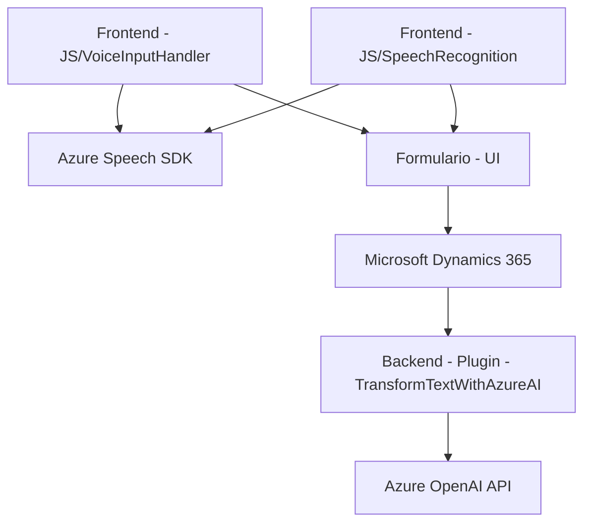

### Breve resumen técnico
El repositorio contiene tres archivos con funcionalidades específicas para habilitar reconocimiento de voz, síntesis de voz y procesamiento avanzado con IA en un sistema basado en **Microsoft Dynamics 365**. Las soluciones combinan el uso de dependencias externas como **Azure Speech SDK** y **Azure OpenAI API**, además de lógica personalizada para interacción con formularios y ejecución de plugins.

---

### Descripción de arquitectura
La arquitectura presenta características destacadas:
1. **N capas**: Existe una separación entre:
   - **Frontend**: Implementación en JavaScript para interacción con el usuario en formularios y reconocimiento/síntesis de voz.
   - **Backend/Servidor**: Plugins de Dynamics CRM que utilizan Azure OpenAI API para transformar texto y devolver respuestas estructuradas.
   - **Servicios externos**: Integración tanto en frontend como en backend con APIs de Azure Speech y Azure OpenAI.
   
2. **Cliente-Servidor**: El sistema permite comunicación bidireccional entre frontend (formulario y JavaScript) y backend (plugin) con llamadas HTTP. También se integra con servicios externos como Azure Speech y OpenAI.

3. **Plugins en Dynamics CRM**: Los plugins actúan como lógica específica para interactuar directamente con la capa de dominio de Dynamics 365.

---

### Tecnologías usadas
- **Frontend**:
  - **JavaScript**: Código modular para reconocimiento y síntesis de voz.
  - **Azure Speech SDK**: Habilitación de entrada y salida (texto a voz, voz a texto).
  - **Xrm.WebApi**: Para acceso y manipulación de datos en Dynamics CRM.

- **Backend**:
  - **C#**: Desarrollo de plugins en Dynamics CRM.
  - **Azure OpenAI API**: Transformación de texto según criterios de IA.
  - **Newtonsoft.Json**: Manipulación de respuestas JSON estructuradas.
  - **System.Net.Http**: Para llamadas REST a servicios de Azure OpenAI.

- **Patrones**:
  - **Modulo estructurado**: Cada archivo organiza su lógica en funciones o clases especializadas.
  - **Plugin-based architecture**: Extensiones para Microsoft Dynamics.
  - **Integración de servicios externos**: Carga dinámica del SDK (Speech SDK) y ejecución de lógica externalizada (OpenAI).
  - **Adaptador**: Traducción de datos del formulario para compatibilidad con APIs externas (Azure Speech/OpenAI).

---

### Diagrama Mermaid

---

### Conclusión final
1. **Tipo de solución**: Es una implementación **mixta entre frontend y backend** para extender funcionalidades de Microsoft Dynamics 365 mediante la integración de capacidades avanzadas de voz (Azure Speech SDK) e inteligencia artificial (Azure OpenAI API).
   
2. **Arquitectura funcional**:
   - **N capas**: Separación de frontend (procesamiento en el cliente basado en formularios) y backend (plugins con lógica pesada de OpenAI).
   - **Cliente-Servidor**: Interacción dinámica entre el cliente (JavaScript) y los servicios externos/backend.

3. **Dependencias principales**:
   - **Azure Speech SDK** para entrada/salida de voz.
   - **Azure OpenAI API** para procesamiento avanzado de texto.
   - **Xrm.WebApi y Dynamics 365 SDK** para operaciones de formularios y entidades.

En general, el sistema muestra una clara orientación hacia uso extensivo de servicios en la nube, modularidad en el código y aplicabilidad dentro de un entorno empresarial como Dynamics 365.