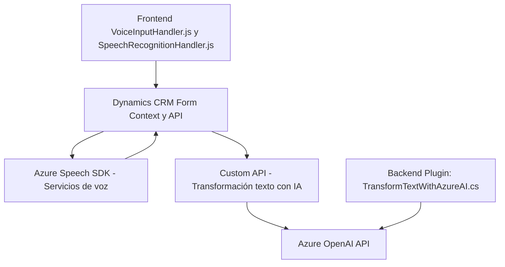

### Breve resumen técnico:
El repositorio describe múltiples archivos que juntos implementan una solución para interacción avanzada entre formularios de Microsoft Dynamics, Azure Speech SDK y Azure OpenAI. Los componentes incluyen:
- **Frontend JavaScript** para síntesis y reconocimiento de voz.
- **Plugins de Dynamics CRM** como extensiones para transformación de texto.
- **Azure Speech SDK y Azure OpenAI API** como recursos externos.

---

### Descripción de la arquitectura:
La solución utiliza una arquitectura **combinada de capas y servicios externos**, organizada como:
1. **Frontend en Dynamics CRM**: Proporciona interactividad mediante integración con Azure Speech SDK.
2. **Backend bajo Dynamics CRM**: Utiliza plugins para manejar lógica avanzada como transformación de texto con IA.
3. **Azure Speech y OpenAI APIs**: Servicios de procesamiento externo para voz y texto.
4. **Integración modular**: Código segmentado en funciones independientes con patrones como Factory, Request-Response, y SOA.

---

### Tecnologías usadas:
1. **Frontend:**
   - Lenguaje: JavaScript.
   - Framework: Sin framework necesariamente; uso directo de APIs como Azure Speech SDK.
   - Integración: Llamadas a Dynamics CRM y APIs externas mediante modularización.

2. **Backend:**
   - Lenguaje: C#.
   - Ecosistema: Dynamics CRM SDK.
   - Librerías: `System.Net.Http`, `Microsoft.Xrm.Sdk`, `Newtonsoft.Json`, entre otras.
   - Servicio: Azure OpenAI API.

3. **Servicios externos:**
   - Azure Speech SDK: Para reconocimiento de voz y síntesis textual.
   - Azure OpenAI API: Para transformación avanzada de texto.

4. **Patrones utilizados:**
   - **Factory Pattern**: Configuración de Speech SDK para síntesis.
   - **Request-Response**: Interacción directa de plugins con APIs Azure.
   - **SOA**: Delegación de procesos IA al servicio OpenAI.
   - **Modularidad**: Funciones de asistencia (ex. `processTranscript`, `applyValueToField`).

---

### Diagrama Mermaid válido para GitHub:

---

### Conclusión final:
La solución integra **tecnologías de frontend, servicios de voz**, y **backend con inteligencia artificial** para automatizar la interacción de usuarios a través de formularios dinámicos en Microsoft Dynamics CRM. El uso de capas y la interacción con servicios externos lo convierte en un ejemplo sólido de una **arquitectura SOA híbrida**, con dependencia de servicios externos (Azure Speech SDK y OpenAI) para manejar lógica avanzada y procesamiento externo. Aunque modular, la solución está fuertemente acoplada a Microsoft Dynamics y los servicios de Azure, limitando su portabilidad fuera de este ecosistema.