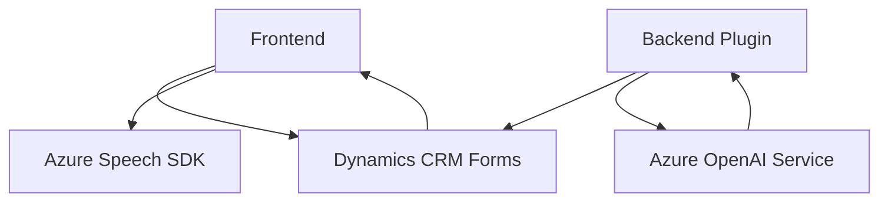

### Resumen Técnico

Este repositorio presenta una solución destinada a la interacción con formularios dinámicos y la incorporación de funcionalidades basadas en inteligencia artificial. Incluye componentes de frontend para la síntesis y el reconocimiento de voz, junto con un plugin backend para transformar texto mediante Azure OpenAI.

### Descripción de la Arquitectura

La arquitectura de la solución combina **frontend y backend**, adoptando un paradigma de **integración de servicios externos**:
- **Frontend**: Representado por JavaScript, que gestiona la interacción del cliente mediante manipulaciones del formulario en Dynamics CRM y comunicación con servicios como Azure Speech SDK. Este componente es modular y separado por funcionalidad.
- **Backend (Plugin en .NET)**: Implementado en Dynamics CRM, el plugin interactúa con Azure OpenAI para transformar texto en estructuras JSON según normas preestablecidas.

La solución sigue una arquitectura **n-capas**, donde el frontend actúa como capa de presentación, y el plugin como capa lógica en el backend. También se observa dependencia hacia servicios externos de Microsoft Azure.

### Tecnologías y Patrones usados

1. **Tecnologías principales**:
    - **Frontend**:
      - Lenguaje: JavaScript.
      - Servicios: Azure Speech SDK.
      - Plataforma: Dynamics CRM.
    - **Backend**:
      - Lenguaje: C#.
      - Framework: Dynamics SDK (.NET Framework).
      - Servicios: Azure OpenAI (GPT-4).
    - Herramientas: DOM, JSON, HTTP APIs.

2. **Patrones de diseño**:
    - **Frontend**:
      - Modularización: Funciones independientes para síntesis, reconocimiento de voz y datos del formulario.
      - Lazy loading: Carga dinámica del SDK (Azure Speech).
      - Observador: Callbacks para procesamiento de eventos en reconocimiento de voz.
    - **Backend**:
      - Plugin extensible: Implementa `IPlugin` para operaciones en el contexto de Dynamics CRM.
      - API-based architecture: Conexión con Azure OpenAI mediante endpoints HTTP.
      - Responsabilidad única: Cada clase y función tiene un propósito específico.

### Dependencias y Componentes Externos

1. **Frontend**:
   - Azure Speech SDK: Sintetiza y reconoce voz mediante el servicio externo.
   - Dynamics CRM Web API (Xrm.WebApi.online): Manipula formularios y campos relacionados.

2. **Backend**:
   - Azure OpenAI Service: Transformación de texto en JSON estructurado.
   - Espacios de nombres .NET: `Microsoft.Xrm.Sdk`, `System.Net.Http`, `Newtonsoft.Json.Linq`.

### **Diagrama Mermaid**

### Conclusión Final

La solución en el repositorio es una combinación de frontend modular y backend orientado a servicios, diseñada para mejorar la experiencia en plataformas Dynamics CRM mediante accesibilidad (voz) y procesamiento inteligente de texto (IA). La inclusión de Azure Speech SDK y Azure OpenAI evidencia una integración fuerte con el ecosistema Microsoft, lo que la hace efectiva y escalable en ese contexto.