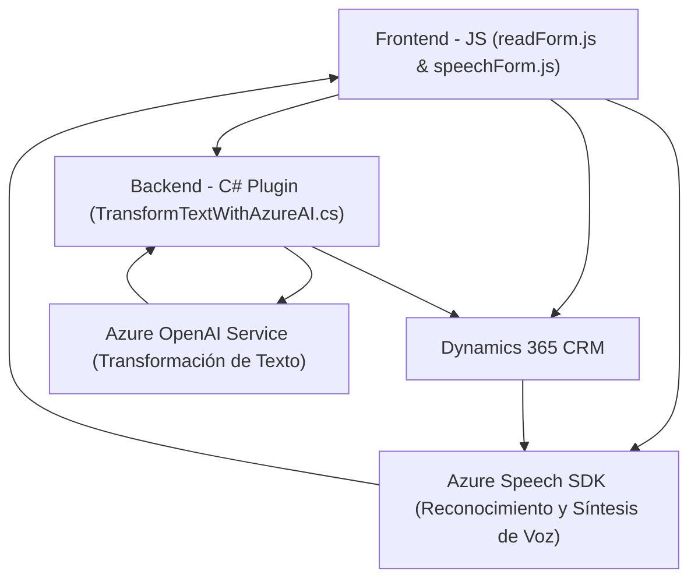

# Análisis Técnico del Repositorio

## Breve resumen técnico
Este repositorio contiene una solución híbrida utilizada para integrarse con Dynamics CRM. Combina múltiples tecnologías y capas para gestionar datos de formularios, convertir texto en voz y voz en texto, además de aplicar procesamiento avanzado de transformación textual utilizando Inteligencia Artificial provista por Azure OpenAI. También incorpora plugins de CRM para extender la funcionalidad.

---

## Descripción de arquitectura
La solución tiene una arquitectura híbrida compuesta por las siguientes partes:
1. **Frontend**: Implementado en JavaScript, interactúa con formularios de Dynamics CRM. Ofrece integración con **Azure Speech SDK** para el reconocimiento y síntesis de voz en tiempo real.
2. **Backend**: Desarrollado en C#, utiliza el **patrón Plugin** típico de Dynamics CRM para extender la funcionalidad y hacer llamadas a servicios externos (Azure OpenAI).
3. **Servicios Externos**: Azure Speech SDK y Azure OpenAI Service desempeñan funciones críticas para procesamiento de texto y voz.

### Tipo de Arquitectura
Basado en los archivos y funcionalidades descritas:
- **Arquitectura n-capas**: Se identifica al menos una separación clara entre capa de presentación (frontend), lógica de negocio (plugin en backend) y servicios externos (integración con Azure).
- **Integración con Microservicios**: Las funciones dependen de APIs externas para funciones esenciales como reconocimiento de voz y transformación de texto.

---

## Tecnologías usadas
1. **Frontend**:
   - **JavaScript ES6**: Gestión de lógica de frontend, manipulación del DOM, y llamadas a servicios.
   - **Azure Speech SDK**: Manejo de síntesis y reconocimiento de voz.
   - **Dynamics 365 CRM API**: Acceso y actualización de datos en formularios del CRM.
2. **Backend**:
   - **C# y .NET Framework**: Implementación de plugin de Dynamics CRM.
   - **Azure OpenAI Service**: Consumo de API externa para reglas de transformación de texto.
   - **Newtonsoft.Json (para parsing JSON)**.
3. **Servicios**:
   - **HttpClient**: Para consumo de la API de Azure OpenAI.
   - **Xrm.WebApi.online**: Métodos estándar para interacción con el CRM.

---

## Dependencias externas presentes
1. **SDKs**:
   - Azure Speech SDK (JavaScript).
   - Dynamics CRM SDK (C#).
2. **Servicios**:
   - Azure OpenAI (API para procesamiento textual).
   - Azure Speech (para síntesis y reconocimiento de voz).
3. **Librerías adicionales**:
   - Newtonsoft.Json para C# (manejo de JSON).
   - Sistema de dependencias en Dynamics 365 (`IPlugin`).

---

## Diagrama Mermaid

---

## Conclusión final
El repositorio implementa una solución híbrida centrada en la inteligencia artificial y la integración con Dynamics 365 CRM. Combina tecnologías modernas como Azure Speech SDK y Azure OpenAI para habilitar funcionalidades avanzadas de voz y lenguaje natural. Se utiliza una arquitectura n-capas, con conexión a microservicios externos para obtener capacidades específicas. El código presenta modularidad adecuada y patrones de calidad como separación de responsabilidades y callbacks para funciones asíncronas.

Esta solución es ideal para casos que requieren interacción avanzada entre usuarios y sistemas CRM mediante interfaces de voz o procesamiento de texto automatizado basado en IA. Sin embargo, sería recomendable reforzar la gestión de credenciales y claves API para mejorar la seguridad.