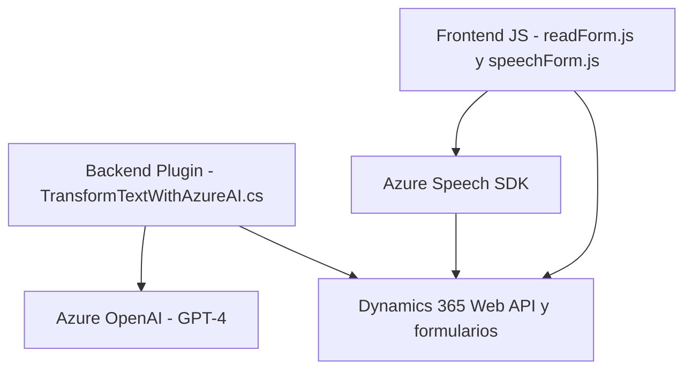

## Breve resumen técnico
El repositorio contiene una solución distribuida enfocada en la integración entre Microsoft Dynamics 365 y servicios de Azure como el Speech SDK y OpenAI. Los archivos cubren tanto el manejo de datos en el frontend (para formularios web) como el procesamiento avanzado de texto mediante un plugin en el backend de Dynamics CRM.

---

## Descripción de arquitectura
La solución es un híbrido compuesta por un frontend utilitario y un backend basado en plugins. Su arquitectura parece ser de **n capas**, donde la interacción se realiza entre el frontend y los sistemas backend mediante APIs (Dynamics 365 y Azure). Además, se observa cierto enfoque hacia **arquitectura dirigida por servicios** gracias a la interacción con el Speech SDK, Dynamics Web API, y OpenAI. 

### Componentes principales:
1. **Frontend Utilitario**:
   - Dos scripts en JavaScript (`readForm.js` y `speechForm.js`) que:
     - Manejan lógica de lectura/escritura de formularios de Dynamics 365.
     - Integran funcionalidades del Azure Speech SDK para síntesis y reconocimiento de voz.
     - Utilizan servicios de API como `Xrm.WebApi.online.execute` para enviar datos a Dynamics CRM.

2. **Backend basado en Plugins**:
   - El archivo `.cs` implementa un plugin para Dynamics CRM utilizando el SDK nativo, que:
     - Recibe parámetros desde una operación en Dynamics.
     - Contacta al servicio de Azure OpenAI vía REST API para transformar datos textuales en formato estructurado (JSON).
     - Devuelve datos procesados de manera que puedan integrarse en el sistema.

---

## Tecnologías usadas
### Lenguajes:
- **Frontend**: JavaScript, orientado al desarrollo de módulos autónomos para lectura de formularios y síntesis/reconocimiento de voz.
- **Backend**: C#, para implementar un plugin compatible con Dynamics CRM SDK.

### Frameworks y Servicios:
1. **Microsoft Dynamics 365 Web API**:
   - Manejada desde el frontend para ejecutar operaciones sobre formularios y entidades.
   - En el backend para recibir datos y emitir respuestas transformadas.

2. **Azure Speech SDK**:
   - Sintetización de voz (texto a voz) y reconocimiento de voz (voz a texto) en módulos frontend.

3. **Azure OpenAI API (GPT-4)**:
   - Utilizada en el backend para transformar datos y generar estructuras JSON interpretables.

### Patrones identificados:
1. **Service Layer**:
   - Abstracción funcional bien definida entre frontend, procesamiento en el plugin y APIs externas como Azure.

2. **Modularidad**:
   - Separación clara de responsabilidades en funciones específicas tanto en el frontend como en el backend (lectura, procesamiento, integración con servicios).

3. **RESTful Integration**:
   - Interacción consistente con APIs de Azure OpenAI y Dynamics 365.

---

## Diagrama Mermaid válido para GitHub

---

## Conclusión final
La solución representa una arquitectura de **n capas** bien estructurada, con un enfoque en la integración de servicios y módulos autónomos. El frontend actúa como un intermediario para funcionalidades de accesibilidad (voz) en formularios asociados a Dynamics 365, mientras que el backend plugin complementa la transformación avanzada de datos mediante el uso de Azure OpenAI. Esto muestra un diseño eficiente para aplicaciones empresariales que requieren una capa extra de inteligencia artificial y accesibilidad.