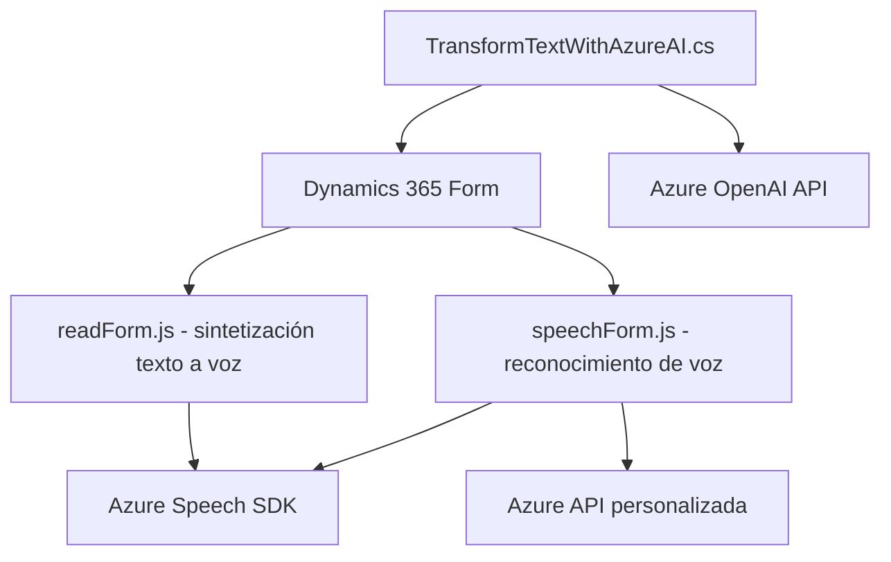

### Breve resumen técnico:
Este repositorio contiene tres archivos principales:  
1. **readForm.js**: Implementa funcionalidad de síntesis de texto a voz usando el **Azure Speech SDK** sobre campos visibles de formularios dinámicos.  
2. **speechForm.js**: Implementa funcionalidad de reconocimiento de voz con el **Azure Speech SDK** para procesar y actualizar datos en formularios de Dynamics 365. Además, utiliza una API personalizada para la integración con inteligencia artificial.  
3. **TransformTextWithAzureAI.cs**: Desarrolla y ejecuta un plugin de Dynamics CRM que utiliza **Azure OpenAI** y herramientas como `System.Net.Http` para transformar el texto según reglas predefinidas.  

### Descripción de arquitectura:
La arquitectura de este sistema puede ser considerada como una combinación de **n capas** y **microservicios orientados a eventos**:  
- **Frontend basado en JavaScript (readForm.js y speechForm.js)** que interactúa directamente con servicios externos (Azure SDK y APIs de IA).  
- Una **capa de backend** basada en **Dynamics CRM Plugins (TransformTextWithAzureAI.cs)** que se integra con **Azure OpenAI** para procesamiento avanzado del texto.  
   
Los archivos trabajan con un enfoque basado en eventos asociado a (principalmente) formularios dentro de contextos de Dynamics 365.

### Tecnologías usadas:
- **Frontend (JS):**
  - JavaScript.
  - Azure Speech SDK para síntesis y reconocimiento de voz.
  - Integración con APIs mediante solicitudes HTTP.
  - DOM para la manipulación dinámica de SDK y eventos.
  
- **Backend (C#):**
  - Dynamics CRM SDK (Microsoft.Xrm.Sdk) para interacción con el sistema.
  - Azure OpenAI API para procesamiento de texto.
  - System.Net.Http para llamadas HTTP.
  - Json serialization/deserialization (`System.Text.Json` y Newtonsoft.Json.Linq).

### Diagrama **Mermaid** (válido para GitHub):

### Conclusión final:
Este repositorio está diseñado para proporcionar capacidades avanzadas de interacción humano-software mediante síntesis de voz, reconocimiento de voz y procesamiento de texto con inteligencia artificial en un entorno basado en Dynamics 365. La **arquitectura n capas** se adapta a procesos orientados a eventos con integración directa a servicios externos de Azure, haciendo el sistema altamente dinámico y modular. Las tecnologías y patrones utilizados aseguran versatilidad y optimización en el manejo de formularios dinámicos.