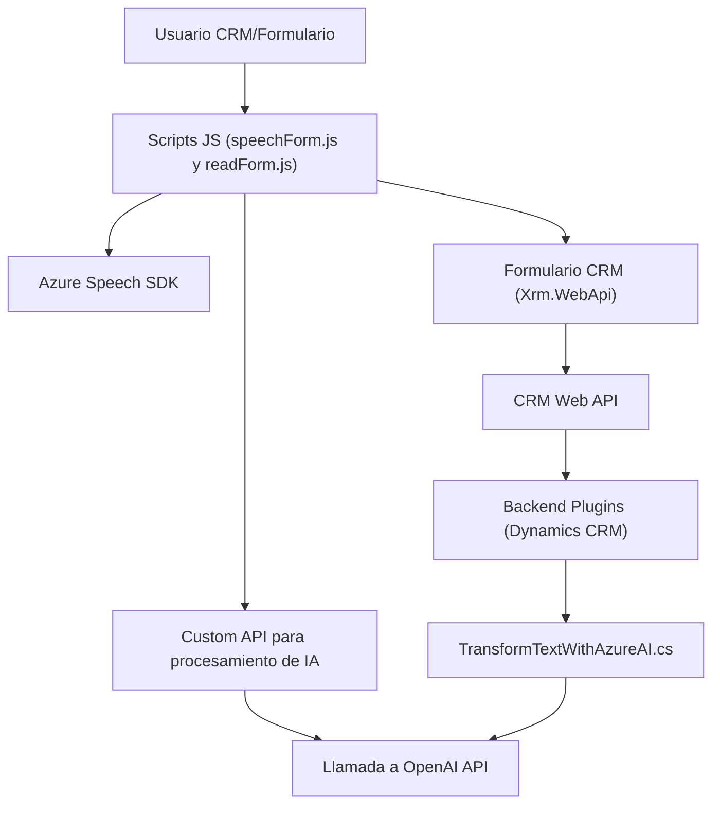

### Breve resumen técnico

El repositorio contiene tres módulos principales que integran funcionalidades relacionadas con voz y transformación de texto mediante servicios de Azure. Los scripts y plugins implementan capacidades como síntesis de voz, transcripción, reconocimiento de campos dinámicos en formularios, y transformación de texto a objetos JSON mediante **Azure Speech SDK** y **Azure OpenAI Service** en el contexto de **Dynamics CRM**.

---

### Descripción de arquitectura

1. **Tipo de solución:**  
   - Predominantemente se trata de una solución híbrida que combina un **frontend** para interacción directa con usuarios (script JS) y **backend plugins** para procesamiento avanzado (C#).

2. **Arquitectura:**  
   - La arquitectura refleja un **modelo en capas**: 
     1. **Capa de presentación:** Representada por los scripts JS que operan en el navegador interactuando con formularios (Dynamics CRM).
     2. **Capa de lógica de negocio:** Implementada con plugins C# para las transformaciones avanzadas usando servicios OpenAI y Speech.
     3. **Servicios externos:** Interacción directa con APIs como Azure SDK y OpenAI.

---

### Tecnologías, frameworks y patrones usados

#### Tecnologías:
- **Frontend:** 
  - **JavaScript:** Scripts para manejar la interacción voz-formulario y lógica CRM.
  - **Azure Speech SDK:** Para sintesis de voz y reconocimiento de entrada por voz.
  - **Dynamics CRM Web API (Xrm.WebApi.online):** Para manipular y aplicar datos en formularios.
- **Backend:**
  - **C#:** Implementación de lógica del negocio como plugins sobre Dynamics CRM.
  - **Azure OpenAI Service:** Para transformar texto mediante prompts predefinidos.
  - **Microsoft Xrm SDK:** Manejo de entidades e interacción directa con datos CRM.
  - **Newtonsoft.Json y System.Text.Json:** Para manipulación avanzada de estructuras JSON.

#### Patrones arquitectónicos:
- **Plugin-based architecture:** La extensión de Dynamics CRM mediante plugins como `TransformTextWithAzureAI.cs`.
- **Carga dinámica de dependencias:** En el lado frontend, el SDK de Speech se carga en tiempo de ejecución.
- **Event-driven architecture:** La interacción del usuario en formularios (datos visibles o entrada por voz) es manejada mediante eventos y lógica asociada.
- **Integración de APIs externas:** La solución realiza solicitudes HTTP (Azure Speech SDK, Azure OpenAI Service).

---

### Dependencias y componentes externos presentes
- **Claves y configuraciones de servicios:**
  - `azureKey` y `azureRegion` usados en scripts frontend para Azure Speech SDK.
  - `apiKey` y `endpoint` requeridos para Azure OpenAI Service.
- **Servicios relacionados:**
  - **Speech SDK Browser Packager:** Dinámicamente cargado desde la URL pública de Azure Speech SDK.
  - **Dynamics CRM Web API:** Para integrar datos directamente en formularios.
- **Librerías externas:**
  - **Newtonsoft.Json**: Manejo avanzado de JSON en el backend.
  - **System.Net.Http**: Para solicitudes HTTP a APIs externas del backend.

---

### Diagrama **Mermaid** válido para GitHub Markdown

El siguiente diagrama representa una vista general de las interacciones y dependencias del sistema:

---

### Conclusión final

Este repositorio representa una solución orientada a la automatización de procesos en el contexto de Dynamics CRM, combinando entrada de voz, procesamiento de texto mediante IA, y síntesis en audio. La arquitectura en capas utilizada asegura una separación adecuada de concernimientos, mientras que la integración mediante APIs externas permite personalizar y extender las capacidades de Dynamics. Aunque se detectan buenas prácticas como la asincronía y encapsulación, sería útil implementar manejo avanzado de errores para garantizar resiliencia ante falencias en servicios externos como Azure.