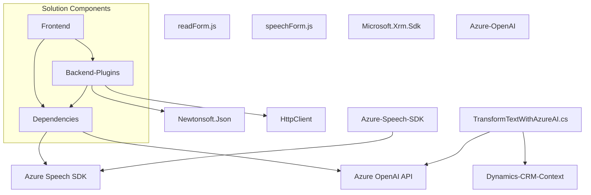

## Breve resumen técnico
La solución parece ser un sistema completo compuesto por un **frontend**, **plugins en el backend para Dynamics CRM**, y **servicios externos de Azure AI y Azure Speech SDK**. Está diseñado para operar dentro de **Microsoft Dynamics 365**, proporcionando capacidades avanzadas de interacción por voz (en frontend) y transformación de texto por inteligencia artificial (en backend).

## Descripción de arquitectura
La arquitectura tiene componentes distribuidos que trabajan en conjunto de la siguiente forma:
1. **Frontend**:
   - JavaScript para manipulación de formularios y síntesis/reconocimiento de voz usando el **Azure Speech SDK**.
   - Modularidad con funciones independientes para entrada por voz, salida vocal, y otras operaciones específicas del formulario.
   - Manejo dinámico de datos visibles en el DOM del formulario.

2. **Backend Plug-ins**:
   - C# plug-in que se integra con **Dynamics CRM** como un componente extensible.
   - Comunica el CRM con Azure OpenAI para procesar textos y normas.
   - Usa dependencias como `Newtonsoft.Json` y `HttpClient` para enviar y recibir información de APIs externas.

3. **Servicios externos**:
   - Azure Speech SDK: Para síntesis de voz en el frontend e interacción con formularios mediante comandos hablados.
   - Azure OpenAI Service: Para transformar textos en formato JSON o según reglas predefinidas en el backend.

La colaboración de estos componentes forma una arquitectura distribuida que puede ser categorizada como **basada en n capas**:
- **Capa de presentación (Frontend)**: Interacción directa con el usuario y lógica de interfase.
- **Capa de negocio (Plugins en Dynamics)**: Procesamiento de texto estructurado con OpenAI y enlace entre Dynamics y el servicio.
- **Capa de datos (Dynamics CRM)**: Contexto del formulario y gestión de entidades en la base de datos relacional utilizada por CRM.

## Tecnologías usadas
- **Frontend**:
  - **JavaScript**: Manipulación del DOM y lógica de entrada/salida de voz.
  - **Dynamics Context API**: Acceso y gestión de datos del formulario en Dynamics 365.
  - **Azure Speech SDK**: Reconocimiento y síntesis de voz.

- **Backend**:
  - **C#**: Implementación de plugins como clases que realizan funciones específicas en Dynamics CRM.
  - **Microsoft Dynamics SDK**: Para conectarse a sistemas creados sobre Dynamics 365.
  - **Azure OpenAI**: Procesamiento de texto estructurado.

- **Servicios Externos**:
  - **Azure Speech SDK**: Reconocimiento/síntesis de voz.
  - **Azure OpenAI**: Integración con GPT para transformación avanzada de información.

- **Patrones de arquitectura**:
  - Modularidad: Código dividido en funciones independientes claras.
  - Integración: Uso de APIs externas como Azure Speech SDK y Azure OpenAI para funcionalidades específicas.
  - Client-Server: Los datos de Dynamics se procesan mediante Azure servicios externos por HTTP requests.

## Dependencias o componentes externos
- **Azure Speech SDK**: Para reconocimiento y síntesis de voz en frontend.
- **Azure OpenAI service**: Procesamiento de texto en backend.
- **Dynamics CRM SDK**: Manejo de los datos en el contexto del CRM.
- **Newtonsoft.Json, System.Text.Json**: Procesamiento y serialización de datos en JSON.
- **HttpClient library**: Para realizar solicitudes HTTP.

## Diagrama Mermaid válido para GitHub

## Conclusión final
La solución integra un **frontend** desarrollado en JavaScript y un **backend** basado en **Dynamics 365 plugins (C#)**, integrándose con **Azure Speech SDK** y **Azure OpenAI service**. Se organiza en una arquitectura basada en **n capas** donde cada componente tiene una tarea específica: presentación (interacción del usuario), lógica de negocio (procesamiento en Dynamics CRM), y servicios externos (Azure AI para sintetización y transformación). En conjunto, la solución apunta a optimizar interacciones entre el usuario, el sistema CRM, y servicios avanzados de IA.