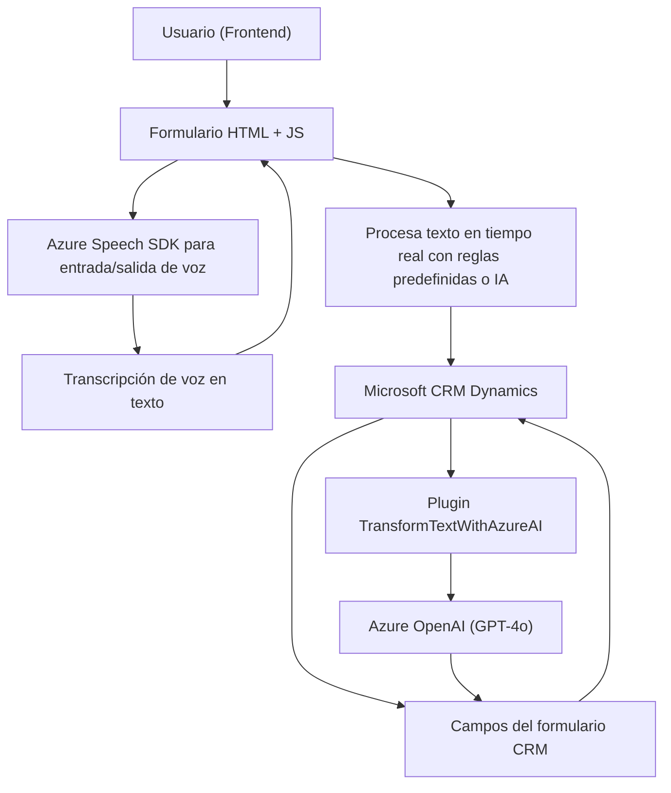

### **Análisis detallado**

#### **Breve resumen técnico**
El repositorio muestra una solución de software que integra varios componentes para trabajar con formularios y voces en un entorno de CRM Dynamics. La funcionalidad principal gira en torno a convertir texto a voz y voz a texto mediante Azure Speech SDK, y utilizar servicios de Azure OpenAI para transformar textos en estructuras JSON con normas específicas. Además, la solución interactúa con datos de formularios (Dynamics CRM), ajusta valores, y utiliza APIs externas para operaciones específicas.

---

### **Descripción de la arquitectura**
La solución parece usar una arquitectura **híbrida client-server** que combina:
1. **Front-end implementado en JavaScript**: Maneja la interacción con el usuario, el reconocimiento de voz y la comunicación con APIs. La estructura modular de la funcionalidad (JS) sugiere una arquitectura **modular** con un enfoque hacia la reutilización y encapsulación de lógica.
2. **Back-end basado en plugins (Microsoft Dynamics CRM)**: Utiliza un plugin que actúa como intermediario entre Dynamics CRM y una API externa (Azure OpenAI). Este componente sigue una arquitectura **orientada a servicios (Service Oriented Architecture)** dado su fuerte dependencia de servicios en la nube.

Esta solución en su totalidad tiene elementos de **arquitectura en capas**:
- **Capa de presentación**: La interacción con el usuario ocurre mediante el frontend en el navegador y la voz (HTML, JS).
- **Capa de lógica de negocio**: Operaciones específicas sobre formularios (lectura/modificación) en Dynamics y procedimientos mediante plugins para interacción con OpenAI.
- **Capa de integración/aplicación**: Uso de APIs externas (Azure Speech SDK, Azure OpenAI).

---

### **Tecnologías, frameworks y patrones usados**
1. **Tecnologías y frameworks**:
   - **JavaScript**: Para frontend-interactuar con el formulario y el SDK de Azure Speech.
   - **Microsoft Dynamics CRM SDK**: Utilizado en los plugin de backend para interactuar con el sistema CRM.
   - **Azure Speech SDK**: Proporciona reconocimiento de voz y síntesis de voz.
   - **Azure OpenAI (GPT-4o)**: Procesa texto y estructuras con IA en el backend.
   - **HTTP y JSON**: Usados para integrar APIs y manejar datos como textos y respuestas JSON.

2. **Patrones arquitectónicos**:
   - **Modularidad funcional**: Cada función encapsula tareas específicas para un propósito modular y reutilizable.
   - **Client-server**: El frontend y el plugin colaboran como cliente-servidor hacia APIs de Azure Speech/OpenAI y CRM Dynamics.
   - **Service-Oriented Architecture (SOA)**: Conexión con APIs externas, como el servicio Azure OpenAI y Speech SDK.

---

### **Dependencias o componentes externos**
1. **Frontend**:
   - JavaScript en el navegador.
   - Carga dinámica de archivos del SDK: `https://aka.ms/csspeech/jsbrowserpackageraw`.
   - Microsoft Dynamics CRM (formas y atributos).
   - APIs externas (Azure Speech SDK, posiblemente APIs personalizadas).

2. **Backend**:
   - Microsoft Dynamics SDK (interacción con CRM).
   - Azure OpenAI para el procesamiento de texto avanzado.
   - JSON para estructuración de datos, mediante `Newtonsoft.Json` y `.Net`.

---

### **Diagrama Mermaid**

---

### **Conclusión final**
El repositorio representa una solución para automatizar el proceso de entrada de datos en formularios mediante funciones de voz y procesamiento de texto. Con un enfoque hacia la integración de servicios, utiliza tecnologías avanzadas como Azure Speech SDK, Azure OpenAI y Dynamics CRM. Aunque reúne características de una arquitectura en capas, tiene elementos de SOA y modularidad funcional que soportan alto nivel de extensibilidad e interacción con APIs externas.

Esta arquitectura y tecnología son ideales para organizaciones que requieran integrar capacidades avanzadas de inteligencia artificial en plataformas CRM existentes, optimizando procesos humanos mediante voz e IA.

