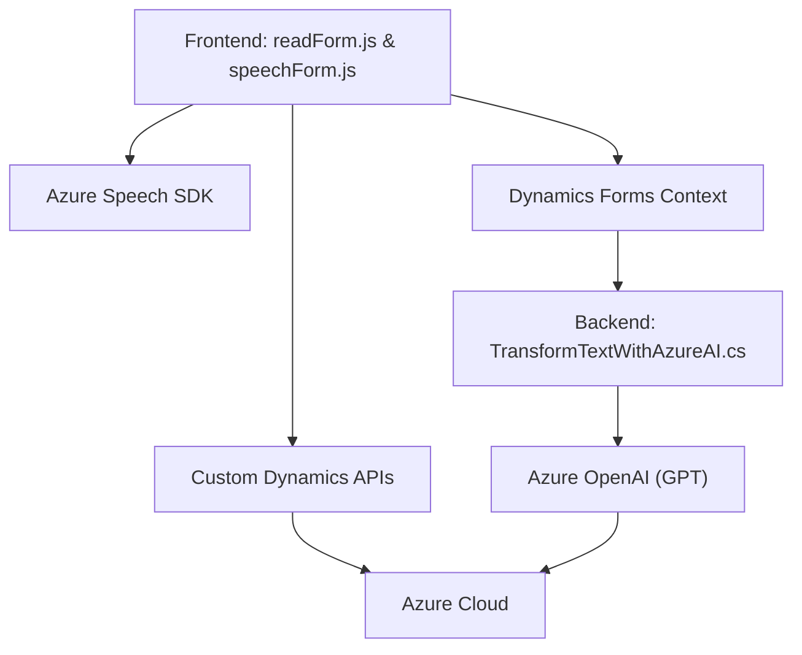

### Breve resumen técnico

El repositorio contiene archivos relacionados con una solución que integra funcionalidades de entrada, procesamiento de datos mediante voz, y transformación de texto con Azure Speech SDK y Azure OpenAI. La arquitectura involucra un frontend que interactúa con Dynamics 365, utilizando SDKs externos y una extensión de plugins en el backend para invocar APIs personalizadas y servicios Azure AI.

---

### Descripción de arquitectura

#### Tipo de solución
La solución presentada combina:
1. **Frontend dinámico:** Manejo de formularios en Dynamics 365 mediante un código JavaScript estructurado en archivos como `readForm.js`.
2. **Backend (Plugins):** Extensión del esquema funcional de Dynamics CRM mediante un plugin definido en C# (`TransformTextWithAzureAI.cs`).

#### Arquitectura principal
La arquitectura adoptada tiene características de **arquitectura híbrida**:
- **Capas:** Un frontend basado en funciones JavaScript integrado con Dynamics 365 representa una capa interactiva.
- **Microservicios:** Uso de APIs en el backend mediante plugins personalizados en Dynamics y la interacción con servicios como Azure Speech y Azure OpenAI representan integración modular.
- **Eventos:** Arquitectura orientada mediante eventos como triggers en Dynamics 365 y callbacks asíncronos en el SDK de Azure Speech.

---

### Tecnologías usadas y patrones identificados

#### Tecnologías y frameworks
1. **Frontend:**
   - Lenguaje: **JavaScript (ES6)**.
   - Frameworks: **Dynamics 365 SDK** integrado con Azure Speech SDK.
   - CDN: Carga dinámica de **Azure Speech** JavaScript SDK mediante el endpoint: `https://aka.ms/csspeech/jsbrowserpackageraw`.

2. **Backend:**
   - Lenguaje: **C# (.NET)**.
   - Frameworks: Extensión de **Microsoft Dynamics 365** con plugins.
   - API externa: **Azure OpenAI (GPT)** mediante solicitudes HTTP.

#### Patrones de diseño y arquitectura
1. **Modularidad:** Descomposición del código en tareas específicas, como procesamiento de formularios (en el frontend) y transformación de texto con Azure AI (backend).
2. **Integración asincrónica:** Carga dinámica de SDKs y APIs a través de callbacks y promesas para procesos no bloqueantes.
3. **Singleton:** Manejo único del SDK de Azure Speech en los clientes.
4. **Microservices:** La delegación de tareas a servicios externos (Azure Speech, Azure OpenAI) y Custom APIs en Dynamics refleja un enfoque basado en microservicios.
5. **Event-driven:** Los triggers de Dynamics invocan lógica backend mediante eventos, lo cual representa un flujo controlado en tiempo real.

---

### Dependencias o componentes externos

#### Identificados en el frontend
1. **Azure Speech SDK:** Para habilitar la entrada y síntesis de voz en el navegador.
2. **Microsoft Dynamics**: Dependencia directa del objeto `formContext` y funciones del SDK para manipular formularios y campos.
3. **Custom APIs**: Integración con APIs personalizadas para manejar interacciones avanzadas como la transformación de texto con el uso de IA.

#### Identificados en el backend
1. **Azure OpenAI GPT:** Servicio gestionado para el procesamiento avanzado de texto usando el modelo de lenguaje basado en GPT.
2. **Microsoft SDK (Dynamics):** Servicios como `IOrganizationService` y `IPluginExecutionContext` son clave para expandir la funcionalidad del CRM.

---

### Diagrama Mermaid válido para GitHub

---

### Conclusión final

La solución presentada se caracteriza por una integración completa entre el frontend de Dynamics Web y extensiones backend mediante plugins en C#. El uso de SDKs externos como Azure Speech y Azure OpenAI asegura una experiencia inteligente y accesible para usuarios, con una arquitectura modular basada en eventos. Sin embargo, la dependencia de múltiples sistemas externos (Azure) podría incrementar la complejidad operativa, especialmente en temas de latencia, verificación de credenciales y costos asociados. El diagrama mermaid simplifica la interacción entre componentes en la arquitectura.