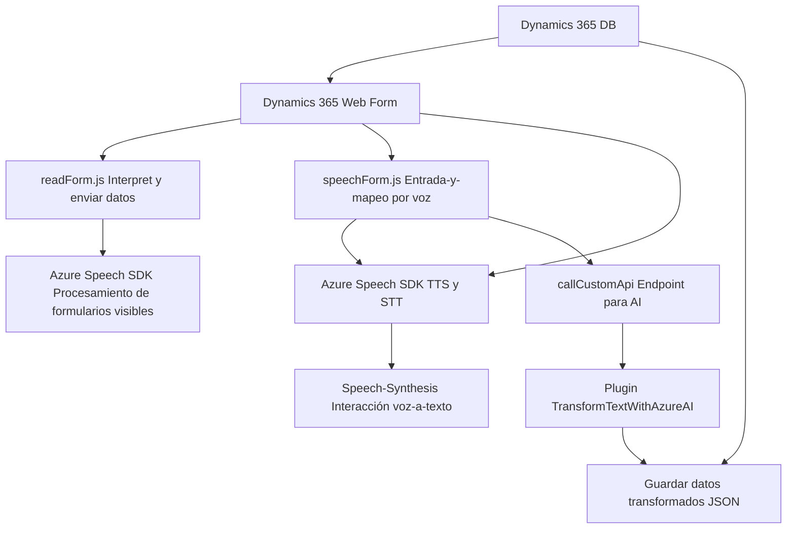

### Análisis Técnico

#### Breve resumen técnico
El repositorio tiene archivos que implementan funcionalidades específicas relacionadas con Dynamics 365 y servicios de Azure (Azure Speech SDK y Azure OpenAI API). Se orientan principalmente a mejorar la interacción entre usuarios y formularios del sistema mediante entrada de voz, procesamiento basado en IA y síntesis de texto en audio.

---

### Descripción de arquitectura
La arquitectura del repositorio puede clasificarse como **modular orientada a servicios (SOA)**. Cada archivo es independiente pero está diseñado para interactuar con servicios externos, como APIs de Azure Speech y Azure OpenAI, Dynamics 365 Web API y plugins personalizados. Los componentes tienen un alto grado de acoplamiento con el sistema de Dynamics 365, integrando las capacidades de estos servicios de manera aislada.

Además, se detecta la aplicación de patrones como **Delegador**, para la carga de SDK externos, **Facade**, para abstraer lógica compleja mediante funciones reutilizables, y **Plugin-Based Architecture** en el archivo `.cs`.

---

### Tecnologías utilizadas
1. **JavaScript**:
   - Lógica conectada a formularios de Dynamics 365.
   - Uso de Azure Speech SDK desde un CDN público.
   - Llamadas a dinámicas API de Dynamics 365 para procesamiento de datos y mapeos.

2. **C#**:
   - Configuración de un plugin para Dynamics 365.
   - Integración con **Azure OpenAI API** para transformar texto basado en IA.
   - Librerías como `Newtonsoft.Json` y `System.Net.Http`.

3. **Frameworks / Entornos**:
   - **Dynamics 365 CRM**: Extensiones basadas en API y plugins personalizados.
   - **Azure Speech SDK**: TTS y STT integrados con formularios.
   - **Azure OpenAI API**: Transformación de texto mediante GPT en formato JSON.

4. **Patrones de Diseño**:
   - **Facade Pattern**: Simplificación de varias interacciones con Azure Speech SDK.
   - **Delegator Pattern**: Modularidad para cargar o delegar servicios externos de manera dinámica.
   - **Service-Oriented Architecture (SOA)**: Comunicación con varios servicios API externos.

---

### Dependencias y componentes externos
1. **Azure Speech SDK**:
   - Provee servicios de TTS (Text-to-Speech). CDN de Microsoft utilizado para cargarlo.
   - URL: `https://aka.ms/csspeech/jsbrowserpackageraw`.

2. **Azure OpenAI API**:
   - API REST en el plugin `.cs`, integrada mediante llamadas HTTP para recibir transformaciones de texto en IA.

3. **Dynamics 365 Web API**:
   - Se utiliza para modificar datos en los formularios dinámicos (creación y modificación de registros).

4. **Newtonsoft.Json**:
   - Serialización de objetos JSON en el código del plugin.

5. **System.Net.Http** y **System.Text.Json**:
   - Comunicación externa y manejo de servicios RESTful en `.cs`.

---

### Diagrama Mermaid compatible con GitHub Markdown

---

### Conclusión Final
El diseño encapsula una solución **orientada a servicios** que aprovecha tecnologías avanzadas de Azure y Dynamics 365 para habilitar funcionalidades específicas. La lógica se divide de forma modular, con cada componente enfocado en una tarea específica: desde entrada por voz (en JavaScript y Azure Speech), hasta procesamiento por IA usando un plugin en C#. Sin embargo, este enfoque tiene un alto acoplamiento con servicios de Microsoft y depende de configuraciones estáticas, lo que podría limitar su flexibilidad en proyectos futuros o más complejos.

