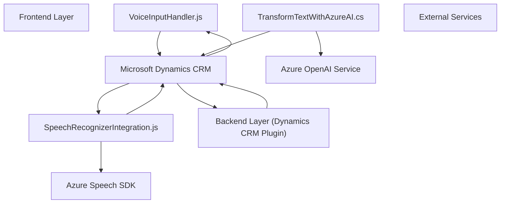

### Breve Resumen Técnico
El repositorio comprende la implementación de funcionalidades basadas en la integración de Microsoft Dynamics CRM y servicios de Azure (Speech SDK y Azure OpenAI API). Este sistema está orientado a gestionar formularios del CRM mediante entrada y salida por voz (Frontend) y un servicio de transformación de texto con IA (Backend).

---

### Descripción de Archivo Principal y Arquitectura

#### **Arquitectura**
El sistema completo sigue una arquitectura híbrida, implementada en **n capas** (Frontend y Backend) que interactúan mediante Microsoft Dynamics CRM y los servicios externos de Azure. Potencialmente, la solución podría adoptarse como parte de un modelo de **microservicios** si los componentes trabajan como orquestadores separados, comunicándose mediante API o eventos.

#### **Componentes Principales**
1. **Frontend**:
   - **Archivos en JavaScript** para manejar la interfaz y lógica del cliente.
   - Las funciones en `VoiceInputHandler.js` extraen datos de formularios de CRM y realizan síntesis de voz usando Azure Speech SDK.
   - Las funciones en `SpeechRecognizerIntegration.js` manejan la entrada por voz, su procesamiento y la aplicación de los valores reconocidos en formularios CRM.
   - Enfoque modular con separación clara de responsabilidades. 

2. **Backend**:
   - **Plugin C#** interactuando con Microsoft Dynamics CRM como un servicio alojado en el servidor.
   - Envío de texto a la API de Azure OpenAI para obtener transformaciones avanzadas basadas en IA.
   - Estructura extensible según el patrón Plugin que es estándar en Dynamics CRM.

3. **Servicios Externos**:
   - Azure Speech SDK es utilizado para la síntesis y el reconocimiento de voz de los datos del formulario.
   - Azure OpenAI Service es utilizado para transformar texto siguiendo instrucciones específicas y retornando un JSON estructurado.

---

### Tecnologías Usadas
1. **Frontend:**
   - Lenguaje: JavaScript (ecmascript moderno).
   - Frameworks/SDKs: Azure Speech SDK.
   - API proporcionada por Microsoft Dynamics CRM para la manipulación de datos del formulario.

2. **Backend:**
   - Lenguaje: C#.
   - Frameworks/Librerías: 
     - `Newtonsoft.Json.Linq` para parsear y manipular JSON.
     - `System.Net.Http` para interacciones HTTP.
     - `Microsoft.Xrm.Sdk` para la integración con Microsoft Dynamics CRM.
   - Servicios: Azure OpenAI Service (GPT-3/4).

3. **Infraestructura y herramientas:**
   - Microsoft Dynamics CRM.
   - CDN para carga dinámica de Azure Speech SDK.
   - HTTP para comunicación con APIs externas (Azure).
   - JSON para intercambio estructurado de datos.

---

### Diagrama Mermaid

---

### Conclusión Final
La solución comentada forma parte de una arquitectura híbrida de n capas que integra la funcionalidad de Microsoft Dynamics CRM con potentes servicios cloud de Azure (Speech SDK y OpenAI GPT). Está diseñada para permitir un manejo del CRM más accesible, utilizando tecnologías de vanguardia como la IA y la síntesis/reconocimiento de voz. La modularidad y el uso de patrones estándar (como fachada, delegado y plugin) facilitan la extensibilidad del proyecto y fomentan la integración fluida entre diferentes herramientas.