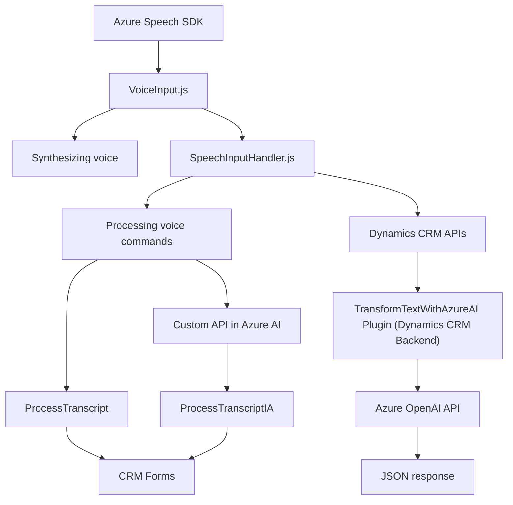

# Análisis técnico y arquitectónico del repositorio

## Resumen técnico
Este repositorio implementa funcionalidades relacionadas con la integración de reconocimiento de voz, síntesis de texto a voz, y transformación de texto con inteligencia artificial. Usando Azure Speech SDK y Azure OpenAI API, y extendiendo Dynamics CRM mediante plugins personalizados, está enfocado en accesibilidad y automatización. La solución implica tanto el manejo de UI en frontend como un backend empresarial basado en servicios de IA en nube.

---

### 1. Tipo de solución
La solución es una **API integrada con frontend complementario**. Incluye:
- Capabilidades frontend: procesamiento de formularios con síntesis y reconocimiento de voz, implementado en JavaScript.
- Backend: un plugin en Dynamics CRM que actúa como un microservicio para transformar texto con IA basada en Azure OpenAI.

---

### 2. Tecnologías, frameworks, y patrones en uso
#### Tecnologías usadas:
1. **Frontend (JavaScript)**:
   - SDK: Azure Speech SDK para reconocimiento y síntesis de voz.
   - Opciones nativas de JavaScript, APIs estándar de DOM, promesas y asincronía.
   - Integración directa con Dynamics CRM mediante `Xrm.WebApi`.

2. **Backend (C#)**:
   - **Microsoft.Xrm.Sdk**: Framework estándar para desarrollo de plugins en Dynamics CRM.
   - **Newtonsoft.Json**: Manejo dinámico de JSON (serialización/deserialización).
   - **System.Net.Http**: Para ejecutar llamadas REST a servicios de Azure OpenAI.

#### Patrones utilizados:
1. **Modularidad**: En frontend y backend, las funcionalidades están divididas en funciones o métodos con responsabilidades independientes.
2. **Cliente-Servidor**: Comunicación directa con APIs de Azure y la integración del plugin dentro de Dynamics CRM.
3. **Service-Oriented Architecture (SOA)**: Uso explícito de servicios en nube para delegar lógica avanzada, como reconocimiento de voz y procesamiento de texto.
4. **Plugin Architecture**: Aplicación de lógica específica de negocio integrándola como extensiones en el sistema Dynamics CRM.
5. **Separation of concerns**: Cada archivo está dedicado a un ámbito específico de funcionalidad (e.g., frontend, integración basada en IA en backend).

---

### 3. Tipo de arquitectura
La arquitectura sigue una aproximación **híbrida entre N-Capas y Service-Oriented Architecture (SOA)**:
1. **N-Capas**:
   - Separation of concerns entre frontend (JavaScript) y backend (plugin en Dynamics CRM).
   - El plugin del backend utiliza los servicios de Azure OpenAI para la lógica de negocio.
   - Comunicación entre capas mediante HTTP REST APIs y servicios SDK.
   
2. **SOA**:
   - Uso extensivo de servicios en nube como el Speech SDK para síntesis/reconocimiento de voz y Azure OpenAI API para procesamiento avanzado.
   - Cada componente interactúa de forma autónoma con sus dependencias externas.

---

### 4. Dependencias o componentes externos potenciales
1. **Azure Speech SDK**:
   - Integración en el frontend para reconocimiento de voz y conversión de texto a voz.
   - Clave y región personalizadas utilizadas como parámetros en las funciones.

2. **Azure OpenAI API**:
   - Endpoint usado en el plugin para ejecutar solicitudes al modelo GPT de Azure para procesamiento de texto.
   - Soporte para prompts personalizados y generación de respuestas estructuradas.

3. **Dynamics CRM Services (`Xrm.WebApi`)**:
   - APIs nativas de CRM para manipulación dinámica de datos en formularios y entidades.

4. **Librerías .NET**:
   - Frameworks estándar como `Microsoft.Xrm.Sdk`, `Newtonsoft.Json`, y `System.Net.Http` utilizados para manipulación del contexto y comunicación HTTP.

---

### 5. Diagrama Mermaid

---

### Conclusión final
Esta solución corresponde a una integración de servicios entre frontend, backend y sistemas en la nube. Sobresale por implementar accesibilidad y facilidad de automatización en entornos empresariales (Dynamics CRM). Con un diseño modular y separación entre frontend y backend, esta solución muestra características tanto de una arquitectura N-capas como de un enfoque SOA, optimizando la interacción entre sistemas y componentes externos en nube como Azure Speech SDK y OpenAI API.