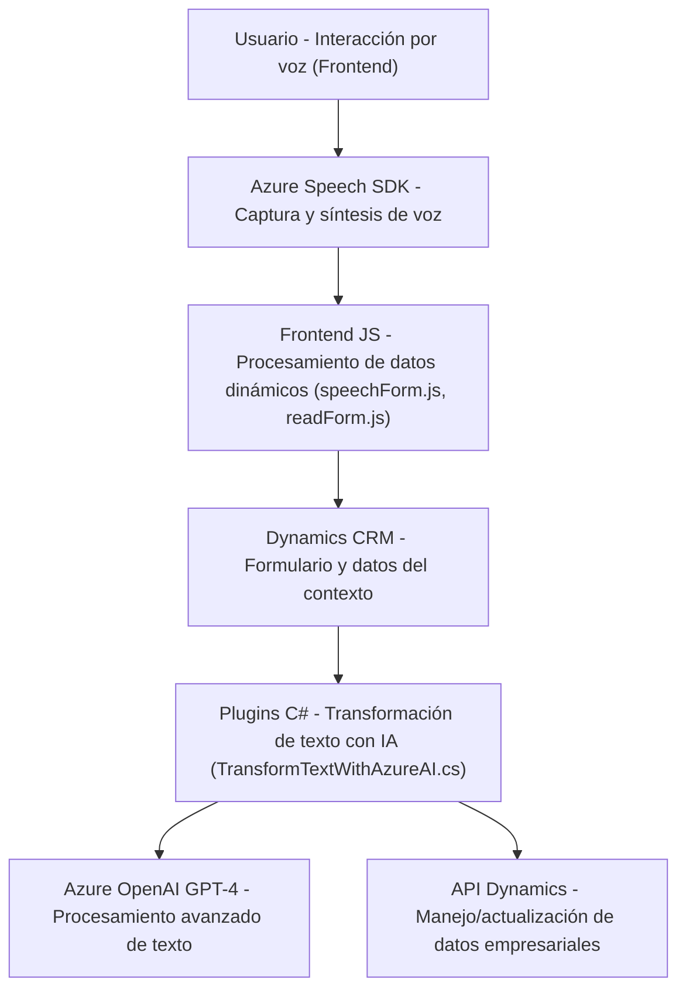

### Breve resumen técnico
El repositorio tiene tres componentes principales:
1. **Frontend**: Gestiona la interfaz de usuario mediante JavaScript, con capacidades de reconocimiento y síntesis de voz utilizando el SDK de Speech de Azure. Compatible con entornos de Dynamics 365, interactúa con formularios y datos visibles de la interfaz.
2. **Plugins para Dynamics**: Extiende funcionalidades en Dynamics CRM mediante un plugin que integra Azure OpenAI para transformar texto con reglas predefinidas.
3. **Integración con APIs de Azure**: Los archivos muestran dependencias explícitas en tecnologías de Azure como Azure Speech SDK y Azure OpenAI.

---

### Descripción de la arquitectura
1. **Tipo de solución**: 
   - API/Plugin extensible con capacidad de procesamiento de IA (Azure OpenAI) para Dynamics 365.
   - Frontend que interactúa con usuarios mediante reconocimiento y síntesis de voz.
2. **Tecnologías implementadas**: 
   - **Microsoft Dynamics 365 API**: Para manipular formularios y registros en la plataforma CRM.
   - **Azure Speech SDK**: Reconocimiento y síntesis de voz.
   - **Azure OpenAI GPT-4**: Procesamiento avanzado mediante inteligencia artificial.
   - **Librerías de JSON**: Para serialización y deserialización de datos entre componentes.
   - **HttpClient**: Comunicación con servicios externos (API REST).
3. **Patrones arquitectónicos**:
   - Modularidad: Separación en componentes con funciones específicas.
   - Service Layer: Los métodos organizados según necesidad del proceso (ej., transformación texto-voz).
   - Facade Pattern: Una capa inicial facilita el uso de las funciones complejas procesadas internamente.
   - Plugin Pattern: Implementación extensible específica para Dynamics CRM.
4. **Arquitectura**:
   - **Híbrida basada en capas** (Monolítica pero dividida en capas: frontend interactivo y backend de servicio).
   - La arquitectura no se clasifica como completamente de microservicios ni hexagonal, pero los servicios externos como Azure Speech SDK o OpenAI actúan como componentes desacoplados.
5. **Dependencias externas**:
   - Azure Speech SDK y Azure OpenAI (por requerir claves y regiones específicas).
   - Microsoft Dynamics CRM (dependencia natural para extensiones del entorno).
   - JSON Manipulation (librerías como `System.Text.Json`).

---

### Tecnologías usadas
- **Frontend**: JavaScript, dinámicas DOM, integración con SDK de Azure Speech.
- **Backend (Plugins)**: 
  - C# para ejecución del plugin en Dynamics CRM.
  - Librerías como `Microsoft.Xrm.Sdk`, `Newtonsoft.Json.Linq` y `HttpClient` para funciones empresariales.
- **Servicios de nube**: Azure Speech SDK, Azure OpenAI GPT-4.

---

### Diagrama Mermaid válido para GitHub
Este diagrama muestra cómo se integran los componentes descritos:

---

### Conclusión final
El repositorio representa una solución híbrida capaz de emplear texto y voz para gestionar datos en formularios de Dynamics CRM con soporte extensivo de inteligencia artificial en Azure. Su diseño modular y dependencias externas como Azure Speech SDK y OpenAI lo convierten en una herramienta poderosa, aunque no se clasifica como específicamente microservicios o arquitectura hexagonal, sino como una solución extensible basada en capas.