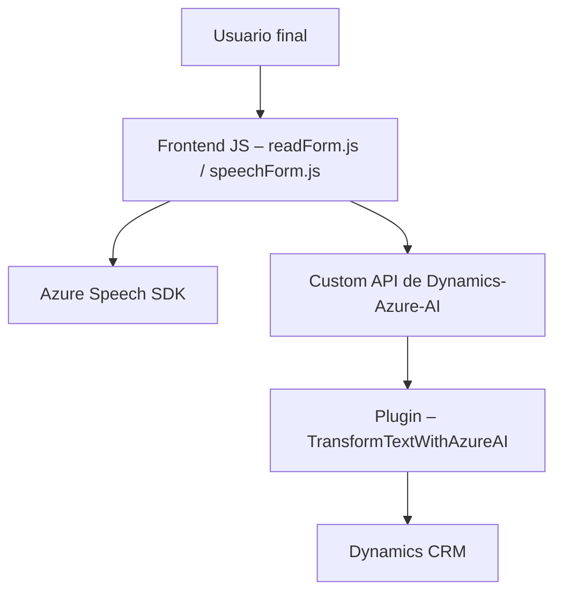

---

## **Breve Resumen Técnico**
El repositorio contiene un sistema orientado a la integración entre un **frontend basado en JavaScript** y un **plugin para Microsoft Dynamics CRM** (escrito en C#). La solución centraliza la funcionalidad de interactuar con servicios de Azure, empleando el **Azure Speech SDK** para realizar síntesis y reconocimiento de voz, junto con el uso de un plugin basado en **Azure OpenAI** para transformar datos. Este sistema está diseñado para aplicaciones empresariales que desean automatizar la interacción por voz con formularios y modelos de datos predefinidos.

---

## **Descripción de la Arquitectura**
La arquitectura es **híbrida**:
1. **Frontend:** Código modular en JavaScript que actúa como parte de una capa de presentación en un sistema más amplio conectado a Dynamics CRM. Mediante el patrón de diseño Event-Driven, las funciones se activan por eventos (por ejemplo, interacciones de usuario como clics) y se encargan de la integración con servicios externos como Azure Speech SDK y APIs personalizadas de Azure AI.
2. **Backend:** Implementación basada en el patrón **Plugin** de Microsoft Dynamics CRM, con conexión a **Azure OpenAI** para la transformación dinámica y estructurada de texto. Este plugin funciona como una extensión del CRM, lo que lo convierte en un microservicio que realiza funciones específicas (procesamiento de texto).

La solución global utiliza **arquitectura de n-capas**, dividiendo responsabilidades entre la capa de presentación (Frontend), servicios externos (Azure SDK y APIs de Azure OpenAI) y backend (CRM + Plugin).

---

## **Tecnologías, Frameworks y Patrones utilizados**

### **Frontend (JS – Voice and Speech Integration)**
1. **Tecnologías:**
   - JavaScript para programación en el navegador.
   - **Azure Speech SDK**: Reconocimiento y síntesis de voz.
   - JSON para manejar datos estructurados (intercambio de datos y respuesta de API).
   - Promesas y funciones `async/await` para manejar asíncronamente las operaciones relacionadas con APIs y SDKs.
   
2. **Patrones:**
   - **Event-Driven Pattern:** Las funciones se desencadenan en respuesta a eventos de usuario.
   - **Modularization:** Cada funcionalidad (por ejemplo, cargar SDK, reconocimiento de voz, síntesis de voz) está separada en funciones claramente definidas.
   - **Encapsulación:** La lógica de interacción con el SDK se concentra en métodos específicos, aislando su uso y permitiendo reutilización.

---

### **Backend (Plugin en Dynamics CRM)**
1. **Tecnologías:**
   - **C#** junto con **Microsoft.Xrm.Sdk** para implementar el plugin en Dynamics CRM.
   - **Azure OpenAI API** para procesamiento avanzado de texto.
   - **Newtonsoft.Json y System.Text.Json** para manejar datos en formato JSON.
   - **System.Net.Http** para envío de solicitudes HTTP a APIs externas.
   
2. **Patrones:**
   - **Microservices:** Azure Speech SDK y OpenAI procesan funcionalidad especializada, desacoplada del sistema principal.
   - **Separation of Concerns:** Diseño modular en clases y métodos de responsabilidad única para facilitar su mantenimiento.
   - **Error Handling:** Gestión de excepciones durante la interacción con servicios externos y plugins.

---

## **Dependencias o Componentes Externos Posibles**
1. **Azure Speech SDK:** Para síntesis y reconocimiento de voz a partir de entradas de texto o audio.
2. **Azure OpenAI Service:** Para transformar texto según reglas predefinidas (por ejemplo, utilizando modelos GPT).
3. **Microsoft Dynamics CRM (XRM Framework):** Específico para datos de negocio y su procesamiento dentro de un contexto empresarial.
4. **Librerías de terceros y propias:**  
   - **Newtonsoft.Json:** Manejo de datos JSON (backend).  
   - **Custom API de Azure AI:** APIs personalizadas para procesos específicos de negocio.

---

## **Diagrama Mermaid**

---

## **Conclusión Final**
El análisis del código y la arquitectura indica que se trata de un sistema que combina **un frontend en JavaScript** para interacción con formularios, reconocimiento/síntesis de voz y comunicación con APIs externas, junto con un **plugin de backend** para integración con ***Microsoft Dynamics CRM.***  

La arquitectura emplea estrategias modernas como **n-capas** y usa servicios basados en microservicios (Azure Speech SDK y Azure OpenAI). La solución apunta a una aplicación empresarial para CRM, muy optimizada para escenarios de automatización mediante la voz y basándose en patrones de diseño claros como Event-Driven y modularidad en frontends modernos.