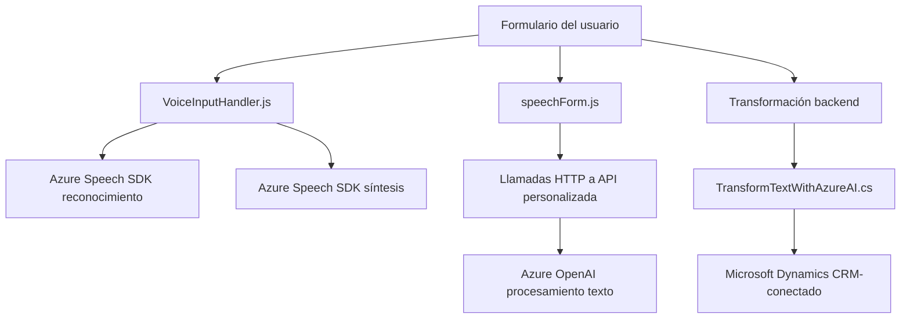

## Breve resumen técnico

El repositorio ofrece una solución dividida entre frontend y backend. La funcionalidad principal involucra la interacción con formularios, reconocimiento de voz mediante el Azure Speech SDK, y transformación de texto con Azure Cognitive Services. Por un lado, el frontend gestiona la síntesis de voz y el reconocimiento, mientras que el backend, utilizando un plugin de Dynamics CRM, ejecuta transformaciones en texto empleando Azure AI.

## Descripción de arquitectura

### Tipo de solución
La solución es una combinación entre API, frontend y backend:
- **Frontend:** Consiste en lógica implementada en JavaScript, que interactúa tanto con el usuario como con las API externas (Azure Speech SDK, servicios web de Dynamics CRM).
- **Backend:** Un plugin implementado en C#, que se integra con el Microsoft Dynamics CRM para transformar texto usando la API de Azure OpenAI.

### Tipo de arquitectura
La combinación de frontend y backend apunta hacia una **arquitectura n-capas**:
- **Capa de presentación (frontend):** Maneja interacción directa con el usuario (formularios, reconocimiento de voz).
- **Capa de lógica de negocio (backend plugin):** Procesa datos del CRM y transforma texto en JSON estructurado mediante Azure AI.
- **Capa de integración con servicios externos:** Invoca dependencias externas como Azure Speech SDK y Azure OpenAI.

### Patrones utilizados
- Modularización: Todas las funcionalidades están divididas en funciones específicas y clases.
- Wrapper: Las funciones encapsulan el manejo del SDK y las API externas.
- Plugin Pattern (C#): Interfaz para interactuar con Dynamics CRM.
- Delegación de responsabilidades: Asignación clara de roles entre las funciones para escalabilidad y mantenimiento.
- External Service Integration: Uso extensivo de Azure SDKs y REST API externas.

## Tecnologías usadas
- Frontend:
  - JavaScript ES6+.
  - Azure Speech SDK.
  - Microsoft Dynamics CRM (Xrm.WebApi).
- Backend:
  - Lenguaje: C#.
  - Framework: .NET Framework (Microsoft Dynamics SDK).
  - Azure OpenAI (REST API).
- Herramientas auxiliares: Newtonsoft.Json para manipulación JSON.

---

## Diagrama Mermaid **100 % compatible**

---

## Conclusión final

Este repositorio implementa una solución que mezcla frontend y backend en una arquitectura de n capas, orientada hacia formularios dinámicos y entrada de voz, donde los datos se procesan mediante servicios de Azure. La integración de SDKs y llamadas API, junto al uso de plugins en Dynamics CRM, sugiere una solución pensada para la personalización y escalabilidad en entornos empresariales. Si bien la arquitectura es modular, se podría considerar una transición hacia frameworks modernos en el frontend (como React o Vue) o una arquitectura hexagonal en el backend para mejorar separación de dependencias.