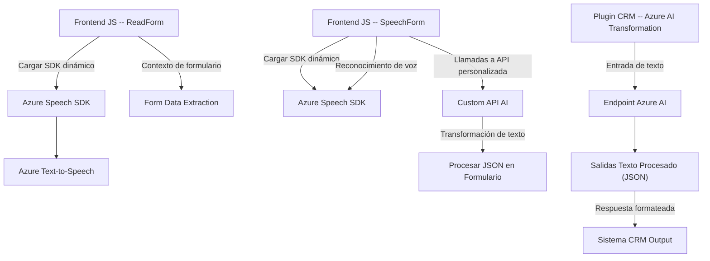

### Resumen técnico

El repositorio contiene tres archivos enfocados principalmente en el manejo de la interacción con formularios y funciones de voz/síntesis de texto, reconocimiento de voz, y transformación de texto con servicios externos basados en inteligencia artificial. Las tecnologías, frameworks y APIs utilizadas son Azure Speech SDK, Azure OpenAI y Dynamics CRM Plugin SDK. La arquitectura general es híbrida con integración de servicios externos dentro de una estructura modular y funcional.

---

### Descripción de la arquitectura

1. **Tipo de solución**:
   - Es una solución híbrida que incluye una integración de frontend en JavaScript para manejar la interfaz usuario (UI) con formulación y reconocimiento de voz.
   - Además, cuenta con un backend basado en Dynamics CRM con un plugin que interactúa directamente con Azure OpenAI. Esto podría formar parte de una arquitectura basada en microservicios.

2. **Arquitectura general**:
   - La solución parece estar construida utilizando una arquitectura de **n-capas** donde el frontend interactúa con un CRM backend y servicios externos (SaaS), como Azure Speech SDK y Azure OpenAI.
   - Posible escenario dentro de una arquitectura **híbrida de microservicios**, donde cada componente maneja tareas específicas delegadas desde un sistema CRM monolítico.

3. **Tecnologías y patrones utilizados**:
   - **Frontend (JavaScript)**:
     - Azure Speech SDK para síntesis y reconocimiento de voz.
     - Dinámica modular (SRP: Funciones con responsabilidades específicas).
     - Carga dinámica de dependencias usando JavaScript.
   - **Backend (C#)**:
     - Dynamics CRM Plugin SDK.
     - Newtonsoft.Json y System.Text.Json para manejo de JSON.
     - Azure OpenAI para transformación de texto mediante un endpoint de inteligencia artificial.
   - **Patrones arquitectónicos**:
     - SRP (Single Responsibility Principle).
     - Integración de servicios externos para funcionalidades específicas.
     - Interacción con APIs específicas como Dynamics WebAPI y Azure SDK.

4. **Dependencias o componentes externos**:
   - **Azure Speech SDK**: Utilizado para conversión de texto a audio (synthesized speech) y reconocimiento de voz.
   - **Azure OpenAI API**: Usada para transformar texto en formato JSON basado en reglas.
   - **Dynamics CRM WebAPI/Xrm SDK**: Para la gestión de formularios y datos internos de la plataforma CRM.
   - **Newtonsoft.Json** y **System.Text.Json**: Librerías utilizadas para manejo de datos en formato JSON.

---

### Diagrama Mermaid

---

### Conclusión final

El repositorio presenta una solución híbrida que combina interfaces de usuario basadas en JavaScript para la interacción con formularios CRM, funcionalidad de reconocimiento de voz y síntesis de texto mediante Azure Speech SDK, y transformación avanzada de texto basado en un código backend que se integra con Azure OpenAI. La arquitectura emplea buenas prácticas con separación de responsabilidades en funciones y clases, junto con dependencias externas críticas como Dynamics WebAPI, Azure Speech SDK y Azure OpenAI.

Aunque la solución posee elementos de una arquitectura de n-capas, el uso de servicios externos como entidad independiente apunta hacia una transición a una estructura más desacoplada y modular, probablemente hacia un modelo de microservicios en el backend.