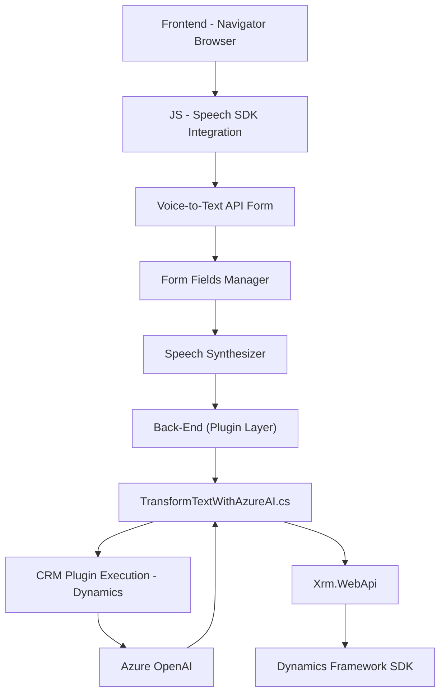

### Breve resumen técnico
El repositorio examinado incluye soluciones para mejorar la experiencia del usuario en aplicaciones Dynamics 365 mediante reconocimiento de voz y generación de texto sintetizado. Se basa en integraciones con servicios de nube como Azure Speech SDK y Azure OpenAI para realizar operaciones avanzadas de procesamiento de voz y texto en tiempo real.

### Descripción de arquitectura
- **Tipo de solución**: Esta es una solución de **backend y frontend integrado**, con componentes que interactúan tanto con formularios web (frontend) como con plugins en Dynamics 365 (backend) mediante APIs y servicios externos.
- **Arquitectura general**: N-capas combinada con principios de **arquitectura orientada a servicios (SOA)** gracias al uso de SDKs de Azure y APIs para delegar procesamiento de voz, reconocimiento y transformación de texto. Los plugins siguen una arquitectura basada en eventos utilizando el modelo de extensibilidad de Dynamics.

#### Componentes principales:
1. **Frontend JS**: Permite procesar formularios y usar reconocimiento de voz para complementar los datos mediante **Azure Speech SDK**. Trabaja mediante interacción directa con la API de Dynamics para actualizar campos.
2. **Backend (Plugins)**: Implementa una lógica transformacional usando servicios como **Azure OpenAI**, configurados con reglas predefinidas para generar contenido JSON que responde a los requisitos del sistema.
3. **Dependencias externas**: Figura servicios de nube (Azure) junto con el ecosistema de Dynamics CRM para extender su funcionalidad.

---

### Tecnologías usadas
1. **Frontend**:
   - **Lenguaje**: JavaScript.
   - **Frameworks/Librerías**:
     - **Azure Speech SDK**: Reconocimiento y síntesis de voz dinámica.
     - Interfaz `Xrm.WebApi` para operaciones con datos de Dynamics CRM.
   - **Patrones**:
     - Modularización lógica mediante funciones separadas por tareas específicas ("Separación de Concerns").
     - **Patrón delegación**: Azure Speech SDK se utiliza para tareas específicas de voz.
     - Uso de asincronía (`async/await`) para operaciones eficientes.

2. **Backend**:
   - **Lenguaje**: C#.
   - **Frameworks/Librerías**:
     - **Dynamics SDK**: Interfaz para interactuar con Contextos CRM.
     - **Azure OpenAI**: Servicios externos para transformar texto.
   - **Patrones**:
     - **Plugin Based Architecture**: Extiende Dynamics mediante eventos de ejecución configurados.
     - Carga dinámica de configuración (reglas predefinidas) para interacción con Azure OpenAI.

3. **Servicios externos**:
   - **Azure Speech SDK**: Para lectura, reconocimiento y transformación de voz en texto.
   - **Azure OpenAI API**: Procesamiento IA del texto con GPT-4 de Azure.

---

### Dependencias presentes
1. **Internas**:
   - Interacción directa con API de Dynamics mediante `Xrm.WebApi`.
   - Integración con formulación CRM para lectura/modificación de atributos.
   - Plugins en C# que usan componentes nativos de Dynamics como `IPlugin`, `IOrganizationService`.

2. **Externas**:
   - **Azure Speech SDK** (`https://aka.ms/csspeech/jsbrowserpackageraw`): Reconocimiento y síntesis de voz.
   - **Azure OpenAI**: API para transformación de texto usando modelos de lenguaje.
   - HTTP client (`System.Net.Http`) para realizar solicitudes externas a plataformas de IA.

---

### Diagrama Mermaid

---

### Conclusión Final
El repositorio presenta una solución bien estructurada que abarca el manejo y procesamiento de datos en formularios dinámicos, complementado por tecnología de reconocimiento de voz y generación inteligente de contenido mediante servicios Azure. La arquitectura combina correctamente **Frontend modular** y un **Backend orientado a eventos**, logrando integraciones extensibles con APIs y SDKs de nube.

Aunque la solución es robusta, depende significativamente de **servicios de nube de Azure**, lo que puede agregar limitaciones en términos de costo y tiempo de respuesta en regiones no optimizadas. Asimismo, la separación de capas entre frontend y backend permite un mantenimiento más sencillo, pero podría beneficiarse de una arquitectura más explícita orientada a hexágonos para gestionar dependencias externas.