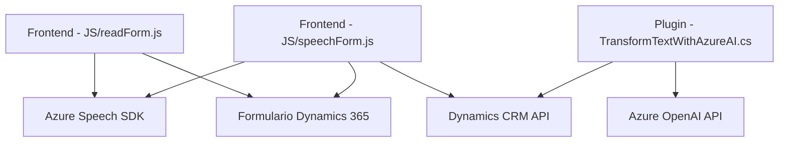

### Breve resumen técnico
Este repositorio define una solución que habilita interacción avanzada basada en voz e inteligencia artificial con formularios de Dynamics 365. La funcionalidad incluye reconocimiento de voz, síntesis de voz, procesamiento IA, y gestión de formularios mediante integración con APIs de Azure (Azure Speech SDK y Azure OpenAI). La arquitectura se centra mayormente en la interacción funcional con servicios externos y en complementos que amplían Dynamics CRM.

---

### Descripción de arquitectura
La arquitectura adopta una **estructura modular** de capas que combina lógica en frontend (funcionalidad de voz en formularios) y lógica extendida en backend mediante plugins. En términos generales:
1. **Frontend**: Código en JavaScript proporciona interacción basada en voz (reconocimiento/síntesis de voz) y procesamiento de datos del formulario.
2. **Plugins**: Extensiones en C# para Dynamics CRM que conectan el contexto del sistema con servicios externos basados en IA (Azure OpenAI).

Aunque no es estrictamente una **arquitectura hexagonal**, el repositorio utiliza servicios externos como puntos clave de integración, lo que refleja características propias de un diseño orientado a servicios.

---

### Tecnologías usadas
1. **Frontend**:
   - **JavaScript**: Lenguaje principal para la interacción con el navegador y la lógica de voz.
   - **Azure Speech SDK**: Reconocimiento y síntesis de voz.
   - **Dynamics 365 Web API**: Interacción directa con formularios de Dynamics (Xrm API).
2. **Backend (Plugins)**:
   - **C#** con librerías estándar (`System.Net.Http`, `Microsoft.Xrm.Sdk`).
   - **Azure OpenAI**: Transformación avanzada de texto usando AI.
   - **Newtonsoft.Json.Linq**: Manejo de datos JSON.
3. **Servicios externos**:
   - **Azure Speech SDK**: Reconocimiento y síntesis de voz.
   - **Azure AI API**: Inteligencia artificial para procesamiento de texto y datos.

---

### Diagrama Mermaid válido para GitHub

---

### Conclusión final
El repositorio implementa una solución integrada para habilitar interacción por voz e inteligencia artificial con formularios en Dynamics 365. Utiliza una arquitectura modular con fuerte dependencia de servicios externos de Azure (Speech SDK y OpenAI). El enfoque sigue una estructura ligera orientada a servicios y presenta un diseño adecuado para sistemas que necesitan complementar la funcionalidad base con inteligencia artificial y capacidades avanzadas de voz.