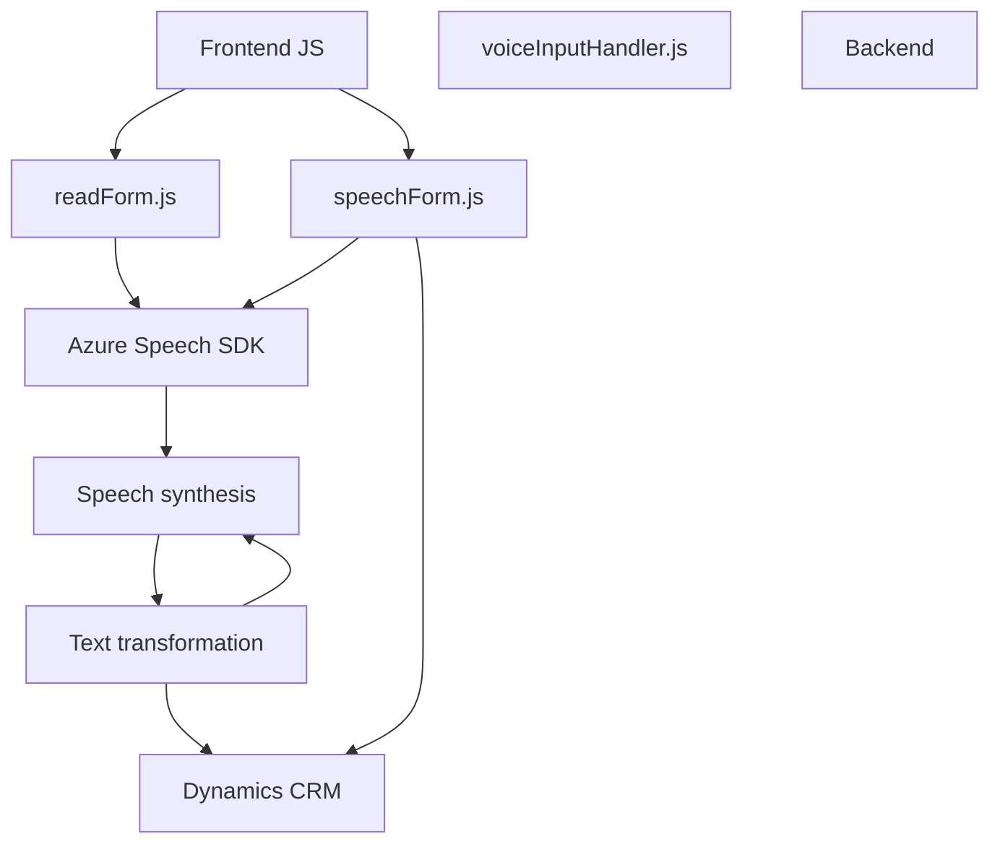

### Breve Resumen Técnico

El repositorio parece estar orientado a un proyecto integrado con Microsoft Dynamics CRM, enfocado en mejorar la interacción usuario-sistema mediante tecnologías de inteligencia artificial. Los scripts `readForm.js` y `speechForm.js` implementan funcionalidades asociadas a voz (entrada y salida), mientras que el plugin `TransformTextWithAzureAI.cs` realiza transformaciones de texto mediante servicios Azure OpenAI. La solución emplea múltiples dependencias externas y patrones comunes de integración.

---

### Descripción de Arquitectura

La arquitectura detectada combina un enfoque **n-capas** con elementos que bordean una **arquitectura hexagonal** o de **puerto-ayuda** debido a la interacción intensiva del sistema con servicios externos (Azure Speech SDK, Azure OpenAI). El frontend implementa patrones de capas donde cada módulo tiene roles específicos: interacción con el usuario (reconocimiento de voz, síntesis de voz) y procesamiento de datos (formato y validación). El backend con el plugin se organiza en torno a eventos (patrón de plugins propio de Dynamics CRM) y funciones que responden a solicitudes del sistema CRM mediante integración con servicios externos.

---

### Tecnologías Usadas

1. **Frontend**:
   - **JavaScript**: Programación de funcionalidades para reconocimiento y síntesis de voz.
   - **Azure Speech SDK**: Text-to-speech (TTS) y reconocimiento de habla usando servicios de Azure.
   - **Microsoft Dynamics CRM**: Contextos del formulario (`executionContext`, `formContext`).

2. **Backend**:
   - **C# (.NET)**: Desarrollo del plugin para Dynamics CRM.
   - **Azure OpenAI Service**: Transformación de texto con modelos de IA como GPT-4.
   - **Microsoft.Xrm.Sdk**: API para Dynamics CRM.
   - **Newtonsoft.Json y System.Text.Json**: Manejo de datos en formato JSON.
   - **System.Net.Http**: Para la comunicación HTTP con el endpoint de Azure OpenAI.

3. **Servicios Externos**:
   - "Azure Speech SDK".
   - "Azure OpenAI API".

4. **Patrones Arquitectónicos**:
   - **Cargador Dinámico**: SDK cargado en tiempo de ejecución.
   - **Patrón de plugins**: Integración con eventos personalizados en Dynamics.
   - **Orientación hacia eventos**: Ejecución a partir de triggers (inicio de grabación, reconocimiento de voz).
   - **Separación de responsabilidades**: Funciones que encapsulan tareas específicas.

---

### Diagrama Mermaid Válido para GitHub

---

### Conclusión Final

La solución incluye tanto frontend como backend y se centra en la interacción basada en voz con formularios y el procesamiento de texto mediante IA en Dynamics CRM. Su arquitectura es principalmente una **n-capas**, con elementos de **hexagonal** en la dependencia directa hacia servicios de Azure. Utiliza tecnologías punteras como Azure Speech SDK y Azure OpenAI API para facilitar una experiencia interactiva avanzada y enriquecida con inteligencia artificial. El diseño es modular, con un claro enfoque en la separación de responsabilidades y la reutilización de componentes.