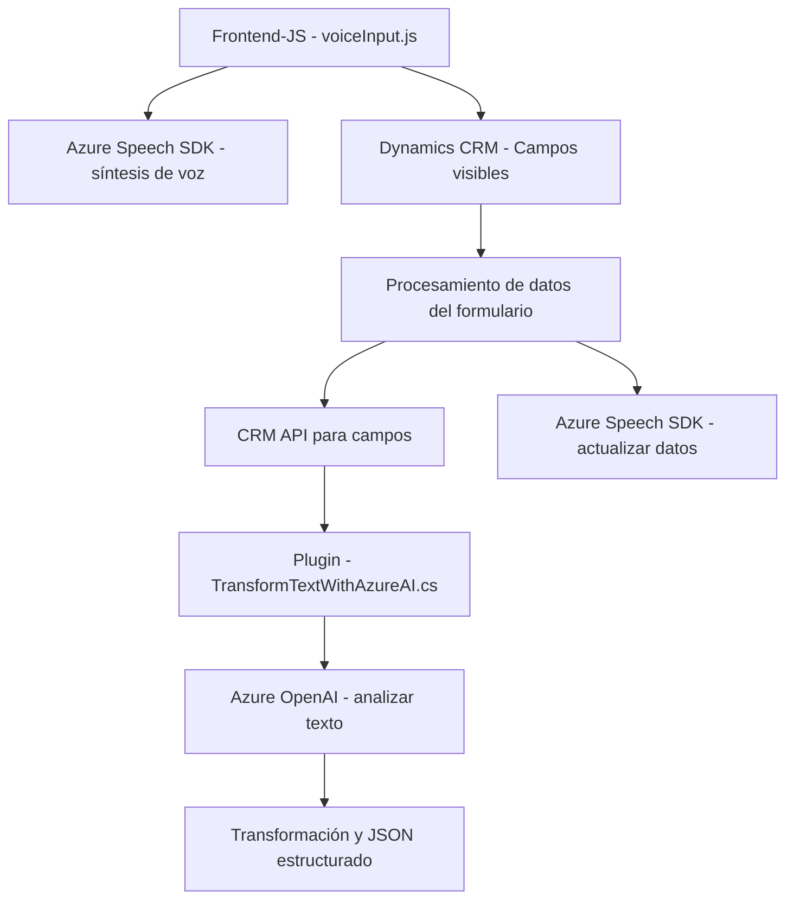

### Breve resumen técnico:
El repositorio contiene tres archivos principales que indican una solución mixta de integración entre formularios dinámicos de CRM y servicios cognitivos de Azure. Las tecnologías implementadas incluyen **Azure Speech SDK**, **Dynamics CRM SDK**, y **Azure AI/OpenAI**.

### Descripción de arquitectura:
1. **Arquitectura global**:
   - Utilizando una **arquitectura basada en n-capas**, donde el código en los archivos `voiceInput.js` y `speechInputProcessor.js` actúan como capa de presentación/interfaz que interactúa directamente con Dynamics CRM en el frontend, y el archivo `TransformTextWithAzureAI.cs` como la capa backend manejando procesamiento avanzado de texto.
   - Hay una **integración externa extensiva** con servicios Azure Speech SDK y OpenAI mediante entretenimiento de APIs.

2. **Componentes clave de la arquitectura**:
   - **Frontend contextual**: Interacción directa con los formularios dinámicos de Dynamics CRM, actualizando datos de formularios contextuales con funcionalidades como síntesis y reconocimiento de voz.
   - **Azure API**: Manejo por SDK (Speech y OpenAI) para tareas de voz (síntesis y reconocimiento) y manipulación de textos con inteligencia artificial.
   - **Backend extensible (plugins)**: Uso de patrones de extensibilidad propios de Dynamics CRM mediante un plugin basado en C# que interactúa con servicios externos como Azure OpenAI.

### Tecnologías usadas:
1. **Frontend**:
   - **JavaScript** para manejo de formularios y lógica de presentación.
   - **Azure Speech SDK** para implementar síntesis de voz y reconocimiento de audio.

2. **Backend**:
   - **C#** para implementar plugins de Dynamics CRM.
   - **Azure OpenAI API** para transformar contenido textual usando reglas específicas.
   - **Newtonsoft.Json** y **System.Net.Http** para serialización JSON y solicitudes HTTP.

3. **Plataformas y frameworks**:
   - **Microsoft Dynamics CRM/Dataverse** como base para formularios y extensibilidad.
   - **Azure Cognitive Services** para tareas de procesamiento inteligente.

4. **Patrones de diseño**:
   - **Modularidad**: Código dividido en módulos pequeños y reutilizables con funciones específicas.
   - **Callback Pattern**: Para cargar dependencias externas como Azure Speech SDK en el frontend.
   - **Plugin Pattern**: Dynamics CRM usa plugins (`TransformTextWithAzureAI.cs`) que ejecutan lógica personalizada en eventos específicos.

### Diagrama Mermaid:

### Conclusión final:
La solución es una arquitectura híbrida que combina tecnologías de **inteligencia artificial** (Azure OpenAI, Speech SDK) con funcionalidades de **gestión de datos dinámica en Microsoft Dynamics CRM**. Utiliza una estructura **n-capas**, donde el frontend administra la interfaz y datos dinámicos de los formularios, y el backend maneja el procesamiento extendido con un enfoque de integración API. Hay posibilidades de mejora en cuanto a la robustez del manejo de excepciones y seguridad para los valores sensibles. Ideal para escenarios en los que se necesite una interacción avanzada entre voz, texto, y estructuras de CRM.