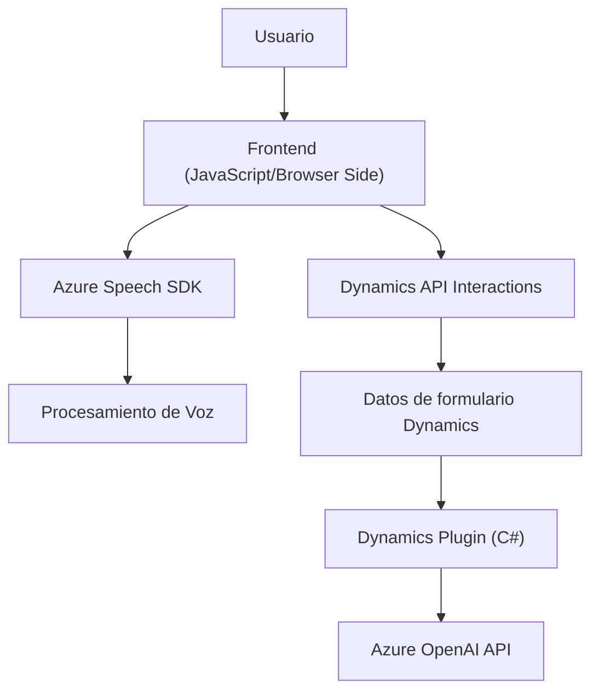

### Breve resumen técnico

El repositorio contiene tres archivos principales: dos están centrados en la implementación de funcionalidades relacionadas con el uso de APIs de Azure Cognitive Services para procesamiento de voz y formulación de texto con IA en formularios Dynamics 365 (en JavaScript), y uno es un plugin de Dynamics CRM desarrollado en C# que integrará la API de Azure OpenAI para transformar texto ingresado en JSON estructurados. Hay fuerte integración con servicios externos de Microsoft Azure y parece estar diseñado para extender la funcionalidad de Dynamics 365 utilizando tanto cliente (frontend con APIs) como servidor.

---

### Descripción de arquitectura

1. **Tipo de solución**:  
   La solución es una integración híbrida que combina procesamiento de datos en el cliente y un backend extendido mediante plugins de Dynamics CRM.  
   - Módulos:
     - *Client-side (Frontend)*: Procesa entradas de datos en formularios interactivos mientras interactúa con APIs externas (Speech SDK y API personalizadas).
     - *Server-side (Plugin)*: Escucha eventos de Dynamics CRM y utiliza la API de Azure OpenAI para transformar texto hacia un formato estructurado.

2. **Arquitectura**:  
   Es una arquitectura **n-capas** donde:
   - La capa de presentación es representada por los archivos JavaScript.
   - La capa de lógica de negocio se apoya en la integración con Dynamics CRM y los plugins extendidos.
   - La capa de servicios/infraestructura está formada principalmente por las APIs externas: Azure Speech SDK y Azure OpenAI.

3. **Patrones de diseño**:
   - **Modularidad** para organizar funciones específicas en JavaScript.
   - **Dependency Injection** en Dynamics CRM plugins: `IPluginExecutionContext` y `IOrganizationService` son utilizados para desacoplar dependencias.
   - **Integration pattern**: Conexión de servicios externos (Azure).

---

### Tecnologías usadas

- **Frontend (JavaScript)**:  
  - *Azure Cognitive Services Speech SDK*: Para realizar reconocimiento y síntesis de voz.  
  - *Dynamics 365 Web API*: Interacción y actualización de formularios y campos dinámicos.  

- **Backend (C#)**:  
  - *Microsoft Dynamics CRM SDK*: Interfaz para implementar plugins en Dynamics CRM.  
  - *Azure OpenAI GPT*: Para transformar texto según normas específicas.  
  - *ASP.NET / .NET Framework*: Basado en Dynamics SDK.  
  - *Newtonsoft.Json*: Manipulación y procesamiento de estructura JSON.  
  - *System.Net.Http*: Envío de solicitudes HTTP para integrar con endpoints externos.  

---

### Dependencias o componentes externos

- **Azure Speech Cognitive Services**:
  - SDK para síntesis de voz y reconocimiento de audio.
  - Comunicación mediante clave de licencia (`azureKey`) y región (`azureRegion`).  
- **Azure OpenAI API**: 
  - Usada por el plugin de Dynamics CRM para transformar texto.  
- **Dynamics CRM SDK**: 
  - Para manipulaciones directas de los datos dentro de formularios y entidades del CRM.  
- **Custom Dynamics APIs**: 
  - Utilizadas por las funciones de JavaScript, como la API personalizada `callCustomApi` definida en `speechForm.js`.

---

### Diagrama Mermaid

---

### Conclusión final

Esta solución plantea un sistema extendido de Dynamics 365 enfocado en la integración con servicios avanzados de IA y procesamiento cognitivo, como Azure Speech SDK y Azure OpenAI. La arquitectura utiliza una estrategia **n-capas**, donde los formularios actúan como la capa de presentación, los plugins y APIs personalizadas se encargan de la lógica de negocio, mientras que los servicios de Azure complementan mediante procesamiento externo.

Puntos fuertes:  
- Modularidad en el cliente.
- Uso potente de APIs de reconocimiento de voz y transformación de texto para enriquecer la experiencia dinámica en CRM.  

Áreas de mejora:  
- Robustez de manejo de excepciones en conexiones con APIs externas.  
- Gestión de claves de acceso a servicios externos podría optimizarse aplicando mejores prácticas de seguridad.

