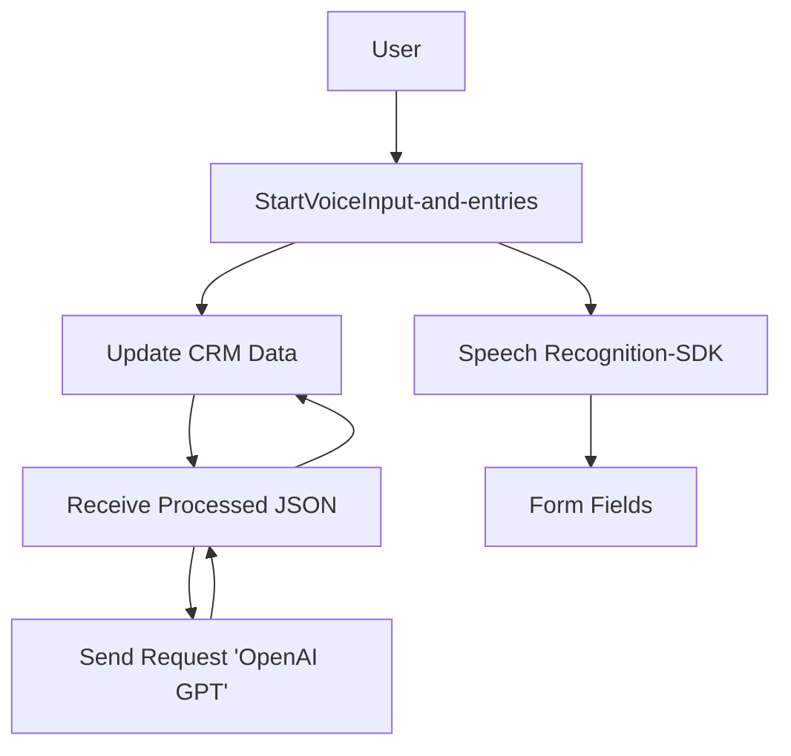

# Breve resumen técnico
El repositorio alojado en GitHub parece implementar una solución híbrida que incluye un frontend basado en JavaScript, que utiliza el **Azure Speech SDK** para interacción por voz, junto con un plugin desarrollado para **Dynamics 365** en C#. El código del frontend facilita la entrada mediante voz y la integración con Dynamics 365. Por otro lado, el plugin en C# utiliza Azure OpenAI para transformar texto en un formato estructurado JSON, lo que amplía las capacidades de interacción en el sistema CRM.

---

# Descripción de arquitectura
La arquitectura del sistema presenta una combinación híbrida:
- **Moderadamente distribuida**, ya que involucra un front-end basado en un navegador, un backend (plugin) dentro de Dynamics 365, y servicios externos como **Azure Speech SDK** y **Azure OpenAI**.
- El frontend parece ser diseñado bajo una arquitectura **modular basada en servicios**, donde funciones individuales encapsulan tareas específicas.
- El servicio de Dynamics CRM utiliza un patrón **SOA (Service-Oriented Architecture)** y el patrón **Plugin Design** para interactuar con las API de servicios externos como Azure OpenAI.

El conjunto no llega a ser completamente **microservicios**, ya que falta independencia entre las diferentes piezas del sistema y depende del ecosistema de Dynamics 365.

---

# Tecnologías usadas
1. **Frontend**:
   - Lenguaje: JavaScript.
   - Framework: Microsoft Dynamics 365 (frontend).
   - Azure Speech SDK: Para la síntesis y reconocimiento de voz.
   - API de Dynamics 365 (`Xrm.WebApi.online.execute`): Para la manipulación de formularios.

2. **Backend**:
   - Lenguaje: C#.
   - Framework: Microsoft Dynamics CRM SDK.
   - Azure OpenAI (GPT): Para procesamiento de texto avanzado y generación de JSON estructurado.

3. **Otros patrones**:
   - Modularidad: Con funciones bien definidas en los archivos de JavaScript.
   - Event-driven: El reconocimiento de voz y las ejecuciones dentro de Dynamics se activan mediante eventos, como el cambio de contexto del usuario.
   - Facade: Uso de funciones intermedias para facilitar el procesamiento dinámico de campos y mapeos en los formularios.

---

# Dependencias o componentes externos
El sistema tiene las siguientes dependencias clave:
1. **Azure Speech SDK**:
   - Para la entrada de voz (frontend) y síntesis de texto.
   - Cargado dinámicamente desde el CDN: `https://aka.ms/csspeech/jsbrowserpackageraw`.

2. **Dynamics 365**:
   - API: Manipulación de formularios y acceso a datos mediante `Xrm.WebApi.online.execute`.

3. **Azure OpenAI**:
   - Modelo GPT (vía API endpoint).
   - Para procesamiento de texto, transformaciones, y generación de JSON estructurados.

4. **Librerías estándar en C#**:
   - Manipulación básica de datos (`System.Linq`, `System.Text.Json`).
   - Integración de API externas (`System.Net.Http`).

---

# Diagrama Mermaid
El siguiente diagrama muestra la interacción entre los componentes del sistema y servicios externos.

---

# Conclusión final
### Tipo de solución:
El repositorio implementa una **solución híbrida** que conecta un frontend interactivo con voz, un backend dentro de Dynamics CRM, y servicios externos (Speech SDK y Azure OpenAI). Está orientada a mejorar la experiencia del usuario en formularios mediante entrada de voz y capacidades avanzadas de procesamiento de texto.

### Arquitectura:
La arquitectura global del sistema no es completamente descentralizada. Es probablemente un sistema **de capas**, con distribución en dos módulos principales: **frontend** y **plugin backend**. Utilizan servicios externos para extender sus capacidades, pero mantienen su núcleo operativo dentro del ecosistema Dynamics 365.

### Mejora potencial:
1. Desacoplar y abstraer más las funcionalidades del plugin backend para permitir extensibilidad hacia otros módulos o servicios.
2. Optimizar el manejo de configuraciones de SDK y credenciales. Usar métodos seguros por ejemplo con variables de entorno en lugar de tener valores hardcoded.
3. Escalar el frontend más allá del ecosistema Dynamics 365 mediante APIs independientes para entrada y procesamiento de voz.