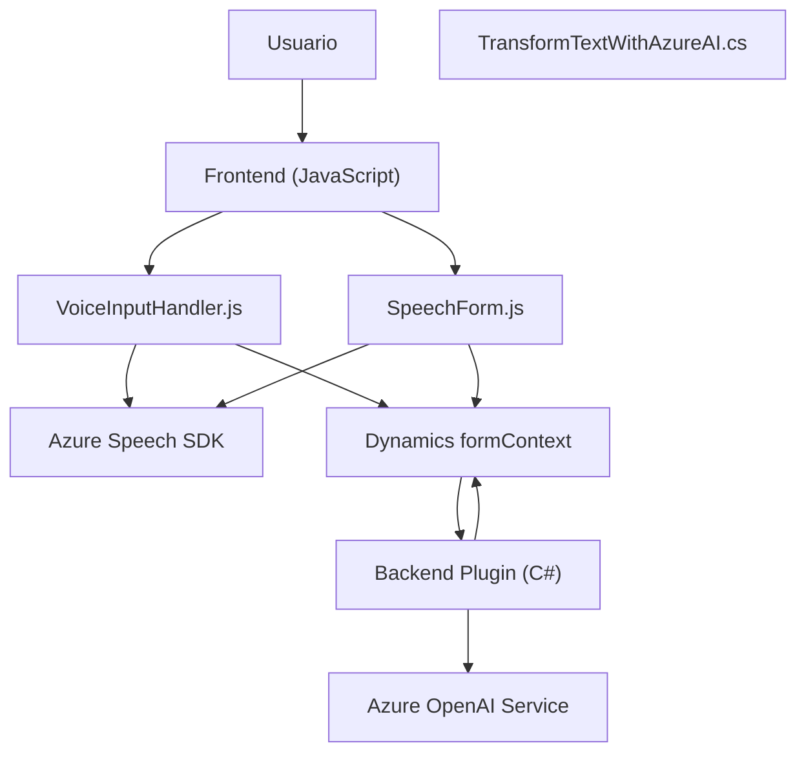

### Breve resumen técnico:

Este repositorio parece ser parte de una suite integrada que ofrece capacidades de entrada y salida de voz, complementadas con inteligencia artificial, aplicada en un contexto empresarial de **Dynamics CRM**. Sus funcionalidades están divididas en tres áreas principales:

1. **Frontend:** Un módulo para lectura y procesamiento de formularios dinámicos utilizando voz (integración con Azure Speech SDK).
2. **Voice Interaction:** Reconocimiento y transcripción de voz con Azure Speech SDK, transformación de texto a datos de formulario, y tratamiento automático o mediante una API personalizada.
3. **Backend Plugin:** Un plugin de Dynamics CRM (C#) que invoca servicios de Azure OpenAI para transformar texto en un objeto JSON estructurado.

---

### Descripción de arquitectura:

La solución parece utilizar una **arquitectura híbrida**, compuesta de las siguientes capas:

1. **Frontend:** Un sistema modular basado en eventos diseñado para manipular formularios y realizar síntesis de voz. Aunque no usa un framework web explícito (como React o Angular), usa JavaScript y DOM API directamente.
   
2. **Plugin Backend:** En Microsoft Dynamics CRM, los "Plugins" representan extensiones del modelo, ejecutándose en combinación con eventos del sistema. Este plugin actúa como un mediador entre Dynamics CRM y Azure OpenAI.

3. **Servicios Externos:**
   - **Azure Speech SDK:** Proporciona soporte para síntesis y reconocimiento de voz.
   - **Azure OpenAI:** Procesa texto y lo transforma en JSON estructurado usando IA.

La arquitectura puede clasificarse como **event-driven** con orientaciones hacia **integración desacoplada** mediante servicios externos. A nivel macro, tiene rasgos de una **n-capas (frontend y backend)**.

---

### Tecnologías y patrones usados:

#### **Tecnologías**
1. **Frontend:**
   - JavaScript para lógica del cliente.
   - Azure SDK para síntesis y reconocimiento de voz en navegadores.
   - Dynamics CRM JavaScript APIs (`executionContext` y `Xrm`).

2. **Backend:**
   - C# para implementar un Dynamics CRM Plugin (`IPlugin`).
   - Dynamics CRM SDK (para el contexto y ejecución controlada por eventos).
   - Azure OpenAI para inteligencia artificial.

#### **Patrones**
1. **Event-driven architecture:** Callbacks y eventos en el frontend (carga dinámica del SDK, respuesta de entrada de voz) y backend (acciones desencadenadas por cambios o eventos en Dynamics CRM).
2. **Modularization:** Código organizado en funciones independientes con responsabilidad única.
3. **Dependency injection pattern** (en el backend): Uso de `IServiceProvider` para desacoplar dependencias en el plugin.
4. **External service integration:** Uso de SDK y APIs para la síntesis y el procesamiento de voz (Azure Speech SDK, Azure OpenAI).

---

### Dependencias y componentes externos:

1. **Azure Speech SDK (frontend):**
   - Biblioteca de voz que habilita la síntesis y reconocimiento. Cargada dinámicamente desde `https://aka.ms/csspeech/jsbrowserpackageraw`.

2. **Dynamics SDK (frontend/backend):**
   - `executionContext`, `formContext`, `Xrm.WebApi` para manipulación y API HTTP desde CRM.

3. **Azure OpenAI Service (backend):**
   - Comunicación a través de HTTP para transformar texto en JSON según directrices.

4. **Common libraries for serialization:**
   - `System.Text.Json` y `Newtonsoft.Json` para la manipulación de datos JSON.

---

### Diagrama **Mermaid**:

A continuación, presentamos un diagrama que describe los principales componentes y flujos de la solución:

---

### Conclusión final:

Este sistema proporciona una solución altamente integrada para mejorar la usabilidad de formularios en Microsoft Dynamics CRM mediante entrada de voz y procesamiento con inteligencia artificial. Utiliza un enfoque **modular, conectado a servicios externos** y actividades definidas por parámetros del contexto de CRM.

**Fortalezas:**
- Uso eficiente de tecnologías modernas como Azure Speech SDK y OpenAI Service para funciones innovadoras de voz e IA.
- Modularidad y separación clara de responsabilidades en el código frontend.
- Uso del plugin de Dynamics CRM para extender capacidades directamente en el flujo de trabajo del sistema CRM.

**Aspectos a mejorar:**
- Uso de Javascript sin frameworks modernos como React puede perjudicar la mantenibilidad a gran escala.
- Detalles de seguridad y operaciones (gestión de claves API, tiempos de respuesta de APIs externas) no están claros y deben ser robustecidos.

En términos generales, la solución implementa una comunicación dinámica entre los usuarios y Dynamics CRM con soporte de servicios de voz, texto y AI, aunque dependerá de la correcta configuración de los servicios externos en un entorno seguro y bien administrado.