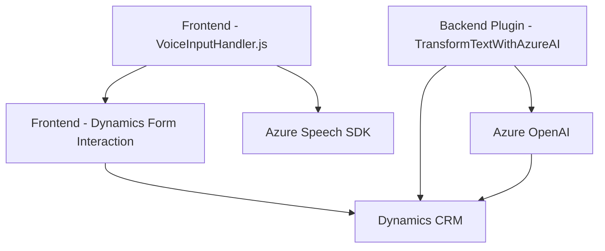

## Breve resumen técnico:

El repositorio describe una solución que integra formularios web en Dynamics 365 con funcionalidades avanzadas de interacción de voz utilizando Azure Speech SDK y Azure OpenAI. Los archivos contienen fragmentos de código que califican a esta solución como una combinación de servicios frontend (gestión de formularios y entrada de voz), un plugin backend (integración con Dynamics CRM), y dependencias externas (Azure Speech y OpenAI).

---

## Descripción de arquitectura:

1. **Tipo de solución**:
   - Principalmente orientada a **frontend y API/backend para Dynamics CRM**.
   - Permite entrada y salida auditiva (voz a texto, texto a voz) en formularios de Dynamics.
   - Extensión del sistema implementada como plugins de Dynamics CRM.

2. **Arquitectura**:
   - **Multicapa (n capas)**:
     - Frontend: Código JavaScript para interacción y procesamiento de formularios.
     - Backend: Plugins para comunicación con Dynamics CRM y servicios de API.
     - Servicios externos: Azure Speech SDK y Azure OpenAI manejan el procesamiento avanzado.
   - **Integración monolítica con Dynamics CRM**:
     - Usa el paradigma de desarrollo de plugins basado en la interfaz `IPlugin`.

---

## Tecnologías, Frameworks y Patrones:

1. **Frontend**:
   - **Technología**: JavaScript.
   - **Frameworks/Servicios**:
     - Azure Speech SDK.
     - Dynamics CRM API (`Xrm.WebApi`).
   - **Patrones**:
     - Modularidad mediante funciones independientes.
     - Comunicación asincrónica mediante funciones tipo callback (`ensureSpeechSDKLoaded`).
     - Manejo directo del DOM y contexto de Dynamics CRM.

2. **Backend**:
   - **Technologías**:
     - `.NET Framework` utilizando `Microsoft.Xrm.Sdk`.
     - Azure OpenAI (servicios GPT para procesamiento de texto).
   - **Frameworks/Servicios**:
     - Dynamics CRM SDK.
     - Azure OpenAI.
   - **Patrones**:
     - **Plugin Pattern** para extender funcionalidad de Dynamics.
     - **Adapter** y **Facade** para encapsular lógica de comunicación externa (Azure OpenAI).
     - Dependency Injection (`IServiceProvider`).

---

## Dependencias externas:

- **Azure Speech SDK**:
  - Procesamiento de voz (reconocimiento y síntesis).
  - Clave y región configuradas dentro del código (`azureKey`, `azureRegion`).

- **Azure OpenAI**:
  - Textos inteligentes basados en GPT.
  - API Key para integración con servicios de Azure.

- **Dynamics CRM API**:
  - Manipulación de formularios en contexto `Xrm.WebApi`.

---

## Diagrama Mermaid válido para GitHub:

---

## Conclusión final:

La solución ejemplifica una integración avanzada que une formularios de Dynamics CRM con servicios cognitivos de Azure, creando una experiencia interactiva de voz dentro de un ecosistema empresarial. La arquitectura se distingue por su robusto manejo modular en frontend y la extensibilidad provista por los plugins backend, mientras que las dependencias externas añaden potencia y escalabilidad a la aplicación. Es especialmente adecuada para entornos empresariales que requieren accesibilidad y automatización basada en IA.