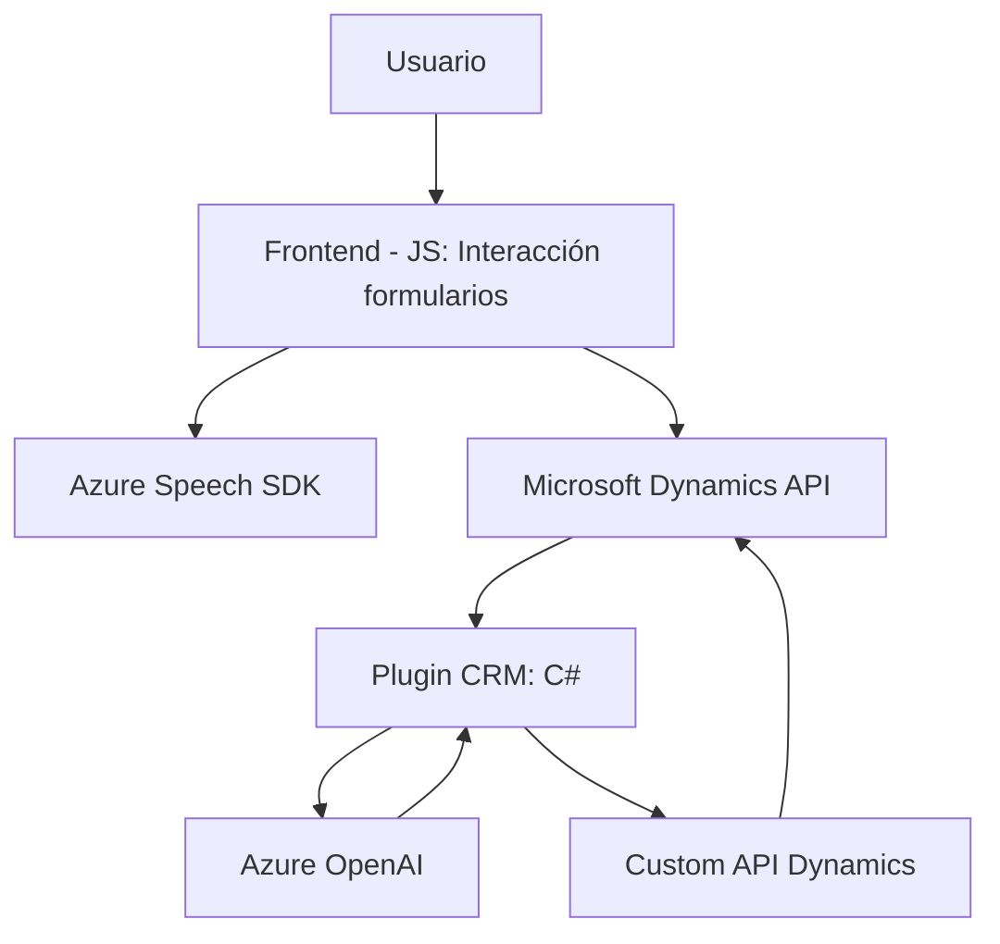

### Resumen técnico
El repositorio analizado implementa una solución técnica que combina módulos de **frontend** (JavaScript) y complementos de **backend** (C#) para extender las funcionalidades de Dynamics CRM mediante el uso de servicios en la nube como **Azure Speech SDK** y **Azure OpenAI**. Está diseñada para la interacción entre usuarios (voz/forma escrita) y formularios, con apoyo en inteligencia artificial.

---

### Descripción de arquitectura
La solución utiliza una arquitectura **n-capas** que incluye:
1. **Capa de presentación (frontend)**: Implementada en JavaScript, manejando la interface de usuario mediante formularios.
2. **Capa de integración/APIs**: Enlaza el frontend con servicios de Azure Speech además de discutir dinámicamente con APIs personalizadas de Dynamics CRM y OpenAI.
3. **Capa de lógica de negocio (Plugins)**: Procesa datos de entrada y ejecuta transformaciones avanzadas usando Azure OpenAI en el contexto del modelo de objetos de Dynamics CRM.

Esta solución muestra independencia en cada módulo, lo cual refleja modularidad en la implementación, pero sigue siendo de naturaleza **monolítica**, ya que todas las integraciones ocurren dentro del mismo entorno sistémico de Dynamics 365.

---

### Tecnologías utilizadas
#### Frontend:
1. **JavaScript**: Principal lenguaje de desarrollo.
2. **Azure Speech SDK**: Para reconocimiento de voz y síntesis de texto a audio.

#### Backend:
1. **C#**: Para implementar plugins en Dynamics CRM.
2. **Microsoft Dynamics SDKs**: Para manipulación de contexto y datos del CRM.
3. **Azure Speech SDK y Azure OpenAI**: Servicios en la nube para síntesis de voz y generación de texto estructurado por IA.
4. **REST APIs**: Integración con servicios de Azure y APIs personalizadas.
5. **HttpClient**: Realización de solicitudes HTTP desde C# plugins.
6. **System.Text.Json**: Procesamiento del JSON para comunicación con Azure.

#### Patrones empleados:
1. **Modularidad**: Separación de funcionalidades en funciones específicas del frontend y en métodos del plugin del backend.
2. **Cargador dinámico**: Para la carga del Azure Speech SDK desde el frontend.
3. **Programación orientada a eventos**: Implementación basada en eventos de interfaz (formularios, activadores).
4. **Integración API**: Comunicación con servicios externos y APIs internas de Dynamics CRM.

---

### Diagrama Mermaid

---

### Conclusión Final
La solución corresponde a una arquitectura **n-capas integrada en Dynamics CRM** que utiliza **Azure Speech** y **Azure OpenAI** para proporcionar una mejor interacción con formularios mediante voz y procesamiento de texto por IA. Tiene una estructura modular coherente, pero vinculada al entorno de Dynamics CRM como un sistema monolítico. 

Destaca por combinar capacidades de frontend y backend con servicios en la nube para aumentar la productividad en la gestión de datos y fomentar la automatización inteligente de procesos dentro del CRM. Sin embargo, al ser dependiente del sistema de Dynamics y Azure, es importante considerar la resiliencia a fallos externos en servicios en la nube.