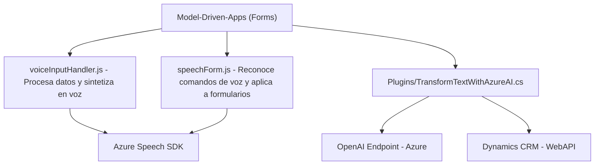

### Breve Resumen Técnico:
El repositorio está diseñado para extender funcionalidades de **Dynamics CRM** y sus formularios mediante la integración de servicios de **Azure AI**, como el **Azure Speech SDK** para reconocimiento de voz y síntesis, y **Azure OpenAI** para procesamiento de texto avanzado. La solución combina módulos JavaScript para el frontend de Dynamics y un plugin en C# (.NET Framework) para operaciones server-side integradas directamente con Dynamics CRM.

---

### Descripción de Arquitectura:
1. **Tipo de Solución**:  
   Sistema híbrido con múltiples capas. La solución integra:
   - **Frontend**: JavaScript para extender las capacidades de formularios en Dynamics CRM.
   - **Backend Plugin**: Plugin en C# diseñado para ejecutarse en el contexto de Dynamics CRM.
   - **Servicios Externos**: Azure AI (Speech SDK para reconocimiento/síntesis de voz y OpenAI para procesamiento de texto).

2. **Arquitectura**:  
   - **Multicapa con integración de servicios**:
      - Frontend: Interfaz del usuario (Model-Driven Apps) dentro de Dynamics.
      - Backend: Plugins (C#) para lógica de negocio y conexión con servicios externos.
      - Azure Cloud: Comunicación con servicios como Speech SDK y OpenAI mediante APIs REST.
   - Uso de servicios externalizados (Azure), lo que permite una arquitectura orientada a microservicios o basada en capacidades.

---

### Tecnologías Usadas:
1. **Frontend**:  
   - **JavaScript**: Usado para lógica en el lado cliente e integración con Dynamics.
   - **Azure Speech SDK**: Para carga dinámica del script y procesamiento de voz.
   - **Promise API**: Para el manejo de operaciones asincrónicas.
   - **HTML DOM API** (Web standard) para cargar scripts y manejar eventos de usuario.

2. **Backend Plugin**:  
   - **C#**: Lenguaje principal de desarrollo.
   - **Microsoft.Xrm.Sdk**: Para interacción con servicios y contexto de Dynamics CRM.
   - **System.Net.Http**: Para realizar peticiones a APIs de Azure.
   - **Newtonsoft.Json LINQ**: Manejo de JSON dinámico.
   - **Azure OpenAI API**: Para transformar texto.

3. **Cloud Services**:  
   Integración directa con:
   - **Azure Speech Service SDK**: Para síntesis y reconocimiento de voz.
   - **Azure OpenAI**: Para procesamiento de texto y generación de JSON estructurado.

---

### Dependencias y Componentes Externos:
1. **Azure Speech Service SDK**: Mediante carga dinámica del script desde el paquete oficial de Microsoft (`https://aka.ms/csspeech/jsbrowserpackageraw`).
2. **Azure OpenAI API**: Interactúa mediante HTTP POST con configuraciones específicas (clave de API, región y normas).
3. CRM APIs y servicios:
   - `Xrm.WebApi` para consultas y manipulación.
   - Plugins y extensiones propias.
4. **Libraries**:
   - **Newtonsoft.Json** y **System.Text.Json** para manipulación de datos JSON.
   - **Regex** para validación o transformación textual.

---

### Diagrama Mermaid

---

### Conclusión Final:
La solución presentada corresponde a una arquitectura híbrida basada en capas, que combina un **frontend interactivo (JavaScript)** en formularios de CRM con un **backend plugin** (C#) que opera en el contexto del servidor. El soporte de servicios externos como Azure Speech SDK y OpenAI añade capacidades avanzadas de IA para reconocimiento y síntesis de voz, además de generación de estructuras de datos transformadas. La arquitectura es modular, extensible e implementa patrones como modularización, integración de servicios, Factory para configuraciones dinámicas, y DTO para estructuración de datos.