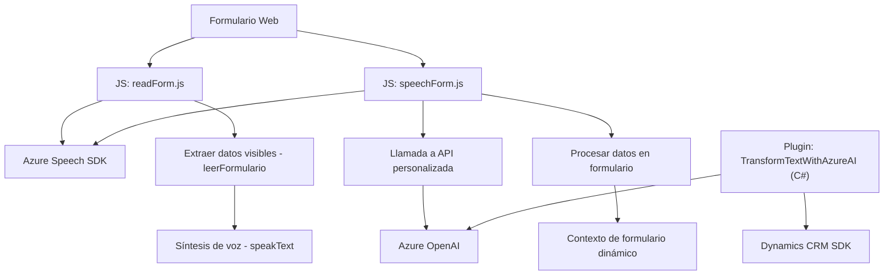

### Breve resumen técnico:

El repositorio contiene tres componentes principales:
1. **Archivos de frontend** en JavaScript (`readForm.js` y `speechForm.js`) que interactúan con el DOM y servicios como Azure Speech SDK para lectura y procesamiento de datos mediante comandos de voz.
2. **Backend Plugin para Microsoft Dynamics CRM** (`TransformTextWithAzureAI.cs`), que utiliza Azure OpenAI para transformar texto en JSON estructurado a través de reglas predefinidas.
3. **Dependencia significativa** de APIs externas ofrecidas por Azure, integrando inteligencia artificial y síntesis/entendimiento de voz.

---

### Descripción de arquitectura:

1. **Tipo de Solución:** Respuesta centrada en un sistema de **integración frontend-aplicación CRM** junto con servicios externos de **Azure AI**. 
2. **Patrones de desarrollo:**
   - **Frontend:** Modular, con funciones reutilizables para tareas de lectura del DOM, síntesis de voz, mapeo de etiquetas y atributos.
   - **Backend Plugin:** Implementación de Plugin para eventos de Microsoft Dynamics CRM. Integra servicios mediante REST APIs y aplica el patrón de Invocación Remota (Remote Procedure Invocation) para conectarse a **Azure OpenAI**.
   - **External Service Integration:** Conexión directa desde el frontend y el plugin al servicio de Azure Speech SDK y OpenAI.
3. **Arquitectura global:** Este sistema tiene una arquitectura **modular y extensible**, que conecta diferentes capas:
   - **Frontend:** Interfaz web interactiva que extiende funcionalidad mediante voz.
   - **Backend Plugin:** Desarrollado para extender CRM con inteligencia artificial.

---

### Tecnologías y Frameworks usados:

1. **Frontend:**
   - **JavaScript:** Para manipulación del DOM y llamadas al Speech SDK.
   - **Azure Speech SDK:** SDK usado para reconocimiento y síntesis de voz.
2. **Backend Plugin:**
   - **Microsoft Dynamics CRM SDK:** Para gestión de eventos del sistema CRM y lógica de negocio.
   - **Azure OpenAI:** Llamadas REST para procesar texto con GPT-4.
   - **.NET Framework:** Implementación en C# mediante clases del SDK de Dynamics y bibliotecas como `System.Net.Http`.
   - **JSON Serialization:** Usando bibliotecas nativas como `System.Text.Json` o redundantes como `Newtonsoft.Json`.

---

### Dependencias o componentes externos:

1. **Azure Speech SDK:** Permite síntesis y reconocimiento de voz.
2. **Azure OpenAI Services (GPT-4):** Procesa texto según reglas predefinidas y genera JSON estructurado.
3. **Microsoft Dynamics CRM SDK:** Extensiones específicas para integración con el CRM.
4. **Browser APIs:** Acceso al micrófono y carga dinámica de scripts en el frontend.

---

### Diagrama Mermaid (100 % compatible con GitHub Markdown):

---

### Conclusión Final:

Esta solución está diseñada para ampliar la capacidad de aplicaciones basadas en Microsoft Dynamics CRM mediante **voz e inteligencia artificial** utilizando servicios Azure. Posee una arquitectura **modular** y **event-driven**, con integración fluida entre frontend, backend y servicios externos. Se destacan las siguientes características:
- Aprovecha servicios SaaS de Azure para síntesis, transcripción y procesamiento de texto.
- Sigue principios de modularidad y desacoplamiento mediante funciones reutilizables en el frontend y métodos bien estructurados en el backend.
- Es extensible para incorporar nuevos eventos, reglas o servicios. Ideal para entornos como CRM o RPA (automatización de procesos).