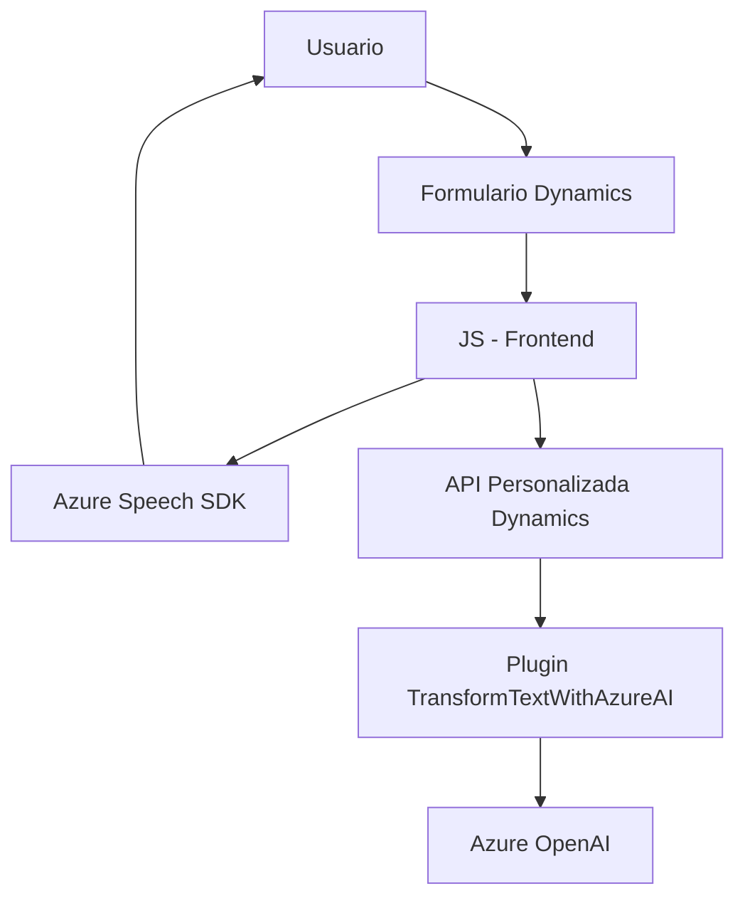

### Breve Resumen Técnico:
El repositorio contiene tres módulos que integran tecnologías de reconocimiento y síntesis de voz (Azure Speech SDK) y procesamiento de lenguaje natural (Azure OpenAI) en una aplicación basada en formularios, probablemente orientada al entorno de Microsoft Dynamics CRM. La solución combina componentes frontend en JavaScript y un backend basado en un plugin .NET para Microsoft Dynamics CRM. 

---

### Descripción de Arquitectura:
La arquitectura del sistema se asemeja a un modelo **n-capas**, donde la lógica de presentación (frontend con JavaScript) interactúa con un componente de lógica de negocio implementado como un plugin en Dynamics CRM (C#). Además, esta arquitectura es complementada por servicios externos como Azure Speech SDK y Azure OpenAI.

Las principales capas son:
1. **Capa de Presentación / Frontend**: Ejecutada en el navegador del usuario. Interactúa con formularios, captura input por voz, y utiliza Azure Speech para síntesis y grabación de voz.
2. **Capa de Lógica de Negocio / Backend**: Compuesta por el plugin TransformTextWithAzureAI.cs, donde se implementan funciones asociadas al procesamiento complejo del texto usando Azure OpenAI.
3. **Capa de Servicio Externa**: La solución realiza integración con servicios externos como Azure Speech SDK y Azure OpenAI a través de APIs.

---

### Tecnologías Usadas:
1. **Frontend (JavaScript):**
   - **Azure Speech SDK**: Para captura de audio y síntesis de voz.
   - **Asincronía (Callbacks y Promesas)** para funciones que interactúan con el SDK y APIs remotas.
   - Manipulación de formularios: Probablemente en el entorno de Dynamics CRM.

2. **Backend (C#):**
   - **Microsoft Dynamics CRM SDK (Microsoft.Xrm.Sdk)**: Para crear un plugin que extiende funcionalidad de negocio en Dynamics.
   - **Azure OpenAI**: Procesamiento de texto con IA.
   - **HTTP Client y JSON Libraries**:
     - **System.Net.Http**: Para realizar llamadas a APIs.
     - **Newtonsoft.Json** y **System.Text.Json**: Para manejo de estructuras JSON.

3. **Servicios Externos:**
   - **Azure Speech**: SDK para síntesis y reconocimiento de voz.
   - **Azure OpenAI**: API de conversión de texto a JSON estructurado basado en IA.

---

### Diagrama Mermaid:

---

### Conclusión Final:
La solución implementada corresponde a un sistema orientado a mejorar la interacción humano-tecnología mediante tecnologías como reconocimiento y síntesis de voz, procesamiento de texto con IA, y manipulación de formularios en un entorno Dynamics CRM. La arquitectura sigue un patrón n-capas, con conexión a servicios externos, optimizada para modularidad y escalabilidad. Sin embargo, ciertas áreas (como la autenticación para los servicios de Azure) pueden beneficiarse de mejoras en seguridad y robustez operativa.