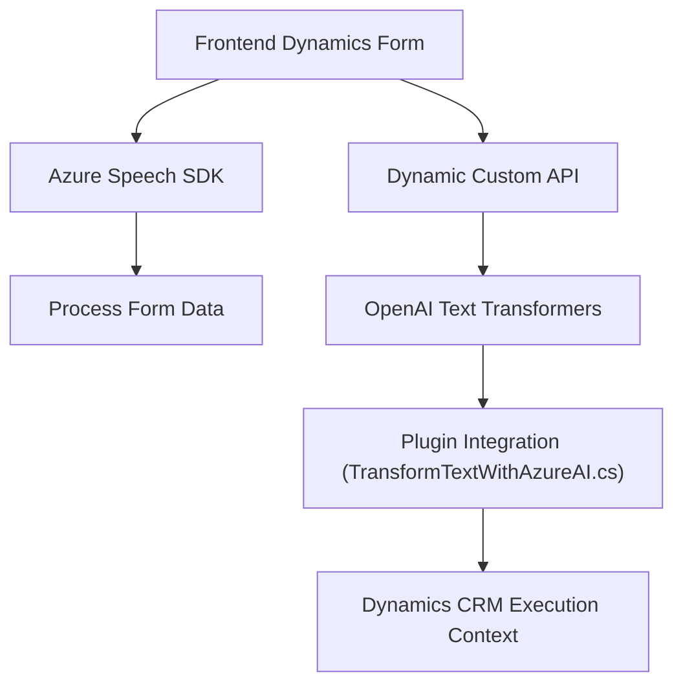

### Breve resumen técnico:
El repositorio incluye múltiples archivos relacionados con la integración de reconocimiento de voz y procesamiento de texto utilizando **Azure Speech SDK** y **Azure OpenAI Services**. Está orientado a habilitar interacción de voz, procesamiento de texto avanzado y actualización dinámica de formularios en un sistema basado en **Microsoft Dynamics 365 CRM**. Los archivos estudian la aplicación modular, la consumición de servicios externos y la interacción con los componentes internos de Dynamics CRM.

---

### Descripción de arquitectura:
1. **Tipo de solución:**  
   - **FRONTEND:** La solución implementada parece ser una integración entre una interfaz de usuario basada en Dynamics 365 y servicios de reconocimiento de voz/texto.  
   - **PLUGINS:** Utiliza una arquitectura basada en complementos (`IPlugin`) para manejar flujos y lógica backend dentro del ecosistema de Dynamics CRM.

2. **Arquitectura aplicada:**  
   - El proyecto sigue un modelo híbrido de **SOA (Service-Oriented Architecture)** para manejar responsabilidades divididas entre varios servicios (Azure Speech SDK, Azure OpenAI Service y Dynamics Custom API).  
   - La interacción del backend es mediante complementos (`Plugins`), mientras que el frontend está basado en integraciones y formularios dinámicos. Este enfoque aplica elementos de arquitectura **n capas**, dividiendo claramente lógica de presentación, negocio y acceso a datos.

3. **Patrones observados:**  
   - **Command Pattern:** Usado para manejar tareas discretas en métodos como `Execute()` en los plugins o `processTranscript()` en los scripts frontend.  
   - **Observer Pattern:** Implementado en el manejo de la carga del SDK para ejecutar acciones en función de eventos.  
   - **Modular Design:** Los métodos y clases están aislados y divididos según alta cohesión y responsabilidades claras.  

---

### Tecnologías usadas:
1. **Front-end:**
   - **Azure Speech SDK**: Usado para reconocimiento y síntesis de voz.  
   - **Dynamics 365 Context**: API específica de Dynamics para manejar formularios y datos de los usuarios.  
   - **JavaScript**: Para manejo de lógica en el navegador y Decodificación/Datos dinámicos.  

2. **Back-end (Plugins):**  
   - **Microsoft Dynamics CRM SDK**: Para la lógica de procesamiento principal basada en plugins de Dynamics.  
   - **Azure OpenAI Services**: Integra procesamiento avanzado de texto basado en inteligencia artificial.  
   - **.NET Framework/C#**: Desarrollo backend en plugins y manejo de dependencias.  
   - **Libraries:** `Newtonsoft.Json`, `System.Net.Http`, `System.Text.Json` para la interacción con API externas.  

---

### Dependencias o componentes externos:
1. **Servicios externos:**  
   - **Azure Speech SDK**: Reconocimiento de voz, y síntesis.  
   - **Azure OpenAI Services:** Procesamiento avanzado mediante herramientas de AI.  
   - **Custom API**: Interacción adicional con Dynamics CRM para transformar texto y actualizar formularios.  

2. **Librerías externas (Plugin):**  
   - **Newtonsoft.Json**: Manipulación del formato JSON.  
   - **System.Net.Http**: Comunicación con API externas.  
   - **Dynamics CRM SDK**: Soporte interno para llamados en tiempo de ejecución.  

---

### Diagrama Mermaid:

---

### Conclusión final:
El repositorio está centrado en habilitar interacción avanzada entre usuarios y una aplicación de negocios basada en **Dynamics 365 CRM**, integrando procesamiento de voz y texto con **Azure Speech SDK** y **Azure OpenAI Services**. La arquitectura combina las funcionalidades de SOA y complementos modulares para manejar responsabilidades claras entre frontend y backend. Esto resulta en una solución robusta para mejorar la eficiencia en flujos de trabajo mediante tecnologías de IA y reconocimiento de voz.