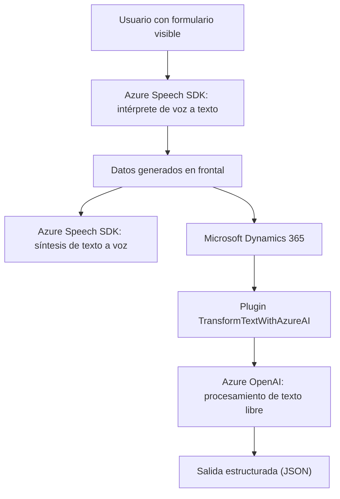

### Breve resumen técnico
El repositorio consta de múltiples módulos pensados para la integración entre formularios de Microsoft Dynamics 365/Dataverse y el servicio **Azure AI**. Se emplea entrada por voz y transcripción automática para interactuar dinámicamente con formularios (frontend) y transformar datos con **Azure Speech SDK** y **Azure OpenAI**.

---

### Descripción de la arquitectura
El sistema sigue un enfoque **modular orientado a servicios**:
1. **Frontend:**
   - Usa JavaScript para recoger datos del formulario, interactuar con APIs externas como el **Azure Speech SDK**, y procesar la entrada de voz de usuarios. También incluye lógica para manejar eventos en tiempo real (formContext de Dynamics).
   - Es responsable de sintetizar voz y capturar transcripciones.
   
2. **Backend:**
   - Utiliza **plugins personalizados de Dynamics 365/Dataverse** que actúan como integraciones de eventos, respondiendo de forma asíncrona para transformar datos con **Azure OpenAI**, manteniendo los datos estructurados en JSON.

Tiene una clara separación de responsabilidades, que apunta a una arquitectura cercana a **n capas**, con elementos de **arquitectura hexagonal** debido a la flexibilidad en la integración de servicios externos (Speech API y OpenAI) mediante adaptadores.

---

### Tecnologías usadas
1. **Frontend:**
   - JavaScript + asincronismo (Promise, async/await).
   - Integración de Azure Speech SDK para entrada y síntesis de voz.
   - Dinámicas del contexto de formularios con APIs de Microsoft Dynamics (probablemente `Xrm.Page` o `executionContext`).

2. **Backend - Plugin .NET:**
   - Lenguaje de programación: **C#**.
   - Servicios externos: **Azure OpenAI** (procesamiento de texto inteligente).
   - Dependencias clave:
     - `Microsoft.Xrm.Sdk` y API de Dynamics.
     - `System.Net.Http` para llamadas HTTP hacia servicios externos.
     - Librerías JSON (Newtonsoft.Json.Linq y System.Text.Json) para manipular datos estructurados.

---

### Diagrama Mermaid válido para GitHub

---

### Conclusión final
La solución es una integración avanzada entre **Microsoft Dynamics 365**, **Azure Speech SDK**, y **Azure OpenAI**. Combina elementos de frontend dinámico, servicios cognitivos de Azure y backend basado en plugins Dataverse. Este diseño apunta a una arquitectura flexible de **n capas** con posibles elementos hexagonales debido al modelo desacoplado y modular basado en proveedores de servicios.