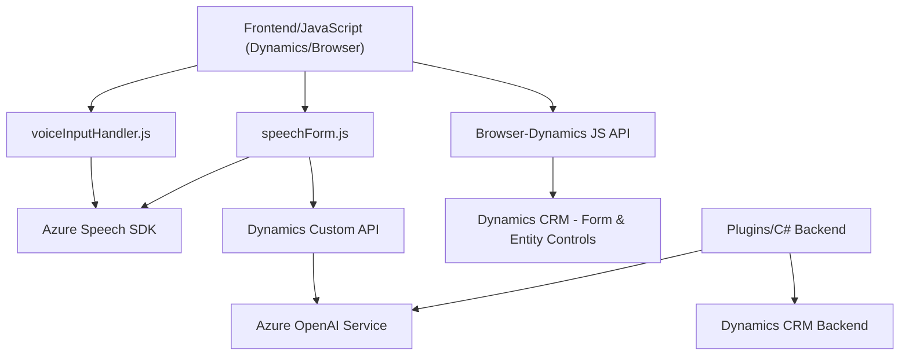

### Breve Resumen Técnico

El repositorio contiene implementaciones para capturar entradas de usuario mediante voz, procesar datos en formularios dentro de Dynamics CRM, y transformar texto con inteligencia artificial utilizando Azure Speech SDK y Azure OpenAI. Estas funcionalidades están organizadas en tres secciones: `Frontend` (JavaScript scripts), plugins (`C#` para Dynamics CRM), y API calls hacia servicios externos.

---

### Descripción de Arquitectura

La solución adopta una **arquitectura híbrida** basada en una mezcla de paradigmas:

1. **Modularidad Frontend**: Los scripts de JavaScript trabajan como módulos funcionales integrados con Dynamics CRM, orientados a tareas específicas (reconocimiento de voz y procesamiento).
2. **Integración con Servicios Externos**: Utiliza servicios en la nube (Azure Speech SDK y Azure OpenAI) para procesamiento de voz y texto. Esto sugiere una arquitectura **centrada en microservicios API** para delegar tareas avanzadas y garantizar escalabilidad.
3. **Plugin en Dynamics CRM**: La lógica de back-end se encapsula utilizando la estructura nativa de plugins de Dynamics CRM, adoptando un **modelo de arquitectura basada en capas** (presentación, lógica de negocio, integración externa).
4. Uso de patrones como **Service Layer** para interactuar con APIs externas y **Façade** para encapsular complejidad en el manejo de datos.

---

### Tecnologías Usadas

1. **Frontend**:
   - **JavaScript**: Es el lenguaje principal para la lógica cliente.
   - **Azure Speech SDK**: Para reconocimiento y síntesis de voz.
   - **AJAX/Fetch API**: Llamadas HTTP hacia APIs externas.
   - **Dynamics CRM JavaScript API**: Manejo de formulario y campos mediante el `executionContext`.

2. **Backend Plugins**:
   - **C# (.NET)**: Implementación de Plugins en Dynamics CRM utilizando `IPlugin`.
   - **Azure OpenAI Service**: Procesamiento de texto con modelos GPT.
   - **Microsoft.Xrm.Sdk**: Interacción con el backend de Dynamics CRM.
   - **Newtonsoft.Json** y `System.Text.Json`: Para manipulación de datos JSON.
   - **HTTP Client Libraries**: Comunicación con APIs.

---

### Diagrama Mermaid

---

### Conclusión Final

Este repositorio ofrece una solución avanzada y específica para la integración de capacidades de reconocimiento y síntesis de voz junto con el procesamiento de texto dinámico en aplicaciones de Dynamics CRM. La arquitectura del sistema consiste en una mezcla de paradigmas:

1. **Frontend Modular en JavaScript**: Conector con Dynamics 365, procesadores de voz.
2. **Backend en Plugins**: Utiliza Dynamics CRM SDK y extensiones para manipular datos y conectarse a servicios como Azure OpenAI.
3. **Microservicios API para procesar texto**: Las tareas de inteligencia artificial están delegadas al servicio de Azure OpenAI.

Este enfoque garantiza flexibilidad, modularidad y extensibilidad mediante la integración de servicios externos modernos (Azure Speech SDK y OpenAI). La ausencia de información sobre bases de datos adicionales y el enfoque fragmentado del diseño sugieren que esta solución está destinada a entornos empresariales preexistentes como Dynamics CRM.