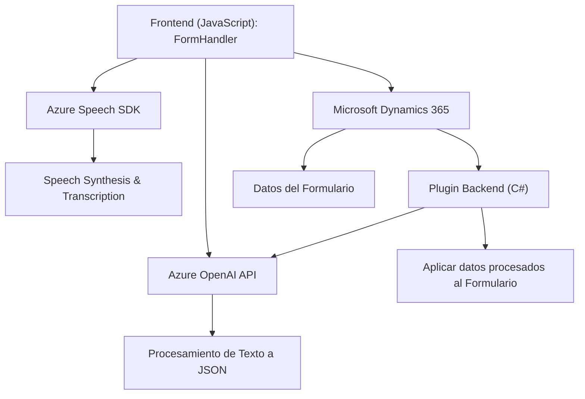

# Análisis y explicación técnica del repositorio

## Breve resumen técnico
El repositorio implementa una solución híbrida que integra un frontend, un plugin para Dynamics CRM y el Azure Speech/AI SDK para realizar dos funcionalidades principales:
1. **Transformación de texto a voz y voz a texto** en formularios, utilizando Azure Speech SDK.
2. **Procesamiento avanzado de texto en Dynamics CRM** con transformación automatizada mediante la API de Azure OpenAI.

## Descripción de arquitectura
### Tipo de solución
La solución es una combinación de **API personalizada**, **plugin de Dynamics CRM**, y **frontend** que interactúan con servicios externos (Azure Speech SDK y Azure OpenAI).

### Tipo de arquitectura
La arquitectura puede clasificarse como una **arquitectura orientada a servicios (SOA)**. Los componentes del sistema están organizados en módulos relativamente autónomos y se comunican a través de APIs. Funciona como una solución híbrida, interconectando:
- Frontend basado en JavaScript.
- Backend extendido como un **plugin de Dynamics CRM**.
- Servicios cloud de Azure para habilidades de AI y speech.

### Componentes de la arquitectura:
1. **Frontend**:
   - Componente visual que interactúa con formularios de Dynamics 365.
   - Implementado en **JavaScript**, con procesamiento modular (dividido por funciones independientes).

2. **Plugin Backend (Dynamics CRM)**:
   - Desarrollo basado en C#.
   - Extiende la capacidad del sistema CRM mediante **Microsoft Xrm SDK**.
   - Comunica datos formateados a la API de **Azure OpenAI** para procesamiento adicional.

3. **Servicios Externos**:
   - **Azure Speech SDK**: Convierte texto del formulario a voz y realiza transcripción de entrada de voz.
   - **Azure OpenAI API**: Utilizada para formatear y reestructurar el texto en formato JSON según reglas definidas.

## Tecnologías, frameworks y patrones observados
### Tecnologías principales:
1. **JavaScript**:
   - Componentes relacionados con Dynamics CRM/Frontend están escritos en JS.
   - Interactúan con formularios usando APIs y objetos `executionContext`.

2. **Microsoft Dynamics CRM SDK**:
   - El backend utiliza la librería `Microsoft.Xrm.Sdk` para extender la funcionalidad nativa de Dynamics CRM.

3. **Azure Speech SDK**:
   - Utilizado en el frontend para síntesis de texto a voz y transcripción de voz a texto.

4. **Azure OpenAI API**:
   - Llamada desde el plugin Dynamics CRM para procesar texto y generar JSON estructurado.

5. **Servicios HTTP**:
   - El plugin realiza comunicaciones externas con Azure OpenAI mediante solicitudes `HTTP POST`.

6. **JSON Serialización/Deserialización**:
   - Uso de `System.Text.Json` y `Newtonsoft.Json` para procesar cargas JSON.

### Patrones observados:
1. **Modularización**:
   - Separación de responsabilidad clara mediante funciones independientes en el frontend y el plugin backend.

2. **Facade**:
   - Facilidad de uso en Azure Speech SDK encapsulada en funciones como `ensureSpeechSDKLoaded` y `startVoiceInput`.

3. **Integración con APIs externas**:
   - Integra servicios externos mediante patrones de integración de API (e.g., `callCustomApi`, `GetOpenAIResponse`).

4. **Data Mapping**:
   - Transformación dinámica de datos en frontend y plugin para aplicar valores procesados en formularios (`applyValueToField`).

## Dependencias y componentes externos
1. **Azure Speech SDK**: Para interacción speech-to-text y text-to-speech en tiempo real.
2. **Azure OpenAI API**: Para transformación avanzada de texto en JSON.
3. **Microsoft Dynamics CRM SDK**: Extensiones creadas para personalizaciones específicas de CRM.
4. **HTTP/Web Services**: Para comunicar con Azure APIs.
5. **Navegador**: Carga dinámica de scripts y procesamiento local para garantizar compatibilidad en formularios web.

## Diagrama Mermaid

## Conclusión final
El repositorio describe un sistema que combina el poder del procesamiento de voz y aplicaciones de inteligencia artificial basadas en Azure, integrados con Microsoft Dynamics CRM. La solución utiliza una arquitectura orientada a servicios con una alta dependencia de servicios externos y una fuerte modularización. Además, el uso de plugin en Dynamics CRM y herramientas como Azure SDK son una elección sólida, facilitando una integración eficiente y escalable. Sin embargo, por motivos de seguridad, sería ideal utilizar configuraciones de autenticación más robustas en lugar de incrustar directamente claves API en los scripts o código fuente.