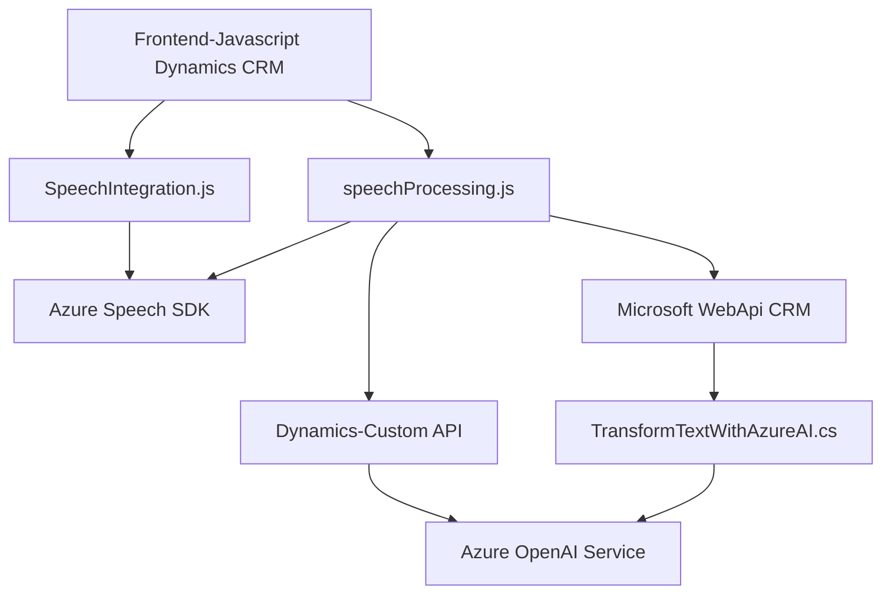

### Breve resumen técnico

El repositorio describe una solución completa donde se integran múltiples tecnologías para la interacción entre formularios, reconocimiento de voz, síntesis de voz, y procesamiento de datos mediante inteligencia artificial. Está diseñado para Dynamics CRM, extendiendo sus capacidades mediante plugins y funcionalidad JavaScript en formularios.

---

### Descripción de la arquitectura

#### Tipo de solución
1. **Frontend especializado en Dynamics CRM**: JavaScript ejecutándose en formularios del CRM.
2. **Ejecutables y Plugins personalizados**: Extensiones que corren en eventos del servidor.
3. **Integración con servicios externos**: Uso de Azure Speech SDK, Azure OpenAI Service, y APIs personalizadas de Dynamics CRM.

#### Arquitectura empleada
La arquitectura combina los siguientes conceptos:
1. **Capas**:
   - Capa cliente (JavaScript en el navegador).
   - Capa lógica de negocio (plugins de Dynamics CRM).
   - Capa de servicios externos (SDK, Azure OpenAI).

2. **Patrón Plugin-Based**:
   - Plugin extensible del CRM como intermediario para procesamiento avanzado en la capa de negocio.

3. **Arquitectura SOA (orientada a servicios)**:
   - Uso de APIs web externas (Azure Speech SDK y Azure OpenAI).

4. **Integración modular**:
   - Todo el procesamiento JavaScript está altamente modularizado, basado en funciones.
   
---

### Tecnologías, frameworks y patrones empleados

1. **Frontend (Javascript):**
   - **Azure Speech SDK**: Para síntesis y reconocimiento de voz.
   - **Microsoft Dynamics CRM WebAPI**: Consultas y operaciones en entidades CRM.

2. **Backend (.NET):**
   - Plugins usando:
     - **Microsoft Dynamics SDK**.
     - **Azure OpenAI Service** para generación de datos procesados.

3. **Patrones de diseño:**
   - **ETL**: Flujo de extracción de datos de formularios, transformación por IA, y carga en formularios CRM.
   - **Delegación dinámica**: Reutilización de funciones específicas para modularidad.
   - **Integración REST API**: Comunicación eficiente con servicios externos.

---

### Diagrama **Mermaid**

---

### Conclusión final

La solución integra formularios dinámicos de Dynamics CRM con servicios avanzados de Azure (reconocimiento de voz, síntesis y procesamiento de IA). Utiliza una arquitectura híbrida basada en capas, plugins y servicios independientes, lo que permite una buena escalabilidad y adaptabilidad para entornos corporativos. Implementa patrones de desarrollo que aseguran modularidad, delegación funcional, y integración REST API para asegurar eficiencia en el flujo de trabajo.