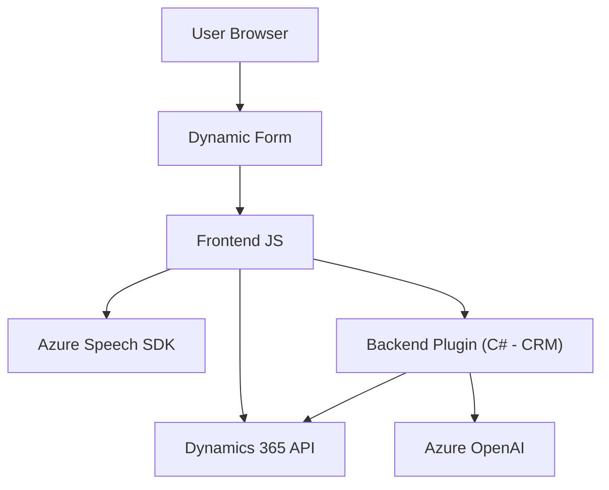

## Breve resumen técnico

El repositorio analizado incluye tres archivos principales relacionados con la interacción entre frontend, lógica de negocio en un sistema CRM (Dynamics 365), reconocimiento de voz (con Azure Speech SDK) y procesamiento de lenguaje natural (con Azure OpenAI). La combinación de estas tecnologías crea una solución híbrida que habilita la interacción del usuario con datos de formularios utilizando voz, texto a voz y transcripción enriquecida por inteligencia artificial.

---

## Descripción de arquitectura

**Tipo de solución:**  
La solución parece ser una integración avanzada entre un **frontend para formularios dinámicos** y un backend que aprovecha servicios externos como Azure Speech SDK y Azure OpenAI API. Adicionalmente, se integra directamente con **plugins de Microsoft Dynamics 365**, formando parte de una **SaaS CRM inteligen**e (como Microsoft Dynamics).

**Arquitectura:**  
La arquitectura sigue un enfoque híbrido:  
1. **Frontend:** JavaScript encapsula procesos de voz (texto a voz y reconocimiento de voz) y gestiona la interacción en el navegador.  
   - Posee características de arquitectura modular (cada funcionalidad separada en una función).  
2. **Backend:** Implementado en C# como plugins dentro del ecosistema Dynamics 365, orientado a cumplir la arquitectura de Microsoft CRM con integración de servicios externos.  
3. **Dependencias externas:** Explora APIs externas como Azure Speech SDK y Azure OpenAI, en un patrón desacoplado clásico.

Características principales:  
- Desacoplamiento del frontend y backend.  
- Uso de **lógica procedural en el frontend** con funciones diseñadas como unidades modulares.  
- Uso de **patrón cliente API** para interactuar con servicios externos.  
- **Hybrid-cloud architecture**: Aprovecha servicios de Microsoft Azure para procesamiento de voz y lenguaje natural, mientras se aloja internamente como parte de un sistema de CRM.  
- **Extensions pattern:** La lógica de negocio se extiende en Dynamics 365 mediante plugins (en C#).

---

## Tecnologías usadas

**Frontend:**  
- **JavaScript**: Base para la programación del lado cliente.  
- **Azure Speech SDK**: SDK para reconocimiento de voz y síntesis de texto a voz (integración directa con Azure).  
- **Microsoft Dynamics 365 API:** Utilizada para interacción con formularios y entidades del CRM.  

**Backend:**  
- **C#/.NET Framework**: Código del plugin implementado en C#.  
- **Microsoft Dynamics 365 SDK**: Framework para extender la funcionalidad de Dynamics CRM.  
- **Azure OpenAI API**: Para procesamiento de texto con tecnologías GPT.  
- **System.Text.Json**: Para manejar datos estructurados (JSON).  
- **Newtonsoft.Json**: Opcional, para manipulación JSON en C#.  

**Cloud Services:**  
1. **Azure Speech Services**: Para reconocimiento y síntesis de voz.  
2. **Azure OpenAI (GPT-4)**: Para procesamiento avanzado de texto.

---

## Diagrama Mermaid válido para GitHub

---

## Conclusión final

La solución desarrollada en este repositorio está diseñada para complementar un sistema de CRM (Microsoft Dynamics 365) con capacidades de integración con **Azure Speech SDK** (para interacción por voz) y **Azure OpenAI API** (para procesar lenguaje natural). La arquitectura es híbrida: **Frontend procedural modular** en JavaScript combinado con **backend en C# como plugins**, lo cual sigue los principios de extensibilidad de Dynamics CRM. Además, es una **cloud hybrid system**, que aprovecha servicios SaaS provenientes de Azure para reconocimiento de voz, síntesis de texto a audio y procesamiento avanzado con IA.

Aunque el diseño muestra una integración adecuada para su propósito, optimizaciones como el uso de escalabilidad en el backend podrían mejorar la modularidad y reducir dependencias. La documentación técnica es sólida y permite comprender fácilmente las funciones de cada módulo.