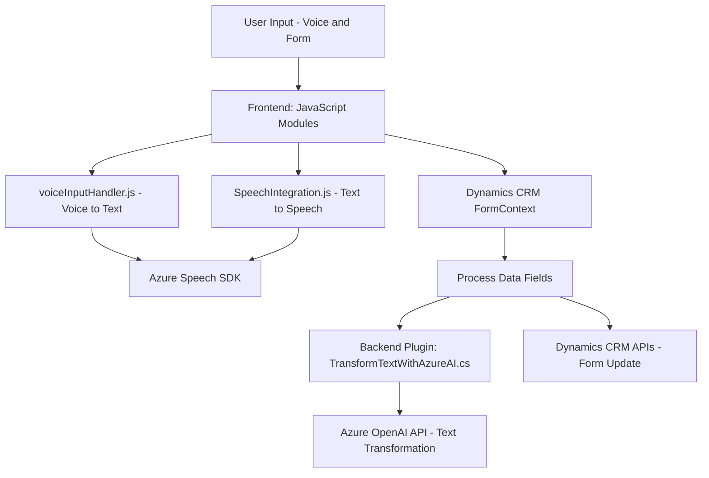

#### Breve resumen técnico:

El repositorio implementa una solución que integra Dynamics 365 CRM con Azure Speech SDK y Azure OpenAI. Consta de varios módulos que interactúan con APIs externas y el entorno CRM para incorporar funcionalidades avanzadas como entrada de voz, síntesis de texto a voz y procesamiento inteligente basado en IA. Esencialmente, la solución está dividida entre frontend JavaScript (para capturar y procesar datos desde formularios y voz) y backend (un plugin que utiliza Azure OpenAI para transformar texto). 

#### Descripción de arquitectura:

La arquitectura es híbrida y funcionalmente orientada con una mezcla de **Cliente-Servidor** y **plug-ins**. En el frontend, el código está organizado en módulos responsables de dos aspectos principales: voz a texto y texto a voz. Adicionalmente, el backend en C# implementa un plugin que complementa las capacidades de Dynamics CRM utilizando Azure OpenAI. 

El patrón principal observado es **integración API mediante adaptadores**, donde los módulos de frontend y el plugin intermedian entre el usuario y los servicios de Azure. La gestión de dependencias y la carga dinámica del SDK refuerzan paradigmas como modularidad y reutilización.

#### Tecnologías usadas:

1. **Frontend**:
   - **JavaScript**: Para lógica de captura de datos desde formularios y procesamiento.
   - **Azure Speech SDK**: Manejo de entrada/salida de voz en el navegador.
   - **Dynamics CRM APIs (formContext, Xrm.WebApi)**: Para manipular y actualizar los datos del sistema CRM.

2. **Backend/Plugins**:
   - **C#**: Implementación del plugin.
   - **Azure OpenAI API**: Transformación y estructuración de texto.
   - **Microsoft Dynamics 365 SDK**: Para interacción contextual y lógica de plugin.

3. **Otros**:
   - **HTTP Communication**: Uso de `HttpClient` para interacción con APIs externas.
   - **JSON Processors**: Newtonsoft para manejar datos JSON.

#### Diagrama Mermaid válido para GitHub:

#### Conclusión final:

Esta solución está diseñada para extender las capacidades de Dynamics CRM mediante integración con Azure Speech SDK y Azure OpenAI. Utiliza una arquitectura modular orientada a servicios, conectando frontend y backend mediante APIs y plugins. La estructura sugiere que la aplicación puede considerarse como una implementación dentro de una arquitectura de **n capas**, con el frontend actuando como la capa superior (Presentación) y los plugin + APIs funcionando como capas de Negocio y Datos.