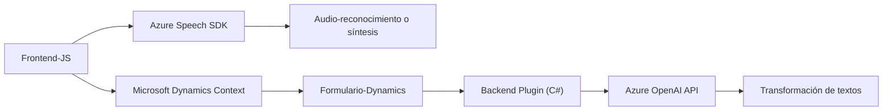

### Breve resumen técnico

El repositorio parece implementar una solución para la automatización basada en voz y procesamiento de texto utilizando **Microsoft Dynamics 365**, **Azure Speech SDK**, y **Azure OpenAI**. Incluye funcionalidad para interactuar con formularios en Dynamics, realizar generación de voz a partir de texto y usar inteligencia artificial para procesamiento y transformación de datos.

---

### Descripción de arquitectura

La solución se basa en tres componentes principales:
1. **Frontend**: Implementado en **JavaScript**, enfocado en la manipulación de formularios y la integración con Azure Speech SDK para síntesis y entrada de voz.
2. **Backend Plugin para Dynamics CRM**: Implementado en **C#**, cumpliendo el rol de un plugin para procesar texto con Azure OpenAI.
3. **Azure Ecosystem Integration**: Uso de servicios externos como **Azure Speech SDK** y **Azure OpenAI API** para las funcionalidades de voz y procesamiento textual avanzado.

#### Arquitectura identificada:
- **N capas**:
    - Capas identificables:
      1. **Frontend (presentación)**: Interacción con formularios de usuario en Dynamics y operaciones con SDK de voz.
      2. **Backend Plugin (lógica de negocio)**: Procesamiento y transformación textual.
      3. **Servicios Externos (datos)**: Azure para el Speech SDK y OpenAI API.
    - Cada capa tiene funcionalidades claras y roles específicos conectados por APIs y servicios.

- **Orientada a servicios**:
    - La solución depende de servicios externos administrados de primera clase (Azure Speech SDK y Azure OpenAI).
    - La lógica de negocio del plugin actúa como un adaptador de Dynamics CRM.
  
---

### Tecnologías usadas

#### Lenguajes y frameworks:
1. **Frontend**:
    - **JavaScript**: Para manipulación del DOM y la lógica del cliente.
    - Integración con **Azure Speech SDK** para entrada y síntesis de voz.
    - Uso de promesas (`async/await`) para manejo de asincronía.
    - **Microsoft Dynamics Context API**: Utilización del contexto de formulario para capturar datos y aplicar cambios.

2. **Backend**:
    - **C# (.NET Framework/SDK)**: Para implementar el plugin en Dynamics CRM.
    - **Microsoft.Xrm.Sdk**: Manejo del ciclo de vida de los plugins en Dynamics.
    - **Azure OpenAI API**: Para procesamiento avanzado de textos.

#### Servicios externos:
- **Azure Speech SDK**: Para reconocimiento de voz y síntesis de texto.
- **Azure OpenAI API**: Para transformar y procesar textos usando inteligencia artificial.

#### Patrones utilizados:
1. **Modularidad**:
    - Código distribuido de forma que cada función y archivo tiene un propósito específico y bien definido.
2. **Dynamic Resource Loading**:
    - Carga dinámica del SDK de voz desde el navegador.
3. **Callback y Promesas**: Para garantizar asincronía en las operaciones.
4. **Plugin Pattern (Dynamics)**:
    - Estructura del plugin de Dynamics con un método `Execute` principal y funciones estáticas auxiliares.
5. **Integración con servicios externos** (Azure): Delegación de procesamiento avanzado al ecosistema de Azure.

---

### Diagrama **Mermaid** 100 % compatible con GitHub Markdown

---

### Conclusión final

La solución se construye alrededor de un modelo **N capas** con una fuerte integración con servicios externos (Azure Speech SDK y OpenAI API) y Dynamics 365. La arquitectura es modular y bien orientada para funciones específicas del sistema como reconocimiento de voz, síntesis de audio y procesamiento textual avanzado. Sería útil identificar posibles mejoras en áreas como seguridad (gestión de claves API) y optimización de configuración dinámica para las dependencias externas.

Con esta estructura, se posiciona como una solución escalable diseñada para entornos empresariales que requieren interacciones de voz y automatización avanzada dentro de Dynamics 365.