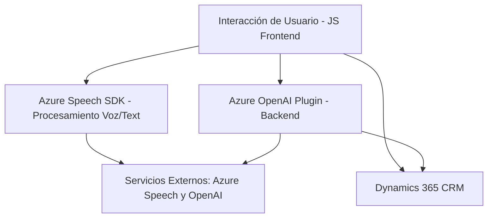

### Breve Resumen Técnico

La solución está compuesta por tres principales componentes: 
1. **Frontend**: Implementa la lógica para interactuar con usuarios mediante un navegador. Utiliza Microsoft Azure Speech SDK para síntesis de voz y procesamiento de datos.
2. **Backend**: Contiene un plugin de Dynamics 365 CRM para transformar texto utilizando Azure OpenAI, generando estructuras JSON personalizadas.
  
Estas piezas trabajan juntas con una integración entre Dynamics 365, Azure Speech SDK y Azure OpenAI.

---

### Descripción de Arquitectura

La solución está diseñada principalmente como una **arquitectura de n capas** usando un enfoque híbrido. Tiene las siguientes capas funcionales:

1. **Presentación (Frontend)**: Reside en archivos como `readForm.js` y `speechForm.js`, manejando interacción de usuario, forma visible de datos y conversión a texto/voz.
2. **Lógica empresarial/Backend**: Realizada a través de un plugin de Dynamics 365, que interactúa con Azure OpenAI para generar capacidades avanzadas de procesamiento de texto (contenida en `TransformTextWithAzureAI.cs`).
3. **Servicio externo/API**: Utiliza servicios de Azure (Speech SDK y OpenAI) mediante conexiones de API para abordar procesamiento avanzado.

---

### Tecnologías Usadas

1. **Frontend**:
   - **Lenguaje**: JavaScript.
   - **Frameworks y SDKs**:
     - Azure Speech SDK (sintetización de voz y reconocimiento de entrada de voz).
   - **Entorno integrador**: Dynamics 365 (contexto de ejecución y datos visibles).

2. **Backend**:
   - **Lenguaje**: C#.
   - **Frameworks y Librerías**:
     - JSON Manipulation: `Newtonsoft.Json.Linq`, `System.Text.Json`.
     - HTTP Client: `System.Net.Http`.
     - Dynamics SDK: `Microsoft.Xrm.Sdk`.
   - **Servicios Externos**:
     - Azure OpenAI (GPT model integration).

3. **General**:
   - **Plataformas**:
     - Dynamics 365 CRM.
     - Microsoft Azure.

4. **Patrones**:
   - Modularidad para definición de funciones independientes.
   - Servicios externos desacoplados mediante dependencias cargadas dinámicamente.

---

### Diagrama Mermaid

---

### Conclusión Final

La solución es un sistema **integrado basado en n capas**, que conecta lógica empresarial (Dynamics, Azure OpenAI) con usuarios finales mediante un frontend en JavaScript. La interacción con servicios externos se maneja dinámicamente para mantener el sistema ligero y modular. 

Es ideal para entornos donde se requiera automatización cognitiva (sintetización de voz/texto) y procesamiento inteligente de formularios con entrada de voz. Podría ampliarse aún más mediante la expansión de microservicios o funciones serverless en Azure para mayor escalabilidad.