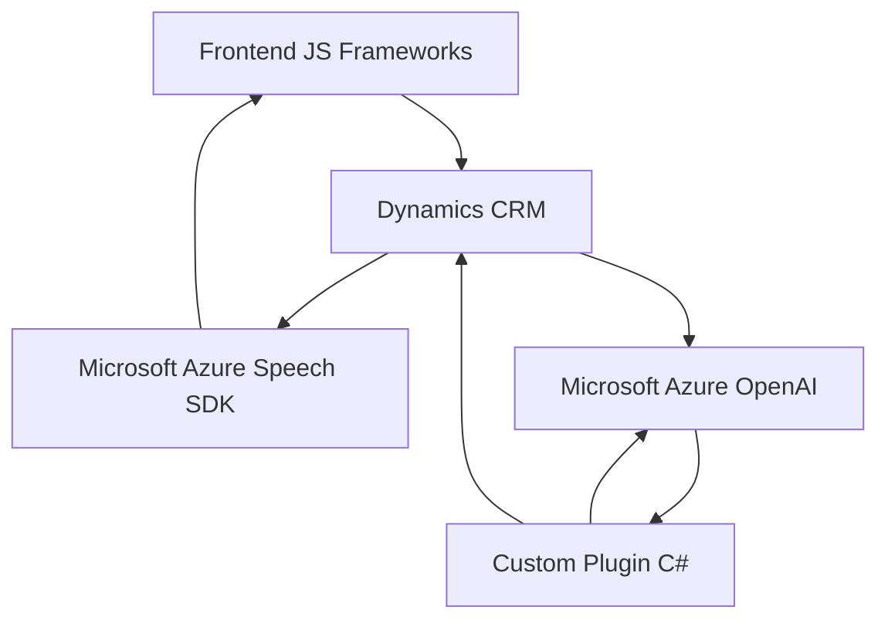

### Breve resumen técnico

El repositorio implementa un sistema de entrada y salida de datos dinámicos basado en voz y procesamiento de texto en integración con servicios externos como **Microsoft Azure Speech SDK** y **Azure OpenAI API**, enfocado en la personalización de formularios en **Dynamics 365 CRM**.

### Descripción de arquitectura

La arquitectura se divide en tres componentes principales:
1. **Frontend**: Usa JavaScript para interactuar con datos de Dynamics CRM, procesar formularios y habilitar capacidades de texto a voz y reconocimiento de voz mediante **Azure Speech SDK**.
   
2. **Backend/Plugins**: Implementa plugins personalizados en C# para Dynamics CRM. Uno de ellos aprovecha **Azure OpenAI API**, realizando procesamiento avanzado de texto con IA y retornando resultados estructurados a través de llamada HTTP.

3. **APIs Externas**: Extensa integración con servicios de **Microsoft Azure** para IA (OpenAI API) y capacidades de voz (Speech SDK).

La arquitectura se califica como **modular con integración multicapa**, donde el frontend y plugins se encajan en la infraestructura del CRM Dynamics 365 facilitando la extensión de funcionalidades y conectándose con APIs externas.

---

### Tecnologías usadas
- **Microsoft Dynamics 365 CRM**: Plataforma CRM principal para gestión de formularios y datos.
- **Microsoft Azure Speech SDK**: Procesa texto a voz (TTS) y reconocimiento de voz (STT).
- **Microsoft Azure OpenAI API**: Servicios para transformación de texto con inteligencia artificial.
- **Frontend (JavaScript)**: Realiza tareas de interacción con formularios CRM y funcionalidad asistida por IA.
- **System.Net.Http (C#)**: Realiza solicitudes a APIs REST (Azure OpenAI).
- **Newtonsoft.Json**: Librería para manejar estructuras JSON en el plugin de C#.

---

### Diagrama **Mermaid**

---

### Conclusión final

El repositorio implementa una solución modular con patrones de integración asociativa. Utiliza plataformas robustas como **Dynamics CRM** y servicios externos en la nube de **Azure** para mejorar funcionalidades de entrada/salida de datos mediante reconocimiento de voz, síntesis y análisis mediante IA. Esto permite automatizar el procesamiento de datos en sistemas CRM y habilitar capacidades avanzadas como lectura en voz alta y conversión de voz a texto directamente en los formularios dinámicos.