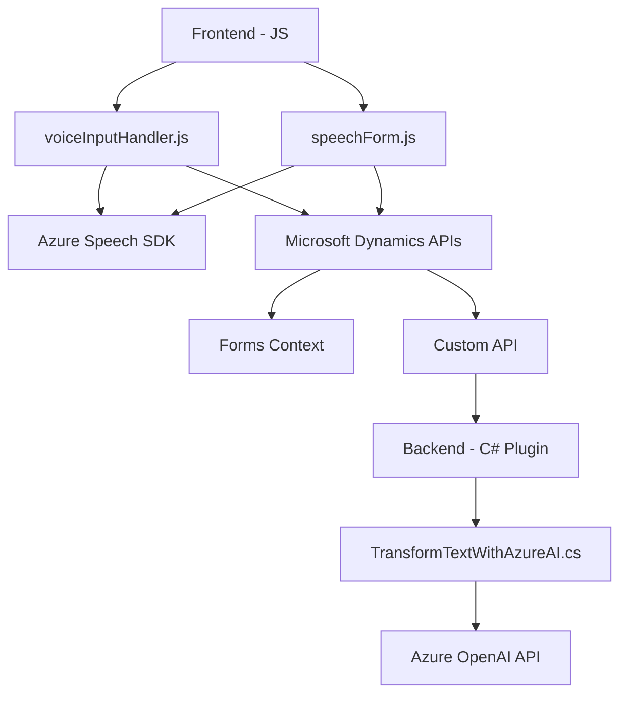

### Breve Resumen Técnico
El repositorio presenta una solución basada en Microsoft Dynamics CRM para procesar datos de formulario y entrada de voz. La arquitectura emplea componentes frontend en JavaScript que interactúan con servicios externos (Azure Speech SDK y Dynamics APIs) y un módulo backend en forma de plugin escrito en C# que utiliza Azure OpenAI para transformar texto con IA.

---

### Descripción de Arquitectura
La solución sigue una **arquitectura híbrida basada en capas**, con los siguientes elementos:
1. **Frontend**:
   - Procesa datos del usuario y los envía al backend.
   - Utiliza el Azure Speech SDK para reconocer voz y realizar síntesis de texto.
   - Se integra con APIs de Microsoft Dynamics CRM para interactuar con formularios.
2. **Backend**:
   - Implementa un **plugin para Dynamics CRM** que transforma datos utilizando Azure OpenAI y devuelve resultados en formato JSON.

#### Patrones destacados:
1. **Modularización** en funciones independientes para facilitar el mantenimiento.
2. **SDK Wrapper** para abstractar la interfaz del Azure Speech SDK y OpenAI API.
3. **Event-driven architecture** al reaccionar a eventos del SDK de voz y del CRM.
4. **Integración RESTful** para consumir APIs externas (Azure OpenAI, Dynamics).

Este diseño es típico de soluciones extendidas en Dynamics CRM, donde se combinan personalizaciones frontend con plugins backend para procesos específicos de negocio.

---

### Tecnologías Usadas
1. **Frontend**:
   - **JavaScript**: Para manejo y extracción de datos de formularios.
   - **Azure Speech SDK**: Reconocimiento y síntesis de voz.
   - **Microsoft Dynamics CRM API**: Interacciones con datos de formularios.
   
2. **Backend**:
   - **C#** (Plugin): Organización de lógica empresarial.
   - **Azure OpenAI API**: Procesamiento avanzado de texto con IA.
   - **Microsoft Dynamics SDK**: Para extender funcionalidades del sistema.

3. **Dependencias comunes**:
   - **APIs Externas**: Comunicación con Azure API y Dynamics.
   - **HTTP Client Libraries**: Para el backend, como `System.Net.Http`.
   - **JSON Manipulation**: `Newtonsoft.Json` y `System.Text.Json`.

---

### Diagrama **Mermaid** válido para GitHub Markdown

---

### Conclusión Final
La solución es una extensión para Microsoft Dynamics CRM que combina tecnologías frontend y backend. Su propósito es mejorar la interacción de los usuarios con formularios al integrar reconocimiento de voz, síntesis de texto y procesamiento con IA. Utiliza componentes bien definidos con modularidad y respetando los principios de la arquitectura en capas.

Las dependencias externas principales son los SDKs de Azure Speech y OpenAI API, lo que posiciona esta solución como basada claramente en servicios en la nube. Aunque es efectiva y versátil, sería prudente considerar mejoras en la seguridad, como el manejo de claves API mediante servicios de administración de secretos.