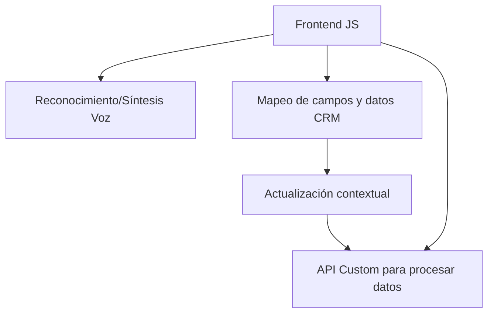

### Breve resumen técnico
Se trata de una solución que utiliza reconocimiento y síntesis de voz, procesamiento de texto con inteligencia artificial utilizando Azure, y facilita la integración con Microsoft Dynamics CRM. La arquitectura incluye integración con SDK externos, procesamiento modular, y predictibilidad en el manejo de datos del CRM.

---

### Descripción de arquitectura
1. **Tipo de solución**: Principalmente un _microservicio_ orientado a la funcionalidad de voz y procesamiento de texto en un contexto CRM con uso de servicios externos como Azure Speech SDK y OpenAI.
2. **Arquitectura predominante**: Una mezcla de **n-capas** (para las dependencias que interactúan con Dynamics CRM) y **hexagonal** en la manera en que las API externas procesan texto y voz.
3. **Componentes principales**:
   - **Frontend**: Proporciona herramientas para extraer datos de formularios y permite la interacción a través de voz y comandos.
   - **Backend/plugin**: Procesa texto con normas predefinidas mediante Azure OpenAI y estructura JSON.
   - **Servicios externos**: Dependencia de SDKs de Azure (Speech y OpenAI) para funcionalidad avanzada.

---

### Tecnologías usadas
1. **Microsoft Dynamics CRM**:
   - `Xrm.WebApi` para interactuar con entidades y datos mediante API.
   - Form context (`executionContext`) para manejar atributos visibles y estructurar datos.
2. **Frontend**:
   - **JavaScript**:
     - Utilización modular con funciones específicas para la síntesis, reconocimiento, y mapeo de datos de formularios.
   - Azure Speech SDK:
     - Cargado dinámicamente.
     - Reconocimiento y generación de voz.
3. **Backend**:
   - **C#:** Implementación de **Plugins** usando el estándar `IPlugin` para Microsoft Dynamics CRM.
   - Comunicación HTTP usando `HttpClient` para interactuar con Azure OpenAI.
   - Uso de la librería **Json.NET** para estructuración y procesamiento de JSON.

---

### Dependencias o componentes externos presentes
1. **SDK de Azure Speech**: Usado para todas las funcionalidades relacionadas con voz.
2. **Azure OpenAI Service**: API para transformar texto en JSON estructurado con normas.
3. **Microsoft Dynamics CRM API**: Para interacción con formularios y entidades.
4. **Librerías estándar**:
   - `Newtonsoft.Json` para manipulación JSON.
   - `HttpClient` para integración con servicios externos.

---

### Diagrama Minecraft **Mermaid**

---

### Conclusión final
La solución tiene un enfoque **modular** y bien estructurado, lo que permite escalabilidad y extensibilidad a través de SDKs y APIs externas sin comprometer la integración directa con Microsoft Dynamics CRM. Combina arquitecturas orientadas a eventos y hexagonales para garantizar que el procesamiento se mantenga desacoplado. Estas prácticas permiten un mantenimiento incremental, lo que es ideal en entornos dinámicos donde es vital adaptarse a las necesidades cambiantes del usuario.