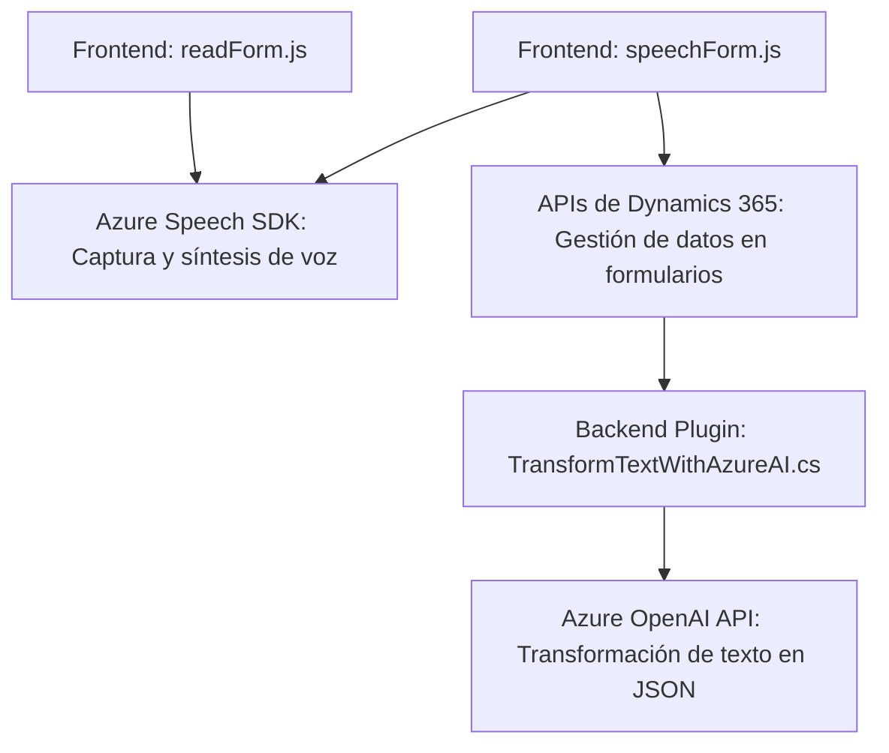

### Breve resumen técnico
El repositorio definido presenta una solución que integra interfaces de usuario y servicios en la nube para implementar la captura y síntesis de voz, procesamiento de texto, y actualización dinámica de formularios. Utiliza dos archivos JavaScript para la lógica frontend (`readForm.js`, `speechForm.js`), y un archivo backend como plugin en Dynamics 365 CRM que integra la API de Azure OpenAI para procesamiento de texto (`TransformTextWithAzureAI.cs`).

---

### Descripción de arquitectura
La arquitectura parece ser una aproximación híbrida que combina:
1. **Cliente-Servidor:**
   - El frontend es responsable de recopilar datos y realizar llamadas a un backend o Azure APIs.
   - El plugin extiende Dynamics CRM para realizar procesamiento avanzado con Azure AI.

2. **Event-Driven:**  
   La solución se activa en contextos o eventos específicos (como la ejecución de plugins en CRM o interacciones basadas en voz).

3. **Integración con APIs externas:**
   - **Azure Speech SDK:** Para captura y síntesis de voz en el frontend.  
   - **Azure OpenAI API:** Para procesamiento de texto en el backend.  
   - **Dynamics API:** Para manejar datos y acciones en el ecosistema de CRM.

4. Uso modular:  
   - El frontend separa las responsabilidades de captura de datos, síntesis de voz y procesamiento en funciones independientes.  
   - El plugin sigue el patrón de extensibilidad de Dynamics CRM para acoplar lógica transformadora de texto directamente al sistema.

---

### Tecnologías usadas
1. **Frontend (JavaScript):**
   - Azure Speech SDK.
   - APIs de Dynamics 365 con `executionContext` para acceder y manipular datos de formularios.

2. **Backend (C# .NET):**
   - Dynamics SDK (`IPlugin`, `IOrganizationService`).
   - Azure OpenAI API para transformación de texto con IA.
   - Librerías HTTP (`System.Net.Http`) y JSON (`Newtonsoft.Json.Linq`).

3. **Patrones de programación:**
   - Modularización de funciones y clases.
   - Integración de servicios externos.
   - Plugin-based architecture en CRM.

---

### Diagrama Mermaid

---

### Conclusión final
La solución presentada es una combinación de servicios de nube (Azure Speech, Azure OpenAI) y extensibilidad en CRM basada en plugins (`IPlugin`). Esto permite manejar interfaz de usuario interactiva (voz y formularios), y delegar tareas de procesamiento avanzadas a servicios remotos. Su arquitectura se puede categorizar como una combinación de **cliente-servidor** y **event-driven**, donde el backend y el frontend son altamente independientes pero colaborativos. La solución es ideal para casos donde se necesita interacción dinámica con datos y operaciones avanzadas de IA integradas.