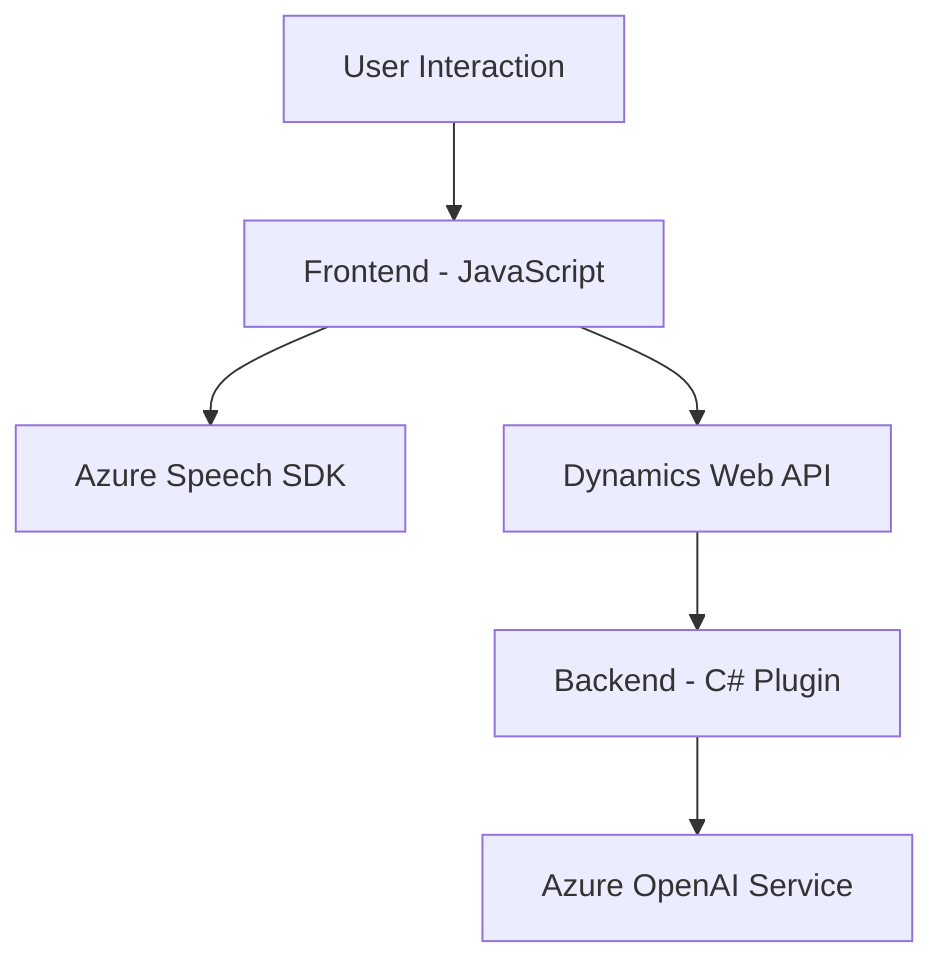

### Breve resumen técnico
El repositorio está centrado en funcionalidades integradas con **Microsoft Dynamics CRM** y **Azure**. Las características principales incluyen entrada y síntesis de voz, transcripción, manipulación de datos del formulario y transformación de texto mediante IA. Se divide en una capa de frontend basada en JavaScript interactuando con APIs externas (Azure Speech SDK, Dynamics Web API) y una capa de backend implementada como plugins en C# para Dynamics CRM.

---

### Descripción de arquitectura
La solución presenta una arquitectura **orientada a servicios** (SOA) con múltiples capas de integración. Esto incluye:
- **Frontend modular**: Manejo de interacciones del usuario en JavaScript, incluyendo funciones para entradas de voz y síntesis dinámica.
- **Backend desacoplado**: Plugins diseñados para integrarse con Dynamics CRM, interactuar con sistemas externos como **Azure OpenAI** y manipular datos del sistema CRM.

La arquitectura no adopta un diseño monolítico ni completamente distribuido como microservicios, pero tiene características de **n capas** debido a la separación de funcionalidades del frontend y de la backend.

---

### Tecnologías usadas
1. **Frontend**:
   - **JavaScript**
   - Libraries/APIs:
     - **Azure Speech SDK** (integración directa)
     - **Dynamics Web API** (Xrm.WebApi para manipular datos del CRM)

2. **Backend**:
   - **C#** como lenguaje principal.
   - Frameworks:
     - **Microsoft Dynamics SDK** (namespace `Microsoft.Xrm.Sdk`)
     - **Azure OpenAI Service** para texto avanzado y análisis semántico.
     - **JSON Libraries**:
       - `System.Text.Json` y `Newtonsoft.Json.Linq` para serialización.

3. **APIs utilizadas**:
   - **Azure Speech SDK** para voz.
   - **Azure OpenAI Service** para procesamiento de texto y generación de respuestas.

---

### Dependencias o componentes externos
1. **Frontend**:
   - Dependencia directa en **Azure Speech SDK**, cargada dinámicamente.
   - Interacción con **Dynamics Web API** para manejar datos CRM.

2. **Backend**:
   - Dependencia directa en **Azure OpenAI Service** para transformación de texto.
   - Servicios externos:
     - API Key y Endpoint de Azure OpenAI.
     - Modelo GPT (como `gpt-4o`).

3. **Contexto CRM**:
   - Manipulación de formularios con características específicas de Microsoft Dynamics.

---

### Diagrama Mermaid válido para GitHub Markdown

---

### Conclusión final
La solución presenta una arquitectura orientada a servicios (SOA) con una integración directa entre la capa del frontend y el backend, donde se aprovechan servicios externos de Microsoft Azure (Speech SDK, OpenAI) y la capacidad del plugin de Dynamics CRM. El código demuestra un enfoque modular y escalable, aunque la gestión de credenciales de Azure y el manejo de excepciones podrían mejorarse para maximizar la seguridad y robustez del sistema.