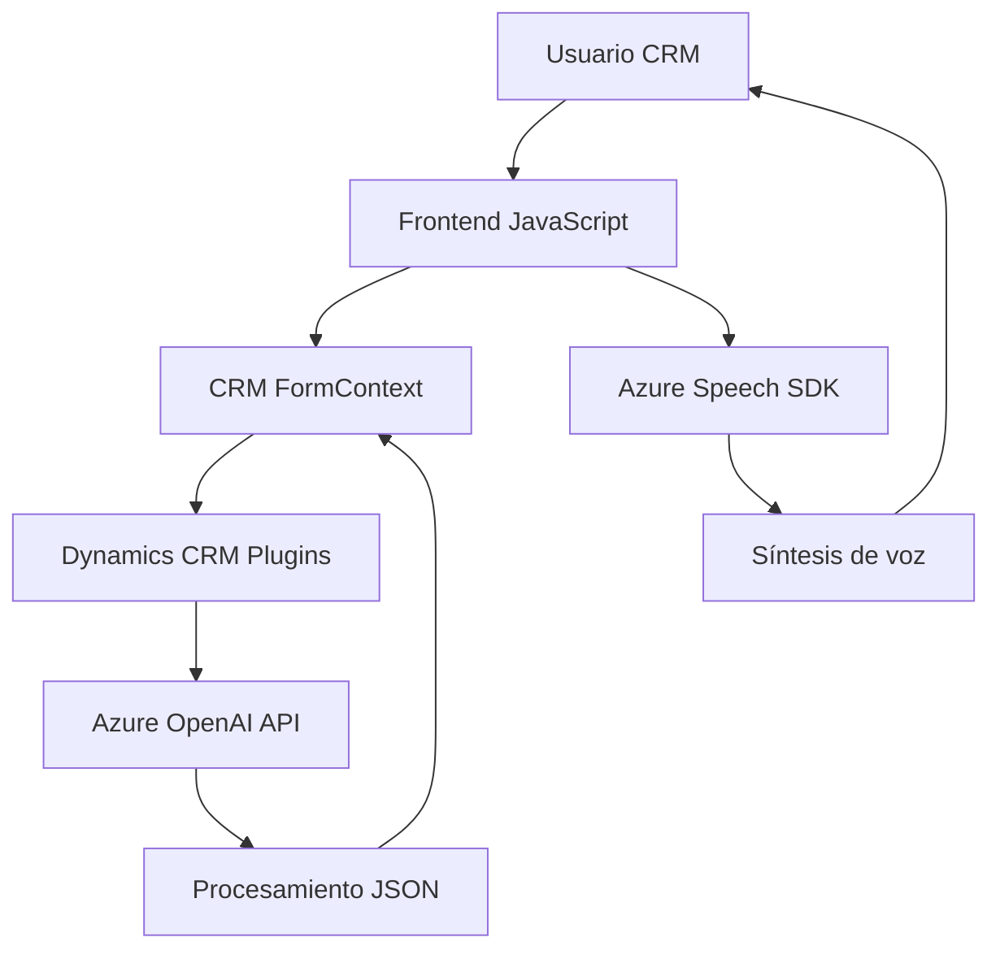

## Breve resumen técnico
El repositorio representa un conjunto de archivos orientados a una integración avanzada entre **Dynamics CRM**, **Azure Speech SDK**, y **Azure OpenAI**, implementando funcionalidades para reconocimiento de voz, síntesis y procesamiento de texto dentro del ecosistema Dynamics 365. Cada archivo define componentes independientes que colaboran con APIs externas y mecanismos CRM para optimizar la experiencia del usuario.

---

## Descripción de arquitectura
La solución utiliza una arquitectura **modular con integración directa a APIs externas**. Aunque los módulos se utilizaban principalmente en el contexto de un monolito CRM, la cooperación entre los archivos y externalidades los posiciona como un caso de **arquitectura orientada a servicios (SOA)**. El enfoque **multi-capa** (división lógica de funcionalidad) es evidente: Frontend atributivo (JavaScript), middleware de procesamiento (plugins C#) y servicios backend externos (APIs de Azure).

---

### Tecnologías usadas
1. **Frontend:**  
   - Lenguaje: JavaScript.
   - SDK: Azure Speech SDK.
   - Framework de interacción: Dynamics CRM (Javascript API).

2. **Backend:**  
   - Lenguaje: C# (.NET Framework/ASP.NET).
   - Librerías: `Newtonsoft.Json`, `System.Net.Http`, entre otras.
   - API Externa: Azure OpenAI y Azure Speech SDK.

3. **Infraestructura:**  
   - Dynamics 365 (CRM).
   - Servicios de Azure (Storage, Speech SDK, OpenAI).

---

## Diagram Mermaid válido para GitHub

---

## Conclusión final
La solución utiliza **Azure Speech SDK** y **Azure OpenAI** para proporcionar una experiencia rica en Dynamics 365 que incluye reconocimiento de voz, síntesis y transformación de texto. La arquitectura puede considerarse un **monolito evolutivo modificado con SOA**, ya que une múltiples módulos especializados mediante APIs y plugins. Esto asegura flexibilidad, escalabilidad, y alta cohesión entre diferentes partes del sistema, útil para integraciones profundas en el entorno de Dynamics CRM.