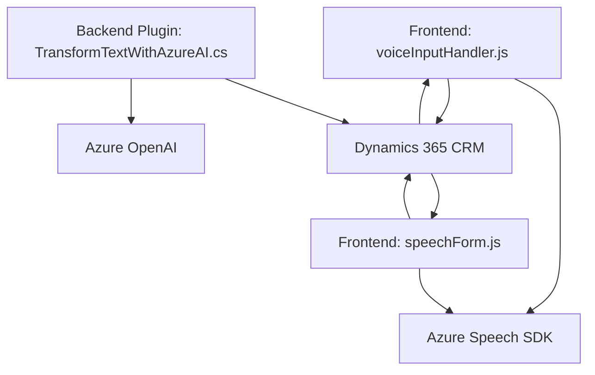

### Breve resumen técnico
El repositorio incluye tres archivos representativos de una solución que integra un frontend basado en JavaScript, en combinación con plugins y servicios cloud ecosystems como Microsoft Azure (Speech SDK y OpenAI). El foco técnico está en implementar funcionalidad inteligente para reconocimiento de voz, síntesis de texto a voz, procesamiento de datos, integración con formularios vinculados a entornos Dynamics CRM y transformaciones de texto con IA.

---

### Descripción de arquitectura

La solución parece formar parte de una arquitectura basada en **microservicios y n-capas**. La integración con Dynamics CRM sugiere que la solución podría operar como un agregado modular para una plataforma más amplia. Se utiliza la frontend para interactuar con los usuarios y manejar eventos relacionados con el formulario (voz y texto). El plugin en C# actúa como un backend encargado de realizar procesamiento avanzado de texto utilizando Azure OpenAI.

#### Detalles de la arquitectura:
1. **Cliente:** JavaScript basado en vistas y manipulación de formularios contextuales (Dynamics CRM frontend).
2. **Servicios externos:** Azure Speech SDK para síntesis y reconocimiento de voz. Azure OpenAI para generación avanzada de transformaciones textuales.
3. **Plugin:** Servicio backend (Dynamics CRM) comunicándose con Azure OpenAI mediante REST API.

---

### Tecnologías usadas
1. **Frontend:** JavaScript, entorno Dynamics CRM (manipulación de contextos y formularios).
2. **Azure Speech SDK**: Para uso de reconocimiento de voz (SpeechRecognizer) y síntesis de texto a voz.
3. **Plugin backend (C#)**:
   - Microsoft Dynamics SDK (`Microsoft.Xrm.Sdk`) para la integración con CRM.
   - `System.Net.Http` para llamadas a REST API.
   - `Newtonsoft.Json`, `System.Text.Json` para procesar JSON estructurado.

---

### Dependencias o componentes externos
1. **Azure Speech SDK en la frontend (`window.SpeechSDK`)**: Proporcionado mediante un script externo.
2. **Azure OpenAI endpoint REST**: Usado por el plugin `TransformTextWithAzureAI.cs` para procesar texto.
3. **Dynamics 365 CRM API (XRM)**: Para manipular datos contextuales y realizar actualizaciones de formularios.
4. **Arreglos JSON** en ambos casos: Usados para procesar los datos estructurados tanto en frontend como en backend.

---

### Diagrama Mermaid válido para GitHub Markdown

---

### Conclusión Final
El repositorio representa una solución escalable y moderna que aprovecha servicios de nube como Azure Speech SDK y OpenAI GPT para reconocer voz, interactuar con formularios contextuales y realizar transformaciones avanzadas de texto mediante IA. Se usan patrones como modularidad y carga dinámica de SDKs en frontend, mientras que el backend emplea una arquitectura extensible basada en plugins de Dynamics CRM. En general, la combinación de tecnologías y patrones propuestos permite una integración fluida entre herramientas avanzadas de IA y aplicaciones empresariales específicas en la nube.