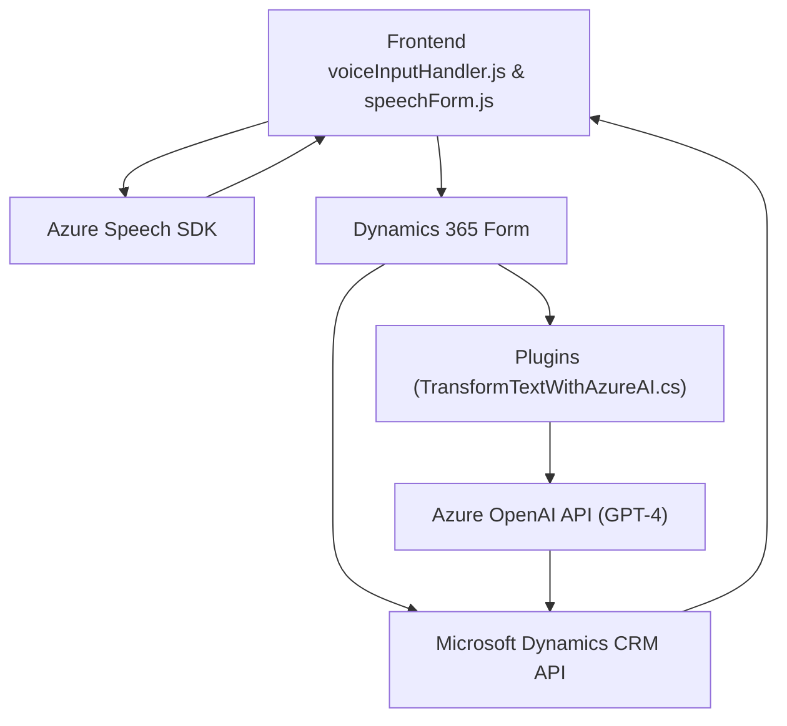

### Breve Resumen Técnico

Este repositorio claramente tiene un enfoque en la **entrada y procesamiento de voz** con integración directa con **Azure Cognitive Services**, principalmente su **Speech SDK**. Además, se destaca la interacción con **Microsoft Dynamics 365**, específicamente para lectura y actualización de formularios dinámicos y el uso de plugins y APIs personalizadas para trabajar con **Azure OpenAI**.

### Descripción de Arquitectura

Este sistema está estructurado para crear una solución híbrida que aprovecha las capacidades de una **arquitectura basada en n capas**, donde:
1. El **Frontend** (JavaScript - APIs dinámicas y transcripción de voz) actúa como una capa de interacción.
2. La capa intermedia, representada por plugins en Dynamics 365, expone **logic processors** orientados al sistema CRM.
3. La capa de datos subsiguientes incluye la interacción con servicios externos, como Azure Speech y OpenAI.

Además, gracias al uso del **Azure Speech SDK** y las APIs personalizadas expuestas en Dynamics, el sistema también presenta características de una arquitectura **orientada a servicios** (SOA). Es decir, los servicios externos como Azure se integran mediante patrones como "composición de microservicios".

### Tecnologías Usadas
1. **Frontend (JavaScript):**
   - **Microsoft Dynamics CRM API** para manipulación de formularios.
   - **Azure Speech SDK** para reconocimiento y síntesis de voz.
   - Uso de promesas, asincronía, y patrones de diseño modular en JavaScript.

2. **Backend Plugins (C#):**
   - **Microsoft.Xrm.Sdk** para la interacción con Dynamics CRM.
   - **Azure OpenAI** y el modelo GPT-4 para procesamiento de texto.
   - Manejo de HTTP mediante `HttpClient`.
   - Serialización/Deserialización con `System.Text.Json` y `Newtonsoft.Json`.

3. **Servicios Externos:**
   - **Azure Speech Services** para transcripción y síntesis de voz.
   - **Azure OpenAI** para estructuración automatizada del texto usando GPT.

### Dependencias o Componentes Externos
1. **Azure Speech SDK** (Frontend):
   - Reconocimiento de voz.
   - Síntesis de voz (TTS).

2. **Azure OpenAI API** (Plugin):
   - Transformación avanzada de texto según reglas.

3. **Microsoft Dynamics CRM API**:
   - Contexto del formulario dinámico.
   - Ejecución de plugins y actualización de datos.

4. **Newtonsoft.Json**:
   - Manipulación y estructuración de JSON.

5. **HttpClient**:
   - Comunicación con servicios REST (Azure).

### Diagrama Mermaid

### Conclusión Final

Este repositorio refleja una solución diseñada para trabajar de manera estrecha con **Microsoft Dynamics 365**, añadiendo capacidades avanzadas de procesamiento de voz e inteligencia artificial mediante **Azure Cognitive Services** y **Azure OpenAI**. Su arquitectura es una combinación de **n capas** y **SOA**, destacando la interacción entre el frontend para captura y manipulación de datos dinámicamente, mientras que el plugin en el backend aplica procesos avanzados de análisis y transformación de información.

La modularidad del código, el uso de desacoplamiento entre servicios y su diseño orientado a interacciones asincrónicas hacen que sea una solución escalable y adaptable.