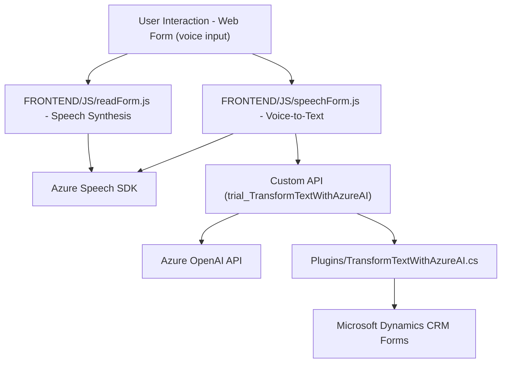

# Technical Analysis of the GitHub Repository

## **Summary**
The repository contains software related to enabling the integration of Azure Speech SDK and Azure OpenAI API with Microsoft Dynamics CRM forms. It includes JavaScript files to process user input from forms and facilitate synthesis and transcription of voice using Azure Speech SDK, as well as a plugin to interact with Azure OpenAI via Microsoft Dynamics CRM API for text transformation tasks.

---

## **1. Type of Solution**
The repository implements parts of a solution that integrates:
- **Frontend components**: Facilitating communication with users via forms and voice input, using JavaScript files for dynamic functionality.
- **Backend plugins**: Enabling Dynamics CRM to interact with Azure OpenAI APIs for data processing.

In summary, this is a **hybrid solution** combining **frontend interactivity** (voice functionality in forms), **API interactions** (custom API and Azure OpenAI API calls), and **backend plugins** for CRM-level data manipulation.

---

## **2. Technologies, Frameworks, and Software Patterns Used**

### **Technologies**
- **Azure Speech SDK** for voice synthesis (`FRONTEND/JS/readForm.js`).
- **Azure OpenAI API** for transformed text processing (`TransformTextWithAzureAI.cs`).
- **Microsoft Dynamics CRM** framework to manage form fields and integrate with plugins.

### **Frameworks and Libraries**
- **Microsoft.Xrm.Sdk**: Framework for interacting with Dynamics CRM services.
- **Newtonsoft.Json**: Advanced JSON manipulation and serialization in .NET environment.
- **System.Text.Json**: Another library for JSON serialization/deserialization in C# plugins.

### **Patterns**
- **Service Integration**: The solution seamlessly integrates Azure cloud services (Speech SDK and OpenAI).
- **Modular Design**: Functions organized into reusable blocks that fulfill specific business needs. Separation of responsibilities is observed in both frontend and backend code.
- **Facade Pattern**: Encapsulation of complex operations, such as transcription and field mapping logic, in well-defined function interfaces.
- **Defensive Programming**: Includes validation logic to handle service failures and invalid inputs gracefully.
- **Event-Based Plugin Architecture**: Backend plugins adhere to standard lifecycle and event handler patterns defined by the Dynamics CRM framework.
- **Dynamic Loading**: The `ensureSpeechSDKLoaded` function loads the SDK dynamically in the browser if not available, showcasing lazy loading.

---

## **3. Architecture Type**
This repository demonstrates **Multi-Tier Architecture**, distributed across:
1. **Presentation (Frontend)**: JavaScript files interface with users via web forms and leverage Azure Speech SDK for speech transcription and synthesis.
2. **Application Logic (Backend)**: Dynamics plugins process form data using Azure OpenAI.
3. **External Services (API Layer)**:
   - Azure Speech SDK for voice generation and transcription.
   - Custom API for additional functionality (text transformation).
   - Azure OpenAI API for advanced AI-based processing.

The solution uses **service-oriented architecture (SOA)** principles, with modularized integrations for external APIs and a CRM plugin system.

---

## **4. Dependencies or External Components**
### **Frontend**
1. Azure Speech SDK (Loader URL from: `https://aka.ms/csspeech/jsbrowserpackageraw`).
2. Microsoft Dynamics form APIs.
3. Browser-based JavaScript environment.

### **Backend**
1. Azure OpenAI service, requiring:
   - An endpoint URL in Azure.
   - Service authentication through API keys or tokens.

2. Microsoft Dynamics CRM SDK:
   - Objects like `ExecutionContext`, `IPlugin`, and `InputParameters`.

3. JSON Libraries:
   - Newtonsoft.Json.Linq or System.Text.Json for CRM plugin operations.

4. HTTP Client Library for API integration.

---

## **5. Valid Mermaid Diagram** (Focus: Solution Architecture)

---

## **Conclusion**

The solution uses a **service-oriented architecture** to connect frontend UI components with cloud services (Azure Speech SDK, Azure OpenAI API) and integrates backend business logic with Dynamics CRM via plugins. While the repository demonstrates modularity and proper separation between presentation and logic layers, some hardcoded values (e.g., Azure configurations) could be replaced with configuration management solutions. The repository demonstrates robust patterns such as modularity, clear function responsibility, service delegation, and dynamic integrations. It's optimized for CRM environments and real-time voice-input-driven interactions.