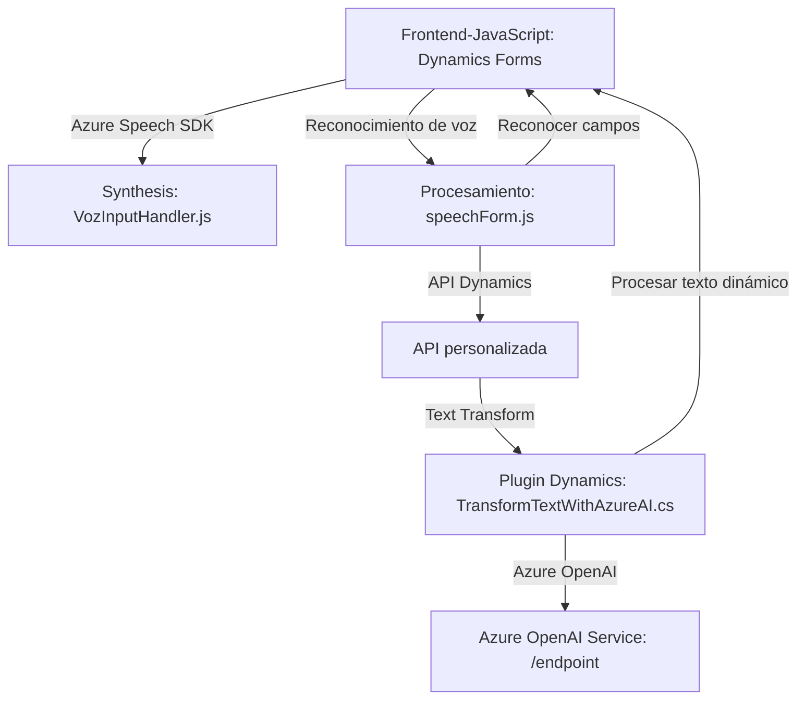

### **Resumen Técnico**
Este repositorio contiene una combinación de frontend en JavaScript, plugins en C#, y utiliza servicios externos como **Azure Speech SDK** y **Azure OpenAI Service** para proporcionar funcionalidades avanzadas de procesamiento de voz, síntesis de texto y transformación de datos. Está orientado a integraciones con **Microsoft Dynamics 365** para enriquecer los formularios y automatizar flujos mediante datos hablados y APIs personalizadas.

---

### **Descripción de la Arquitectura**
#### Tipo de solución:
Esta solución es una **integración vertical** que combina un frontend basado en JavaScript, un API personalizada en Dynamics 365, y un plugin desarrollado en C#. Es diseñada para interactuar directamente con servicios de Dynamics 365 y extender su funcionalidad mediante servicios avanzados como Azure Speech SDK y Azure OpenAI Service.

#### Arquitectura:
La arquitectura muestra una estructura cliente-servidor con una **Direct Integration Architecture**. El frontend proporciona experiencias de captura de datos en Dynamics 365 mediante el reconocimiento de voz, y se complementa con un backend basado en plugins y APIs que realizan transformaciones utilizando servicios externos. Esto puede considerarse parte de una arquitectura **multi-capa**, donde el frontend (UI) interactúa con un backend de Dynamics 365, que actúa como capa intermedia y realiza llamadas a servicios externos.

---

### **Tecnologías y Frameworks Usados**
1. **Frontend (JavaScript)**
   - Azure Speech SDK (JS): Para servicio de síntesis de voz.
   - Dynamics 365 Web API (Xrm.WebApi): Interacción directa con el modelo de datos de Dynamics.

2. **Backend (C# Plugins y API)**
   - C#: Adaptador principal del plugin a Dynamics 365.
   - Dynamics 365 SDK: Usado para crear plugins e interactuar con la plataforma.
   - Azure OpenAI Service: Servicio de IA que ejecuta transformaciones en texto.
   - System.Net.Http: Realiza llamadas al servicio de OpenAI.
   - Newtonsoft.Json / System.Text.Json: Para procesar y manipular los datos JSON.

#### Patrones detectados:
- **Carga dinámica de dependencias:** Uso de funciones para cargar dinámicamente el SDK de Azure Speech.
- **Procesamiento por capas:** La síntesis y captura de voz en el frontend, junto con el procesamiento de texto en la capa backend, sugieren una arquitectura basada en capas.
- **Integración con servicios en la nube:** Uso de Azure Speech y OpenAI para delegar tareas críticas.
- **Plugin architecture:** Extensibilidad en Dynamics 365 mediante el desarrollo de plugins.

---

### **Dependencias importantes**
1. **Internas**:
   - Dynamics 365 (API y plugins): Interacción directa con los datos de los formularios y el modelo de Dynamics 365.
   - `formContext.data`: Permite interactuar con los campos del formulario en tiempo real.

2. **Externas**:
   - **Azure Speech SDK**: Maneja síntesis y reconocimiento de voz en el frontend.
   - **Azure OpenAI Service**: Realiza transformaciones avanzadas de texto mediante IA.
   - **Microsoft Dynamics Web API**: Facilita la conexión entre el frontend y backend que interactúa con el modelo de datos de Dynamics.
   - **System.Net.Http**: Comunicación con el endpoint de Azure OpenAI desde los plugins.

---

### **Diagrama Mermaid**
Representación inicial de la arquitectura:

---

### **Conclusión Final**
Este repositorio implementa una solución que utiliza una arquitectura **multi-capa** para integrar capacidades avanzadas de procesamiento de voz y texto con Dynamics 365. La capa frontend permite capturar datos mediante voz y desencadena la interacción con el backend y servicios externos como **Azure Speech SDK** o **Azure OpenAI**. Esta solución exhibe patrones clave como la integración dinámica de dependencias y una arquitectura basada en plugins, con un enfoque modular. Sin embargo, existen puntos que podrían optimizarse, como una mejor gestión de las claves de API y mejores pruebas de rendimiento para el plugin basado en C#.