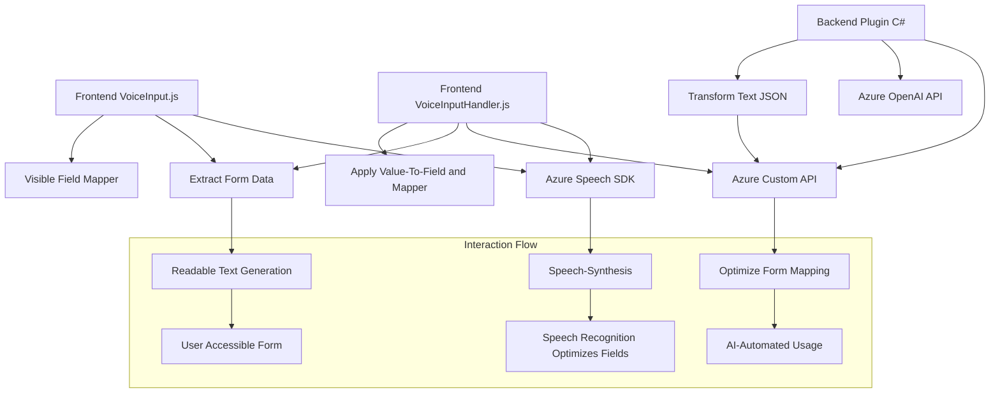

### Resumen Técnico
Esta solución integra funcionalidades para accesibilidad y automatización en un entorno Dynamics CRM mediante reconocimiento de voz, síntesis de voz y procesamiento de texto estructurado. Utiliza el **Azure Speech SDK** y **Azure OpenAI** como servicios externos para implementar capacidades avanzadas de interacción.

---

### Descripción de Arquitectura
La arquitectura del sistema tiene las siguientes características:
- **Multicapas**: La solución tiene separación por responsabilidad:
  1. **Frontend (JS)**: Módulo de reconocimiento y síntesis de voz junto con interacción en formularios.
  2. **Backend (Plugins)**: Procesamiento de texto y generación de estructuras JSON mediante un `plugin` en Dynamics CRM.
- **Cloud-Aided**: Extenso uso de servicios cloud como Azure Speech SDK y Azure OpenAI.

Patrones destacados:
1. Separación de responsabilidades: Cada archivo realiza tareas específicas.
2. Event-driven: Operaciones desencadenadas por eventos o callbacks.
3. API Integration: Servicios de Azure utilizados para tareas especializadas.
4. Lazy Loading: SDKs y librerías cargadas dinámicamente.

---

### Tecnologías Usadas
#### Frontend:
- **JavaScript**: Base para las funcionalidades del lado del cliente.
- **Azure Speech SDK**: Reconocimiento y síntesis de voz.
- **Dynamics API (Xrm.WebApi)**: Interacción con entidades CRM.
- **DOM API**: Manipulación del formulario y carga dinámica del SDK.

#### Backend:
- **C#**: Lenguaje base del plugin.
- **Microsoft.Xrm.Sdk**: Manejo y extensión de Dynamics CRM.
- **System.Net.Http**: Comunicación con Azure OpenAI.
- **System.Text.Json**: Procesamiento JSON.
- **Azure OpenAI**: Modelos GPT-4 para transformación de texto.

---

### Diagramas Mermaid válidos para GitHub

---

### Conclusión Final
Las funcionalidades expuestas en los archivos `readForm.js`, `VoiceInputHandler.js` y `TransformTextWithAzureAI.cs` están orientadas a extender herramientas de accesibilidad y automatización dentro de Dynamics CRM. La solución combina una multicapa basada en eventos que maximiza la interacción entre sistemas locales (frontend) y servicios externos en la nube (Azure Speech SDK y OpenAI). Estas tecnologías son implementadas siguiendo principios sólidos de modularidad, mantenibilidad y reutilización.