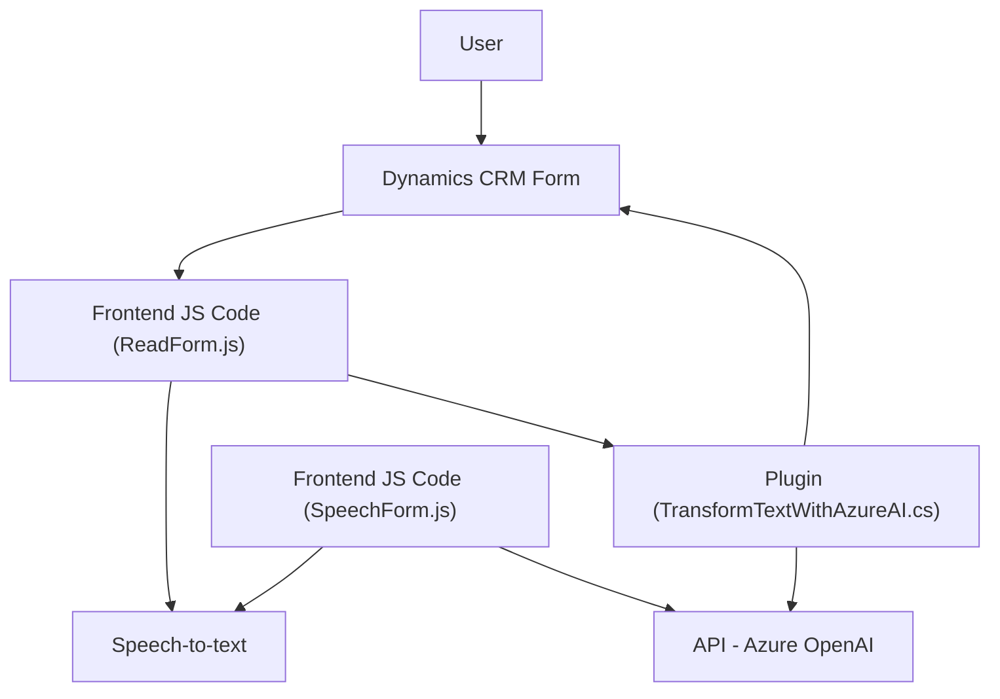

### Breve resumen técnico:

El repositorio incluye una solución para integrar servicios de reconocimiento y síntesis de voz con el CRM Microsoft Dynamics 365. Utiliza el **Azure Speech SDK** para capturar, procesar y sintetizar datos desde formularios en Dynamics 365. Además, contiene componentes para transformar texto en estructuras JSON vía **Azure OpenAI GPT** mediante un plugin. Esto implementa accesibilidad, entrada por voz y capacidades avanzadas de transformación del texto.

---

### Descripción de arquitectura:

1. **Tipo de solución:**  
   La solución se encuentra distribuida entre distintos componentes:
   - Un **frontend** para la gestión de usuarios, incluyendo entrada y salida de datos (voz y formulario).
   - Un **plugin backend** en Dynamics CRM que se integra con **Azure OpenAI API** para generar datos estructurados.

2. **Estructura:**  
   Utiliza una mezcla entre arquitectura de servicios (para las operaciones con Azure) y la arquitectura basada en eventos con integración modular. Por el uso del plugin en Dynamics CRM y la separación de responsabilidades (e.g., entre frontend y backend), la solución despliega una arquitectura **cliente-servidor**.

3. **Componentes:**  
   - **Frontend (JS):** Arquitectura basada en controladores con diversas funciones interconectadas para gestionar datos del formulario y la interacción con Azure Speech SDK.
   - **Backend (Plugin en C#):** Componente basado en `IPlugin` de Dynamics CRM que habilita transformación de texto en base a reglas mediante llamadas externas a Azure OpenAI.
   - Comunicación entre frontend y backend mediante APIs del CRM (e.g., `Xrm.WebApi`) y externas.

4. **Patrones usados**:
   - **Uso de servicios externos:** Azure Speech SDK y Azure OpenAI API.
   - **Observador:** Carga condicional del SDK de Azure para optimizar recursos.
   - **Desacoplamiento:** Distinción clara entre etapas (obtención de datos, transformación, síntesis, etc.)
   - **Plugin pattern:** En el backend, siguiendo las mejores prácticas de Dynamics CRM.

---

### Tecnologías usadas:
- **Frontend:**
  - **JavaScript ES6**: Lenguaje principal utilizado en los controladores.
  - **Azure Speech SDK**: Para captura y síntesis de voz.
  - **Xrm.WebApi**: API del CRM para comunicación y manipulación de datos.

- **Backend:**
  - **C#:** Lenguaje usado en el plugin.
  - **Dynamics CRM SDK (`Microsoft.Xrm.Sdk`)**: Integración con el modelo de datos del CRM.
  - **Azure OpenAI GPT API:** Para transformar texto en estructuras JSON.
  - **Newtonsoft.Json y System.Text.Json:** Herramientas para serialización/deserialización de datos JSON.

---

### Diagrama Mermaid válido para GitHub:

---

### Análisis y conclusión final:

La solución muestra una implementación bien estructurada con la integración de servicios cloud (Azure Speech y OpenAI) para extender las capacidades de Dynamics 365. La interacción entre el frontend y backend sigue principios de modularidad y desacoplamiento, con un diseño basado en eventos y controladores en el frontend mientras el plugin encapsula lógica empresarial en el backend.

#### Ventajas:
- **Escalabilidad:** Uso de SDKs externos permite un crecimiento dinámico del sistema.
- **Capacidades avanzadas:** Servicios de nube como Azure Speech y OpenAI añaden funciones poderosas (voz e IA) sin requerir un mayor esfuerzo local.
- **Integración perfecta:** La solución está diseñada para operar profundamente dentro de Dynamics 365.

#### Desventajas:
- **Dependencias fuertes:** El sistema depende en gran medida de servicios externos (Azure) para funciones clave; cualquier interrupción puede afectar su funcionalidad.
- **Complejidad inicial:** La integración de múltiples componentes puede requerir experiencia avanzada en Dynamics CRM, JavaScript y C#.

En resumen, esta arquitectura combina un manejo moderno de servicios cloud y tecnologías web con integraciones robustas en un sistema CRM empresarial.